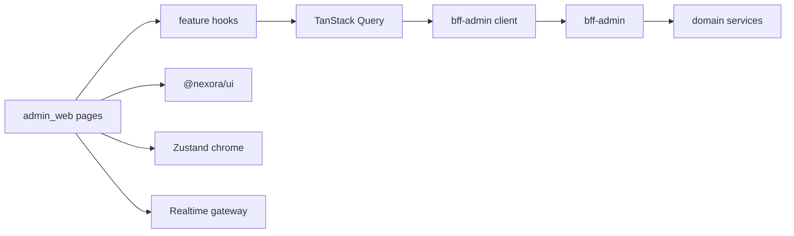
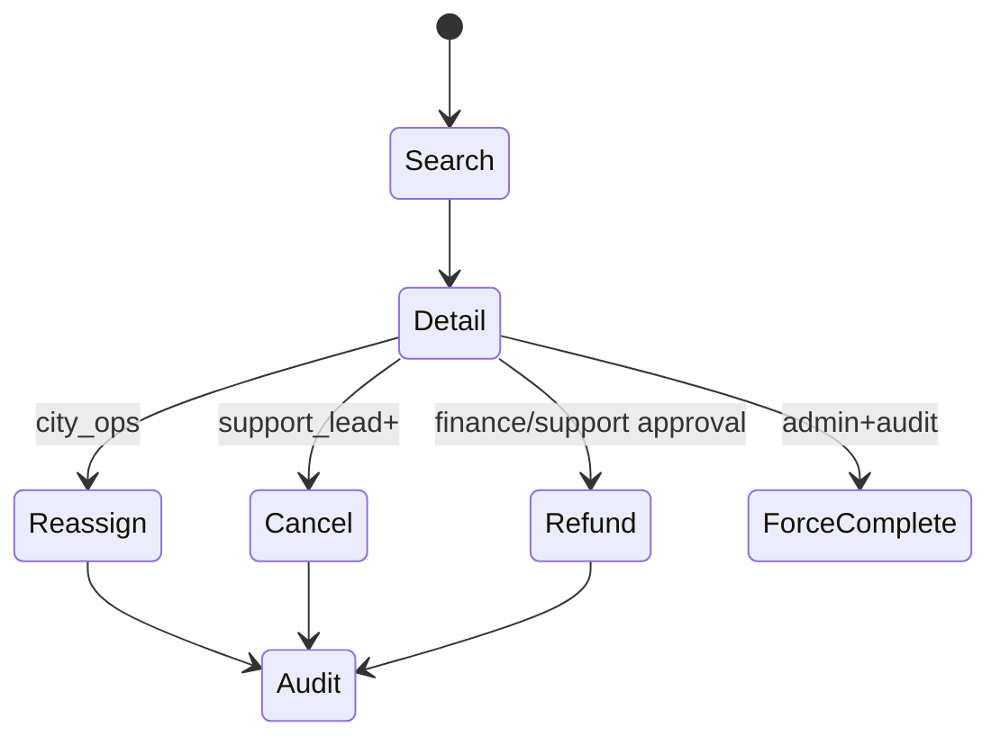
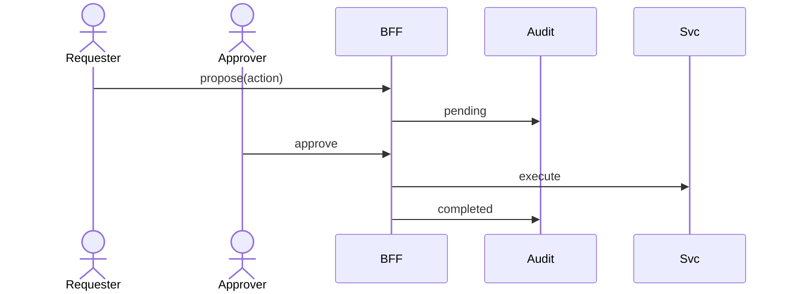

# NEXORA Admin Web — Architecture (Operations Command Center)

> Binding under Master Blueprint §4.4 / §9 Admin / Web + Design System (Admin = **Dense**).  
> Stack: **React + TypeScript + Next.js App Router** · TanStack Query · TanStack Table · `@nexora/ui` · ECharts · OIDC.  
> BFF: `bff-admin` at `/v1`. Never invent a second brand system.

## Mission

Operate the quick-commerce ecosystem at city / multi-city scale: live orders, couriers, dark stores, catalog, pricing, finance, CRM, and AI ops — with granular RBAC and full audit.

## Stack

| Concern | Choice |
|---------|--------|
| Framework | Next.js (App Router) + React 19 + TypeScript |
| Data | TanStack Query |
| Tables | TanStack Table + NEXORA dense skin |
| Charts | Apache ECharts (tokenized) |
| UI | `@nexora/ui` (`packages/web/ui`) |
| State (chrome) | Lightweight Zustand (city, sidebar, theme) |
| Auth | OIDC / session cookie against identity via `bff-admin` |
| Realtime | WebSocket (+ optional SSE for boards) |
| i18n | next-intl (`en`, `tr`) |
| Theme | Light / Dark via CSS variables from design tokens |

## Module hierarchy

```text
Admin Platform
├── Auth & Session (OIDC, 2FA gate, device)
├── Shell (side nav, city switcher, command palette, alerts)
├── Dashboard (KPIs, revenue, SLA, AI insights)
├── Live Operations (map, streams, emergencies)
├── Orders
├── Customers
├── Couriers
├── Warehouses
├── Products / Catalog
├── Inventory
├── Delivery / Zones
├── Campaigns
├── Pricing
├── Loyalty
├── CRM
├── Support
├── Finance
├── Analytics
├── AI Command Center
├── System (config, flags, templates, locales)
├── RBAC (roles, permissions, approvals)
├── Audit Logs
├── Notifications (ops alerts)
├── Monitoring (platform health)
└── Reports / Import-Export
```

## Navigation tree

```text
/login
/(app)
  /dashboard
  /live
  /orders                    /orders/[id]
  /customers                 /customers/[id]
  /couriers                  /couriers/[id]
  /warehouses                /warehouses/[id]
  /products                  /products/[id]  /products/import
  /inventory
  /delivery                  /delivery/zones
  /campaigns                 /campaigns/[id]
  /pricing
  /loyalty
  /crm
  /support                   /support/tickets/[id]
  /finance
  /analytics
  /ai
  /system                    /system/flags  /system/templates
  /rbac
  /audit
  /notifications
  /monitoring
  /reports
```

## Permission model (RBAC)

Roles (align with constitution + ops departments):

| Role | Typical scope |
|------|----------------|
| `viewer` | Read-only dashboards |
| `city_ops` | Live ops, order reassign, courier intervene |
| `support_agent` | Tickets, limited refunds |
| `support_lead` | Escalations, refund approvals |
| `catalog_manager` | Products, pricing drafts, campaigns |
| `finance_analyst` | Finance read + export |
| `finance_admin` | Settlements, payouts (dual-control where required) |
| `warehouse_ops` | Warehouse / inventory read + transfer approve |
| `fraud_analyst` | Risk scores, holds |
| `admin` | City admin (non-kill-switch) |
| `super_admin` | Flags, kill switches, city config (audited / dual-control) |

Permissions are resource + action strings, e.g. `orders:read`, `orders:cancel`, `orders:force_complete`, `finance:payout:approve`.

UI soft-gates + BFF hard enforcement. Every mutating action writes an audit event.

## Dashboard layout

```text
┌─ Top bar: city switcher | search/cmd-K | alerts | theme | profile ─┐
├─ Side nav (dense) ─┬─ Page header (title + breadcrumbs + actions) ──┤
│                    │ KPI row (6–8 cards)                            │
│                    │ Charts row (revenue | orders | SLA)             │
│                    │ Split: live alerts | AI insights | system health│
└────────────────────┴────────────────────────────────────────────────┘
```

## Folder structure

```text
apps/admin_web/
  ARCHITECTURE.md
  FEATURES.md
  README.md
  package.json
  next.config.ts
  src/
    app/                 # App Router pages
    components/          # app-local composites
    features/            # feature modules (domain/data/ui)
    shared/
      api/               # bff client
      auth/
      permissions/
      hooks/
      lib/
      types/
      i18n/
    stores/              # zustand chrome
    styles/

packages/web/ui/         # @nexora/ui
  src/
    tokens/
    components/
    charts/
    patterns/
```

## Shared components (`@nexora/ui` + app)

- `AdminShell`, `SideNav`, `CitySwitcher`, `CommandPalette`
- `KpiCard`, `DataGrid`, `FilterBar`, `BulkActionBar`
- `Timeline`, `StatusBadge`, `EmptyState`, `PageHeader`
- `ChartFrame` (ECharts), `Heatmap`, `LiveMapFrame`
- `PermissionGate`, `AuditHint`, `ConfirmDialog`

## Dependency graph



## API interaction map

| Module | Primary BFF paths |
|--------|-------------------|
| Dashboard | `GET /admin/dashboard` · WS `/ws/admin/ops` |
| Live | `GET /admin/live/snapshot` · WS streams |
| Orders | `/admin/orders` CRUD-ish + actions |
| Customers | `/admin/customers` |
| Couriers | `/admin/couriers` |
| Warehouses | `/admin/warehouses` |
| Products | `/admin/catalog/products` |
| Inventory | `/admin/inventory` |
| Delivery | `/admin/delivery/zones` |
| Campaigns | `/admin/campaigns` |
| Pricing | `/admin/pricing` |
| Loyalty | `/admin/loyalty` |
| CRM | `/admin/crm` |
| Support | `/admin/support/tickets` |
| Finance | `/admin/finance/*` |
| Analytics | `/admin/analytics/*` |
| AI | `/admin/ai/*` |
| System | `/admin/system/*` |
| RBAC | `/admin/rbac/*` |
| Audit | `/admin/audit` |
| Monitoring | `/admin/monitoring/health` |

All writes: `Idempotency-Key` + audit metadata.

## Workflow diagrams

### Order intervention



### Dual-control (sensitive)



## Security

- OIDC session; optional WebAuthn / TOTP for elevated roles
- IP allowlist hooks (super_admin)
- No customer PII in client logs
- PermissionGate on routes + mutation buttons
- All admin mutations audited (who/when/ip/session/old/new)
