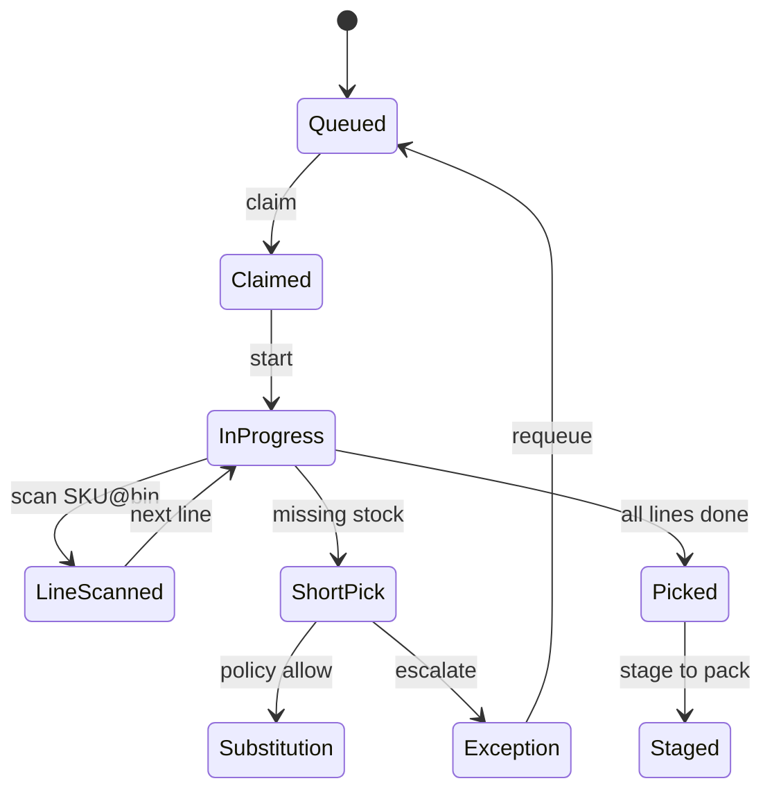
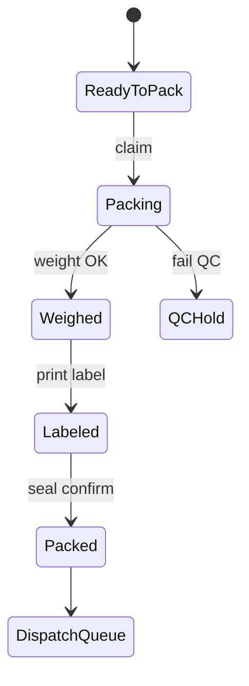
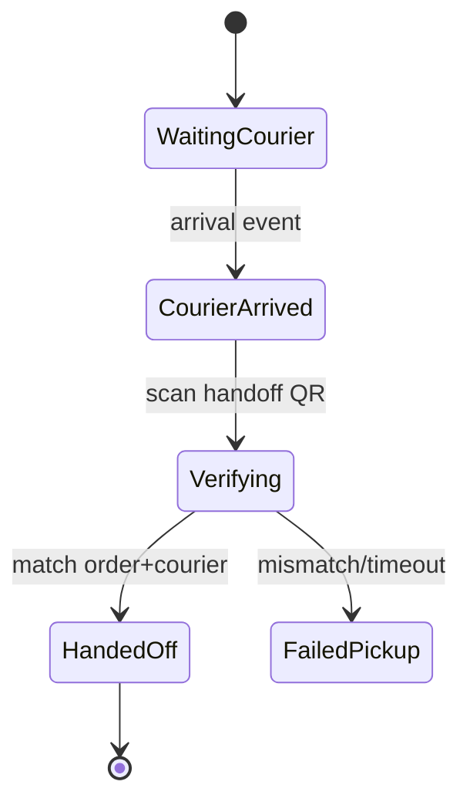
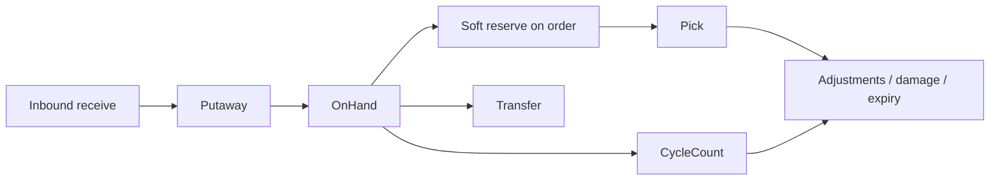

# NEXORA Warehouse (Dark Store) — Architecture

> Binding under Master Blueprint + Design System.  
> Density: **Dense** (DS §00). Shares `nexora_core` + `nexora_design`.  
> BFF: `bff-warehouse` at `/v1`.

## Mission

Operate hundreds of dark stores with ultra-fast pick → pack → handoff, real-time inventory truth, offline-first scan guns, and AI-assisted labor/path optimization.

## Stack

| Concern | Choice |
|---------|--------|
| Flutter | Stable |
| State | Riverpod |
| Routing | GoRouter |
| HTTP | Dio `ApiClient` |
| Local | Hive `WarehouseLocalStore` + mutation outbox (Drift optional later) |
| Scan | `mobile_scanner` (barcode/QR); RFID/Bluetooth as adapter ports |
| Realtime | WebSocket for queues / courier arrival |
| Auth | OTP + biometric + role + shift gate |
| Print | Label print intent / deep-link to printer service |

## Warehouse types

`dark_store` · `regional` · `central` · `micro_fc` · `cold` · `frozen` · `pharmacy` · `fresh`

Station assignment and zone rules are config-driven per `store_id`.

## Roles (RBAC)

| Role | Capabilities |
|------|----------------|
| picker | Claim/pick tasks, scan |
| packer | Pack, weight, label |
| dispatcher | Handoff queue, courier QR |
| inventory_auditor | Counts, adjustments |
| supervisor | Reassign, override, QC |
| warehouse_manager | Dashboard, transfers, purchasing approvals |
| regional_manager | Multi-store read + transfer approve |
| admin | Break-glass (audited) |

Enforced at BFF + UI soft-gates via `WarehouseRole`.

## Folder structure

```text
apps/mobile_warehouse/lib/
  main.dart
  bootstrap/
  app/
  di/
  routing/
  l10n/
  data/local/
  shared/   # rules, analytics, scan, widgets
  features/
    splash/
    auth/          # login, role, shift gate, device
    home/          # dashboard KPIs
    picking/       # queue, task, path, scan
    packing/       # pack station, weight, label
    dispatch/      # courier handoff
    inventory/     # stock, adjustments, cycle count
    transfers/
    expiry/
    purchasing/
    returns/
    quality/
    map/           # warehouse layout
    ai/
    shifts/
    tasks/
    reports/
    notifications/
    settings/
    support/
    shell/
```

## Navigation graph

```text
/                         splash
/auth                     phone → otp → shift clock-in gate
/shell
  /home
  /picking
  /packing
  /dispatch
  /more                   inventory hub + settings
/picking/:taskId
/picking/:taskId/scan
/packing/:taskId
/dispatch/:handoffId
/inventory/**
/transfers/**
/expiry
/purchasing/**
/returns/**
/quality/**
/map
/ai
/shifts
/tasks
/reports
/notifications
/settings
/support
```

## State management

- Global: `apiClient`, `warehouseSession` (user, role, storeId, stationId), `locale`, `theme`
- Queue providers: picking/packing/dispatch (autoDispose + realtime invalidate)
- Active task Notifier owns scan outbox for the current job
- Offline: scan events → Hive outbox → `SyncEngine.flush`

## Workflow diagrams

### Picking



### Packing



### Dispatch / courier handoff



### Inventory



## Dependency graph

```text
UI → Riverpod → Use cases → Repositories
  → Remote bff-warehouse | Local Hive outbox
nexora_design (dense) ← presentation
nexora_core ← network, sync, security
```

## Integrations

| Peer | Integration |
|------|-------------|
| Inventory service | Stock truth, reservations |
| Order / warehouse service | Pick/pack tasks |
| Dispatch / courier | Handoff QR tokens |
| Customer app | Stock availability projections (server) |
| Admin | Live boards, overrides |

## Offline-first scan policy

1. Optimistic apply on device for pick line scan  
2. Enqueue mutation with `client_mutation_id` + idempotency key  
3. Server rejects illegal bin/SKU → rebase task  
4. Packing weight/label may require online for printer; queue seal event  

## Security

- Role + store scoped tokens  
- Device authorization list  
- Audit every adjustment / override  
- Certificate pinning via core  
- Biometric unlock for manager overrides  

## Battery / performance

- Dense lists, large scan CTA  
- Camera scanner only while scan route active  
- Realtime subscribe per store channel  
