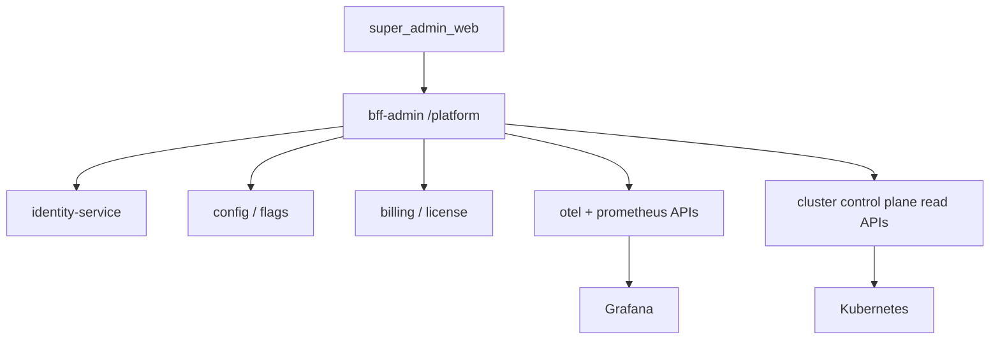
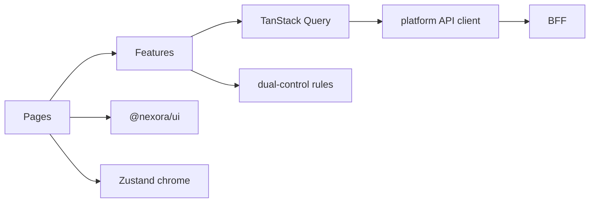
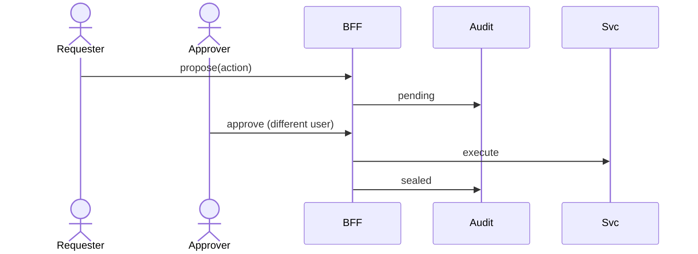

# NEXORA Super Admin Web — Architecture (Global Platform Control)

> Binding under Master Blueprint §4.5 / §9 Admin / Web + Design System (**Dense**).  
> Stack: **React + TypeScript + Next.js App Router** · TanStack Query · Zustand · `@nexora/ui` · ECharts · OIDC + WebAuthn.  
> BFF: `bff-admin` platform namespace `/v1/platform/*` (not city-ops).  
> **Hard rule:** Do **not** duplicate Admin Web city-ops (orders, couriers, warehouse pick boards, CRM tickets). Link out to Admin when needed.

## Mission

Govern the entire multi-tenant quick-commerce ecosystem: countries, companies, brands, tenants, licenses, feature flags, security, compliance, infrastructure, FinOps, AI platform, and disaster recovery.

## Separation from Admin Web

| Concern | Admin (`admin_web`) | Super Admin (`super_admin_web`) |
|---------|---------------------|----------------------------------|
| Scope | City / company ops | Platform / multi-tenant |
| Orders / live map | Yes | No (KPI aggregates only) |
| Tenants / companies | Consume | Create / isolate / suspend |
| Kill switches | Soft city flags | Global + dual-control |
| K8s / Kafka / DR | No | Yes |
| Billing tenants | City finance | Platform / license / FinOps |

## Global organization hierarchy

```text
Platform
 └── Company (legal entity / tenant root)
      └── Brand
           └── Country
                └── Region
                     └── City
                          └── Warehouse / Store
 └── Departments / Teams (cross-cutting)
```

## Tenant architecture

| Mode | Use |
|------|-----|
| Shared DB + `tenant_id` RLS | Default for SMB tenants |
| Separate DB schema/database | Enterprise / regulated |
| Hybrid | Shared catalog meta + isolated PII/ledger |

Capabilities: create, isolate, configure, customize, migrate, backup, monitor.

## Permission hierarchy

```text
platform_owner
  └── platform_security
  └── platform_sre
  └── platform_finops
  └── platform_compliance
  └── tenant_admin (scoped to company)
       └── (delegates into Admin Web roles — not owned here)
```

Dual-control required for: kill switches, tenant delete/suspend, DR failover, secret rotation, license overrides.

## Cloud architecture (logical)



## Navigation graph

```text
/login
/(app)
  /dashboard                 # global KPIs
  /tenants                   /tenants/[id]
  /companies                 /companies/[id]
  /countries                 /countries/[id]
  /org                       # users / depts / teams
  /roles                     # global role templates
  /config                    # platform + brand settings
  /flags                     # feature flag platform
  /licenses
  /billing
  /security                  # security command center
  /compliance                # GDPR/KVKK/CCPA
  /infra                     # clusters / k8s / dns / cdn
  /databases
  /gateway                   # API gateway
  /messaging                 # kafka / queues
  /observability             # logs metrics traces SLO
  /ai-platform
  /analytics                 # worldwide KPIs only
  /disaster-recovery
  /deployments
  /monitoring
  /notifications             # provider hub
  /audit                     # immutable platform audit
  /reports
```

## Folder structure

```text
apps/super_admin_web/
  ARCHITECTURE.md
  FEATURES.md
  README.md
  src/
    app/
    components/shell/
    features/          # one folder per module
    shared/            # api, auth, permissions, dual-control
    stores/
packages/web/ui/       # shared @nexora/ui (no fork)
```

## Dependency graph



## Dual-control workflow


