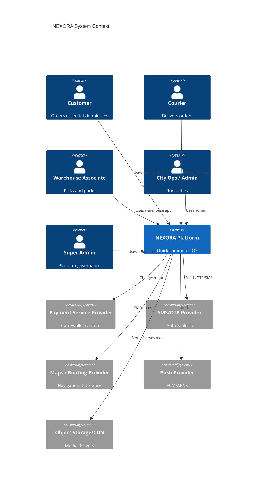
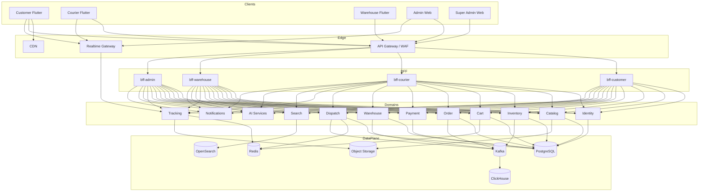
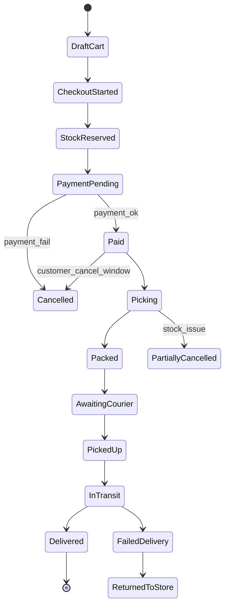
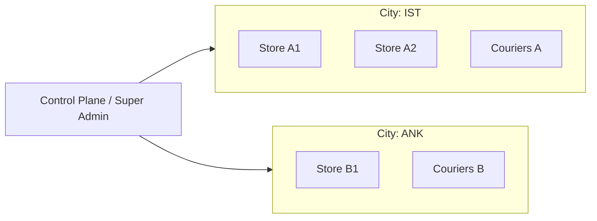

# NEXORA — System Context & Container Diagrams

> Companion to `docs/constitution/MASTER_BLUEPRINT.md`  
> Format: Mermaid (source of truth). Export to PNG/SVG in CI later if needed.

---

## 1. System Context

---

## 2. High-Level Container View

---

## 3. Fulfillment Flow (Order Lifecycle)

---

## 4. Event Backbone Topics (core)

| Topic | Producers | Consumers |
|-------|-----------|-----------|
| `identity.user.events` | identity | CRM, analytics |
| `catalog.product.events` | catalog | search-indexer, cache |
| `inventory.stock.events` | inventory | search, admin, recommendations |
| `order.order.events` | order | warehouse, dispatch, notify, analytics, finance |
| `warehouse.task.events` | warehouse | dispatch, tracking, admin |
| `dispatch.assignment.events` | dispatch | tracking, courier BFF, notify |
| `tracking.location.events` | tracking | realtime-gateway, ETA |
| `payment.payment.events` | payment | order, finance, fraud |
| `notification.delivery.events` | notification | analytics |

---

## 5. City as Scale Unit

All domain partitions, configs, fees, SLAs, and flags are addressable by `city_id`.
