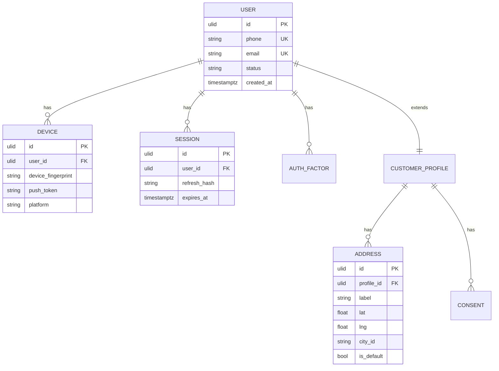
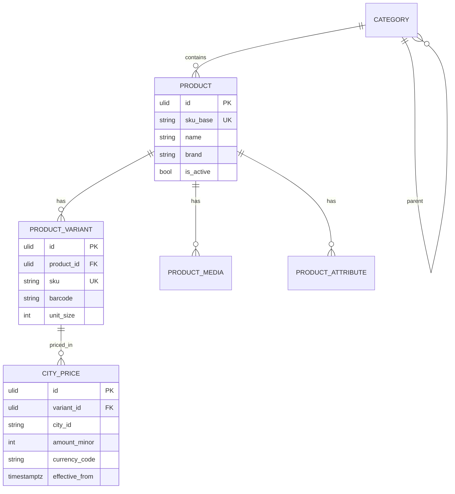
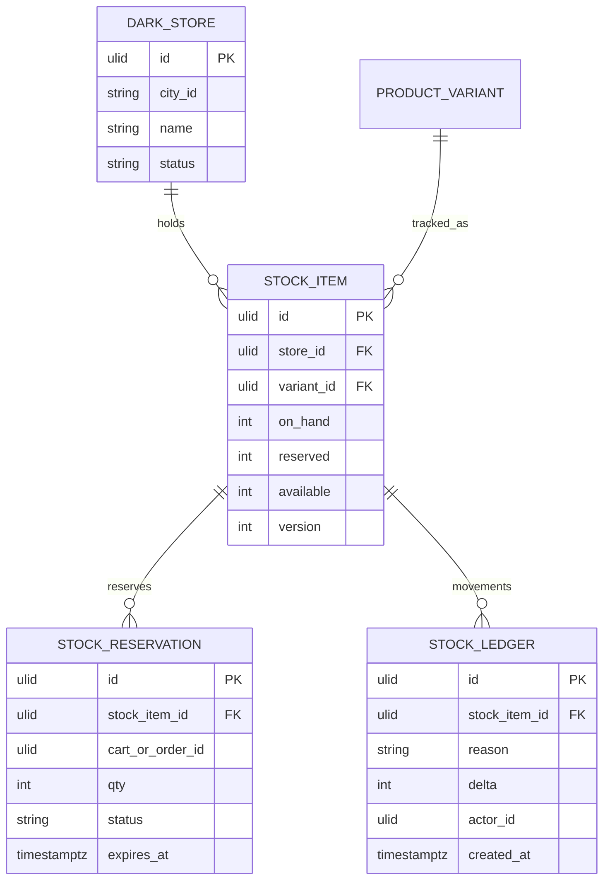
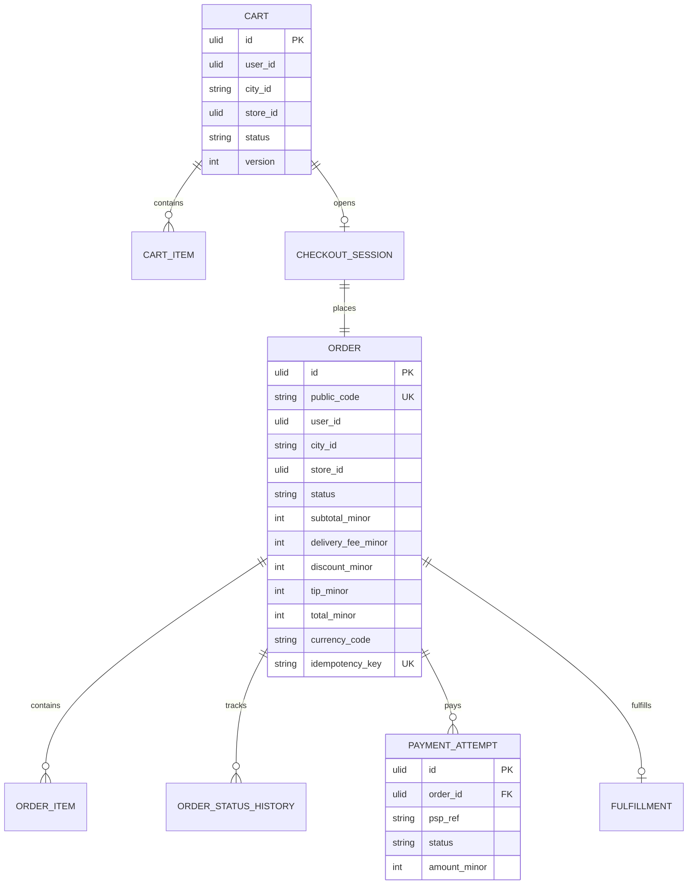
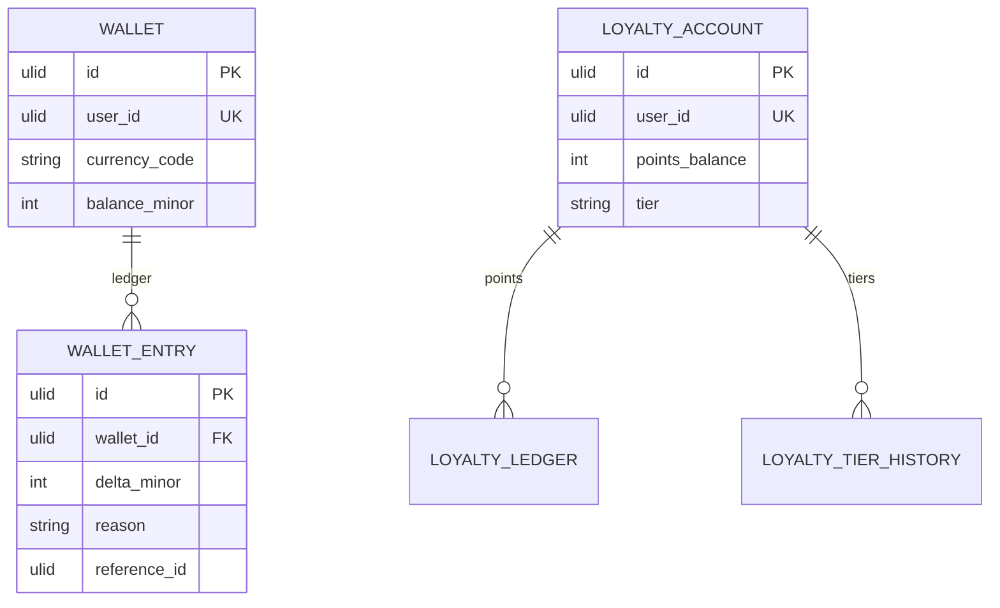

# NEXORA — Core ER Diagrams (Logical)

> Logical model per bounded context. Physical DBs are separated per service.  
> Money fields: `*_amount_minor` + `currency_code`. IDs: UUIDv7/ULID.

---

## 1. Identity & Profile



---

## 2. Catalog & Pricing



---

## 3. Inventory



---

## 4. Cart → Order → Payment



---

## 5. Warehouse & Dispatch

```mermaid
erDiagram
  ORDER ||--|| PICK_TASK : generates
  PICK_TASK ||--o{ PICK_TASK_LINE : has
  PICK_TASK ||--o| PACK_TASK : next
  PACK_TASK ||--o| HANDOFF : stages
  ORDER ||--o| DISPATCH_ASSIGNMENT : assigns
  DISPATCH_ASSIGNMENT ||--|| COURIER : to
  DISPATCH_ASSIGNMENT ||--o{ TRACKING_EVENT : emits

  PICK_TASK {
    ulid id PK
    ulid order_id FK
    ulid store_id
    ulid picker_id
    string status
    int sla_seconds
  }
  DISPATCH_ASSIGNMENT {
    ulid id PK
    ulid order_id FK
    ulid courier_id FK
    string status
    timestamptz assigned_at
  }
  TRACKING_EVENT {
    ulid id PK
    ulid order_id
    string type
    float lat
    float lng
    timestamptz at
  }
```

---

## 6. Wallet & Loyalty


