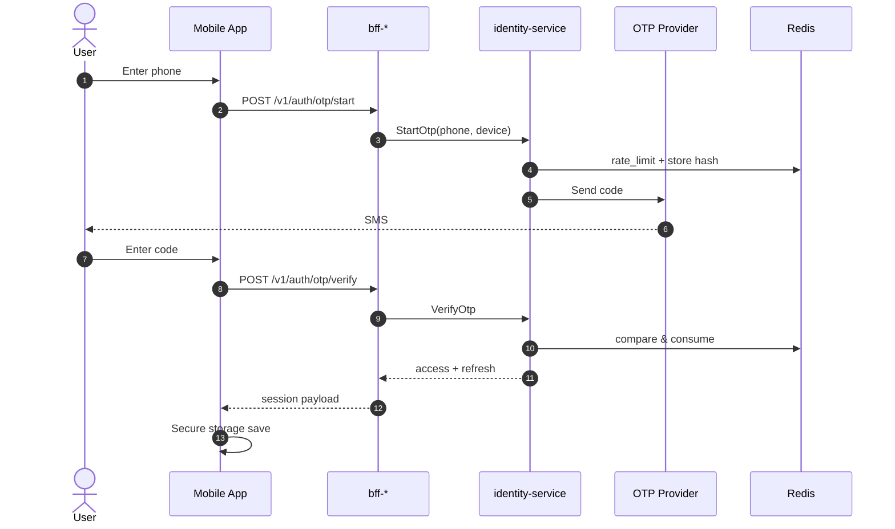
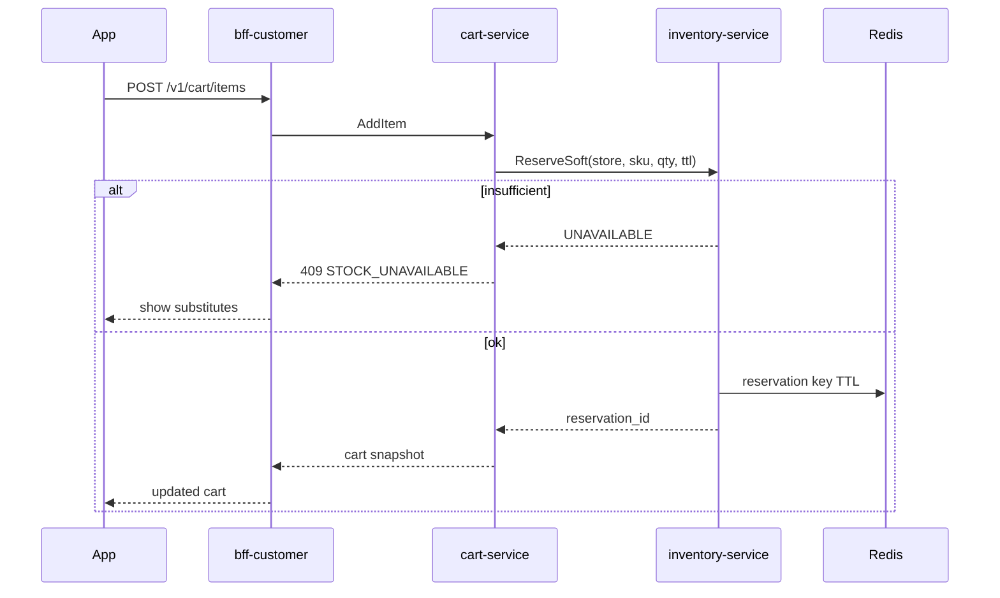
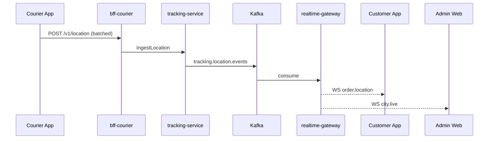
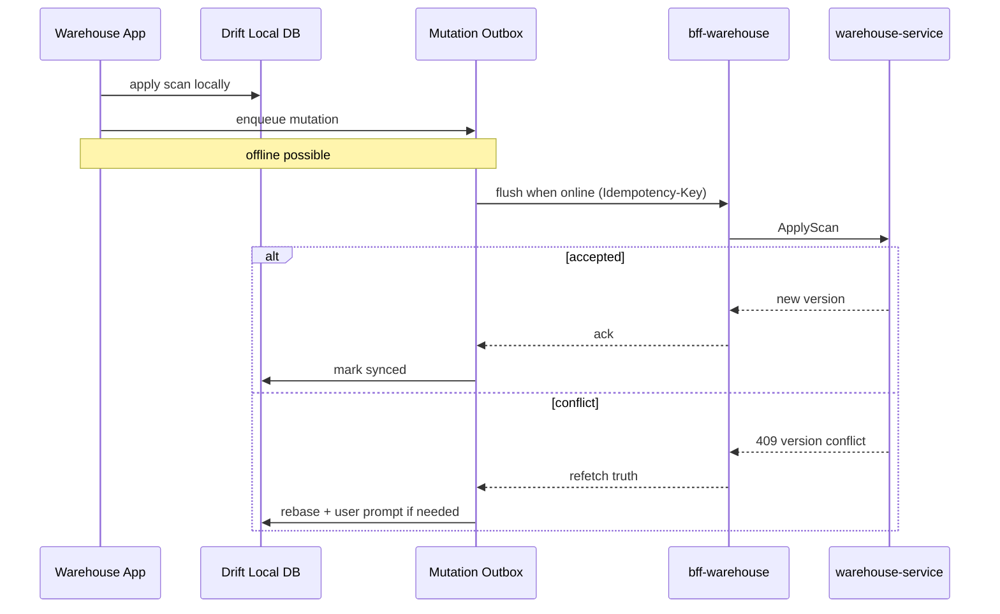

# NEXORA — Sequence Diagrams (Critical Paths)

Companion to Master Blueprint §8 and §29.

---

## 1. OTP Authentication

---

## 2. Add to Cart with Soft Stock Hold

---

## 3. Live Tracking Fanout

---

## 4. Warehouse Scan Offline Sync

