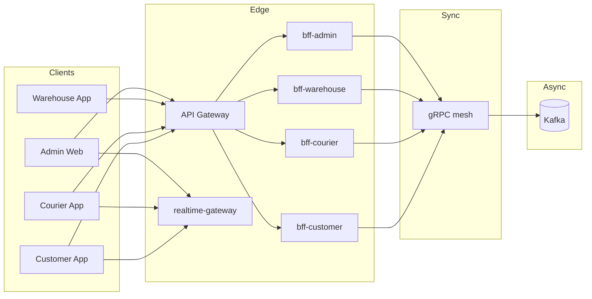
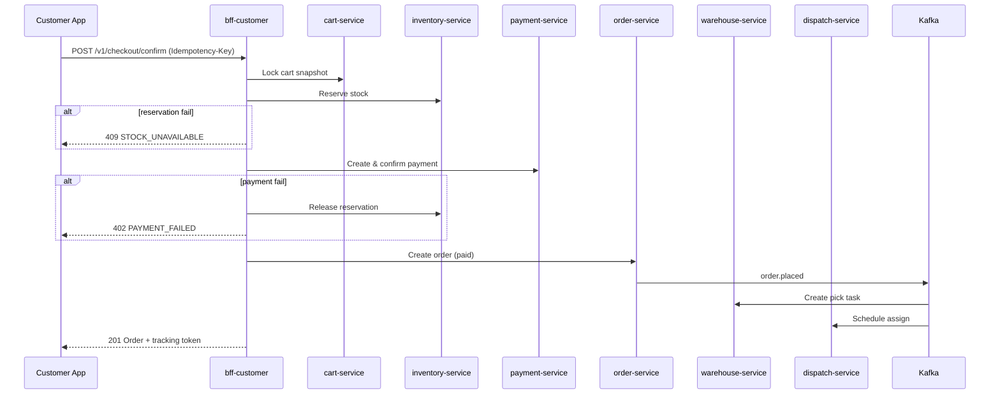
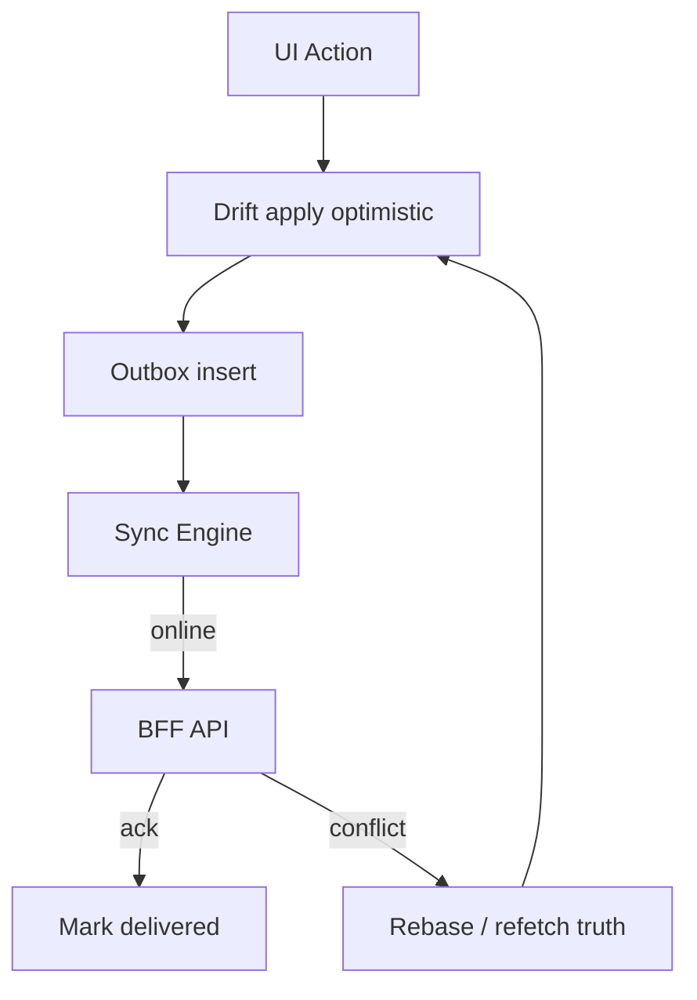
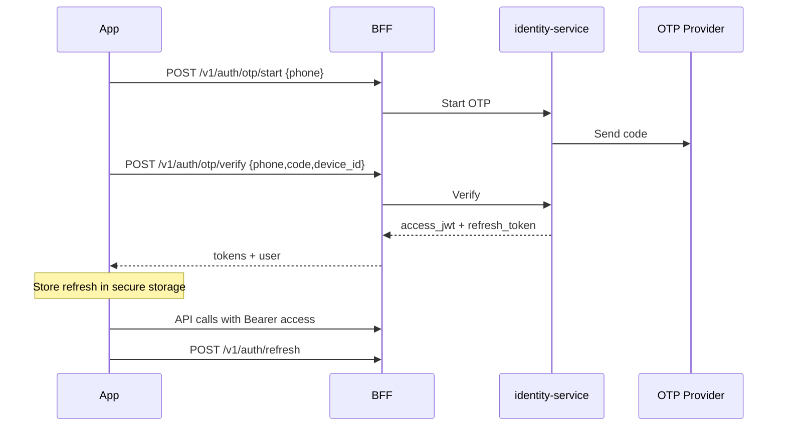
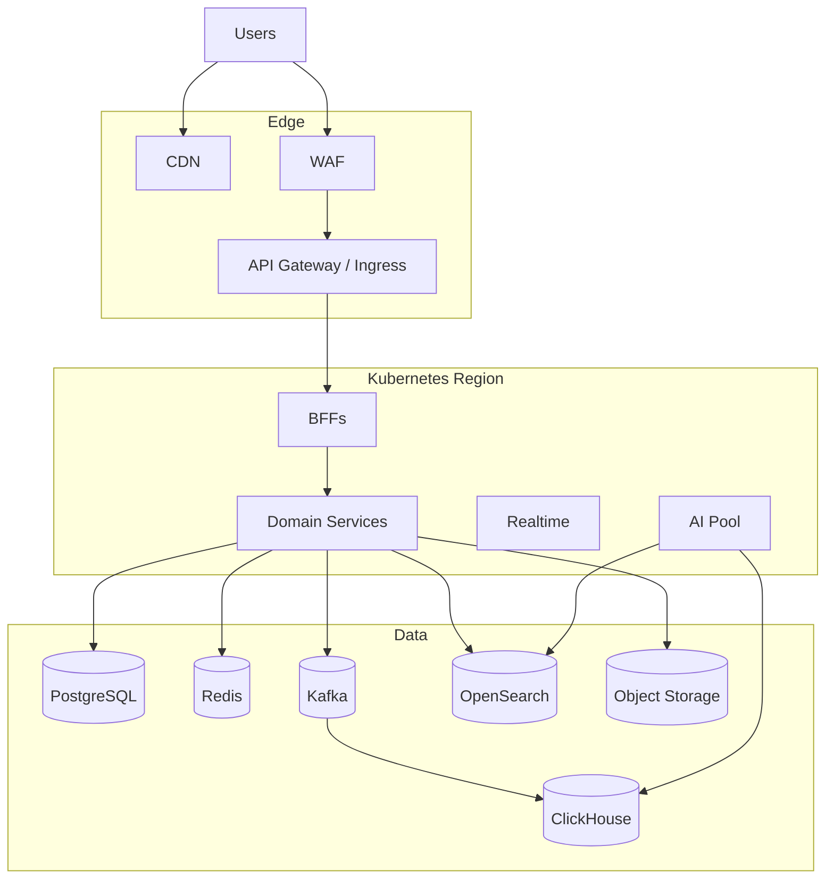

# NEXORA — MASTER BLUEPRINT (PROJECT CONSTITUTION)

> **Status:** BINDING SOURCE OF TRUTH  
> **Version:** 1.0.0  
> **Effective:** 2026-08-06  
> **Authority:** This document supersedes conflicting instructions in future prompts.  
> **Scope:** Complete enterprise Quick Commerce ecosystem.  
> **Rule:** This prompt set MUST NOT generate application code until Phase implementation prompts explicitly authorize it. Future implementation MUST follow this blueprint.

---

## Document Control

| Field | Value |
|-------|-------|
| Product name | **NEXORA** |
| Category | Quick Commerce / Ultra-fast grocery & essentials |
| Design philosophy | Kinetic Clarity (see `docs/design-system/01-brand.md`) |
| Primary markets (initial) | Turkey → MENA → EU expansion corridors |
| Scale target | Millions of MAU; tens of thousands of concurrent couriers; city-level dark stores |
| Classification | Commercial-grade, production-ready architecture |

### Precedence Order

1. This Master Blueprint (constitution)
2. Accepted Architecture Decision Records (`ADR/`)
3. Domain specs under `docs/`
4. Implementation prompts
5. Local README notes

When in conflict: **constitution wins**.

---

# 1. Complete Product Vision

**NEXORA** is an enterprise Quick Commerce operating system that delivers groceries and daily essentials in minutes through a coordinated network of dark stores, couriers, and intelligent fulfillment.

NEXORA is not a single app. It is a **city-scale logistics + commerce platform** with:

- A customer experience that treats **time as the product**
- A courier experience that treats **routing, safety, and earnings clarity** as first-class UX
- A warehouse experience that treats **pick accuracy and SLA** as the only metrics that matter at the bench
- An admin / super-admin control plane that treats **cities as deployable units**
- An AI layer that continuously improves search, assortment, pricing, fraud, and forecasting

**North-star promise:** *From tap to door — with operational truth at every second.*

**Differentiation pillars:**

| Pillar | Meaning |
|--------|---------|
| Operational truth | Customer ETA never lies against warehouse/courier state machines |
| City OS | Each city is a configurable deployment (assortment, fees, SLA, labor rules) |
| Offline-first field apps | Courier & warehouse keep working through flaky networks |
| AI as infrastructure | Recommendations, search, fraud, pricing are services — not UI gimmicks |
| One design language | Shared tokens; density profiles per surface |

---

# 2. Business Goals

### Primary (Year 1–2)

1. Achieve reliable **≤ 15-minute median delivery** in launch cities (SLA defined per city/zone).
2. Reach **sustainable unit economics** at dark-store level (contribution margin after delivery, before HQ overhead).
3. Build a **multi-tenant city control plane** so launching a new city is configuration + inventory, not a rewrite.
4. Establish **trust** via transparent fees, accurate stock, and fast issue resolution.
5. Create a **defensible data/AI flywheel** (search → conversion → fulfillment → preference learning).

### Secondary

6. Expand assortment categories without destroying discovery UX.
7. Grow loyalty retention (repeat rate, cadence, wallet/loyalty attach).
8. Enable B2B micro-fulfillment and partner dark stores later without architecture rewrite.
9. Maintain regulatory readiness (payments, KYC for couriers, data residency, consumer law).

### Success Metrics (North Stars)

| Metric | Target posture |
|--------|----------------|
| Median door time | City SLA (e.g. 10–15 min) |
| Perfect order rate | ≥ 98.5% (no missing/wrong/late/damaged) |
| App crash-free sessions | ≥ 99.7% |
| Search-to-add conversion | Continuously rising; instrumented |
| Courier utilization | Balanced vs fairness & safety |
| Dark-store pick accuracy | ≥ 99.7% |
| P95 API latency (read) | ≤ 150 ms at edge/BFF for hot paths |
| Availability | 99.95% critical path (order create → assign → deliver) |

---

# 3. Target Users

| Persona | Primary surface | Jobs-to-be-done |
|---------|-----------------|-----------------|
| **Customer** | Mobile Customer App | Browse, search, order in minutes, track, resolve issues, loyalty/wallet |
| **Courier** | Courier App | Accept batches, navigate, confirm handoff, earnings, support |
| **Picker / Warehouse Associate** | Warehouse App | Receive orders, pick, pack, stage, inventory counts, exception handling |
| **Dark-store Manager** | Warehouse + Admin | Shift staffing, inventory health, SLA dashboard, incident triage |
| **City Ops / Dispatch** | Admin Dashboard | Live map, reassignment, zone heat, capacity, SLA breaches |
| **Catalog / Merchandising** | Admin | Assortment, pricing, promos, content rails |
| **Finance** | Admin / Finance modules | Settlements, payouts, reconciliation, invoices, tax |
| **CRM / Support** | Admin + CRM | Tickets, refunds, retention campaigns |
| **Data / Growth** | Analytics | Funnels, cohorts, experiments |
| **Super Admin** | Super Admin | Tenants/cities, global config, kill switches, compliance, platform health |
| **Partners (future)** | Partner portal | Franchise/partner inventory & settlement |

---

# 4. Functional Requirements

## 4.1 Customer Mobile App

- Auth: phone OTP, email, social (optional), session refresh, device binding
- Location: address book, pin accuracy, serviceability check, zone ETA
- Home: curated rails, category entry, promos, reorder, personalization
- Catalog: category browse, PDP, variants, allergens, substitutes
- Search: text, voice, image, NL query; facets; typo tolerance; ranking
- Cart: real-time stock reservation soft-hold, fee transparency, substitutions preferences
- Checkout: payment methods, wallet, tips, coupons, scheduling (if city allows), invoice prefs
- Orders: live tracking map, timeline, chat/support, cancel/modify windows
- Post-order: ratings, missing item claims, refunds, reorders
- Wallet, loyalty, coupons, favorites, notifications preferences
- Offline: cached catalog/home; queued safe mutations where allowed

## 4.2 Courier App

- Shift login, document/KYC gate, vehicle profile
- Order offers / auto-assign acceptance rules
- Navigation, multi-stop batches, pickup confirmation (QR/OTP)
- Proof of delivery (photo/OTP/signature per city policy)
- Earnings, tips, incentives, dispute
- Safety: SOS, fatigue signals, speed policy hooks
- Offline queue for status transitions with conflict resolution

## 4.3 Warehouse App

- Station login, role (picker/packer/runner)
- Wave / order claim, pick list (optimized path)
- Barcode/QR scan, weight checks (where required), substitution workflow
- Pack & stage, courier handoff
- Inventory: receive, putaway, cycle count, damage, expiry
- Exception codes with audit trail
- Offline-first scan flows with outbox sync

## 4.4 Admin Dashboard

- City switcher, live ops map, SLA boards
- Orders, customers, couriers, dark stores, catalog, pricing, promos
- Capacity planning, zone editor, fee matrices
- Support tooling (impersonation-safe, audited)
- Finance views, settlements, chargebacks
- Experiment / feature flag consoles (role-gated)
- Audit log explorer

## 4.5 Super Admin

- Multi-city / multi-tenant governance
- Global feature flags & kill switches
- Platform service health, deployment windows
- Compliance policies, data retention configs
- Break-glass access with dual control

## 4.6 Platform Capabilities

- Public/partner APIs, webhooks
- Notification platform (push, SMS, email, in-app, WhatsApp where permitted)
- Finance ledger, payouts, reconciliation
- CRM profiles, segments, campaigns
- Loyalty engine, wallet ledger
- Recommendation, search, forecasting, dynamic pricing, fraud, OCR, chatbot
- Analytics warehouse + product analytics

---

# 5. Non-Functional Requirements

| Domain | Requirement |
|--------|-------------|
| Performance | Hot-path P95 ≤ 150 ms (BFF); order tracking WS fanout regional |
| Scalability | Horizontal scale per service; city sharding keys; Kafka partitions by city/store |
| Availability | 99.95% critical path; multi-AZ; graceful degradation (read-only catalog if cart write fails) |
| Reliability | Idempotent writes; outbox pattern; exactly-once *effect* via idempotency keys |
| Consistency | Strong for payments/inventory reservations; eventual for recommendations/analytics |
| Security | Zero-trust service mesh posture; least privilege; encryption in transit & at rest |
| Privacy | GDPR/KVKK ready; purpose limitation; retention schedules; DSAR workflows |
| Observability | Traces, metrics, logs correlated by `trace_id`, `order_id`, `city_id` |
| DX | Monorepo tooling, codegen, contract tests, local docker compose for critical path |
| Accessibility | WCAG 2.2 AA on customer critical flows; ops glanceability standards |
| i18n | TR/EN day one; ICU messages; locale-aware money/time |
| Compliance | PCI via PSP (no raw PAN storage); courier KYC data isolation |

---

# 6. Architecture Decisions

| ID | Decision | Rationale |
|----|----------|-----------|
| AD-01 | **Modular microservices** behind BFFs | Independent scale for catalog, order, dispatch, inventory |
| AD-02 | **Go** for backend services | Performance, concurrency, ops maturity |
| AD-03 | **gRPC** internal, **REST/JSON** external & BFF | Strong contracts internally; mobile/web friendliness externally |
| AD-04 | **Kafka** as system of async truth between domains | Decoupling, replay, auditability |
| AD-05 | **PostgreSQL** as system of record per bounded context | ACID where money/stock/orders matter |
| AD-06 | **Redis** for cache, locks, sessions, geo hot data | Ultra-low latency |
| AD-07 | **OpenSearch/Elasticsearch** for search index | Full-text + facets at scale |
| AD-08 | **ClickHouse** for analytics/events | High-ingest OLAP |
| AD-09 | **BFF per client family** | Customer / Courier / Warehouse / Admin shaped APIs |
| AD-10 | **Offline-first Flutter field apps** | Courier & warehouse network reality |
| AD-11 | **Event-carried state transfer + transactional outbox** | Reliable integration |
| AD-12 | **City_id as tenancy dimension** | Soft multi-tenant within brand |
| AD-13 | **Feature flags + remote config** | Controlled rollout / kill switches |
| AD-14 | **AI as separate services** with sync+async APIs | Isolation of GPU/latency workloads |
| AD-15 | **CQRS where read models diverge** | Search, tracking, admin boards |

Full ADRs live under `ADR/` and must reference these IDs.

---

# 7. Microservice Boundaries

## Core Commerce

| Service | Responsibility | Owns data |
|---------|----------------|-----------|
| `identity-service` | Users, devices, auth factors, sessions | identity DB |
| `customer-profile-service` | Profile, preferences, addresses, consents, household, CRM notes/timeline, segments, personalization, privacy | profile DB |
| `catalog-service` | PIM: products, variants/SKUs, categories, brands, attributes, locales/SEO, media refs, bundles, publish workflow | catalog DB |
| `pricing-service` | Price books, quote assembly, tax display, dynamic adjustments | pricing DB |
| `promotion-service` | Campaigns, promotions, coupons, vouchers, rule engine, evaluate | promo DB |
| `cart-service` | Cart lines, merge, coupon/quote preview, soft-hold refs (ports) | cart DB + Redis |
| `checkout-service` | Checkout sessions, validation pipeline, complete→order | checkout DB |
| `order-service` | OMS: order aggregate, state machine, sagas, outbox (orchestrates INV/PAY/WH/DIS) | order DB |
| `payment-service` | Payment intents, PSP routing, authorize/capture/void/refund, fraud port | payment DB |
| `wallet-service` | Customer wallet accounts & holds (cash/refund/promo/cashback/gift) | wallet DB |
| `loyalty-service` | Points, tiers/memberships, rewards, referrals, gamification; cashback via wallet port | loyalty DB |

## Fulfillment

| Service | Responsibility |
|---------|----------------|
| `inventory-service` | Stock ledger, locations, soft/hard reservations, ATP, movements, transfers, counts, lots/FEFO |
| `warehouse-service` | WOMS: fulfillment tasks, pick/pack/dispatch, stations, workforce, QC (inventory via port) |
| `dispatch-service` | Dispatch jobs, courier assignment, reassign, fleet registry |
| `routing-service` | Route plans, multi-stop optimize, ETA |
| `tracking-service` | Live courier locations, delivery timeline |
| `geofence-service` | Delivery/restricted polygons, serviceability |
| `location-service` | Geocoding, address intelligence, POI spatial index, heatmaps, maps provider facade (composes geofence/routing) |

## Platform

| Service | Responsibility |
|---------|----------------|
| `notification-service` | Omnichannel templates, preferences, send/schedule, provider routing, delivery receipts, inbox |
| `media-service` | Upload policies, CDN URLs |
| `search-service` | Query API over search index: hybrid lexical+vector, autocomplete, merchandising, trends |
| `recommendation-service` | Rails, similar, FBT, personalized ranking (behavioral + content) |
| `ai-platform-service` | Feature store, model registry, inference/LLM/agents, automation; fraud/forecast/pricing AI (domains call via ports) |
| `data-platform-service` | Event analytics SoT: schema registry, streaming aggregates, lake/warehouse marts, KPIs, experiments, reports, observability ingest, alerts, quality/catalog |
| `fraud-service` | Risk facade (may delegate scoring to `ai-platform-service`) |
| `crm-service` | Tickets, live chat, KB, cases, SLA, CSAT, AI assist port, Customer360 aggregate |
| `review-service` | Reviews, ratings, moderation, trust/reputation, quality scores (not CRM CSAT / catalog / profile) |
| `finance-ledger-service` | Double-entry journal, invoices/tax lines |
| `erp-service` | Enterprise ERP: COA/periods, AP/AR docs, treasury books, budgets, procurement accounting (PR→PO→GRN→3-way), supplier stubs (sync from `supplier-service`), assets, tax packs, expenses/approvals (ledger/inventory/settlement via ports; not payment/wallet SoT) |
| `settlement-service` | Courier/supplier/merchant/partner settlements + reconciliation |
| `config-service` | City configs, remote config (may delegate to `liveops-service`; country/locale SoT is `global-service`) |
| `feature-flag-service` | Flags, experiments linkage (may delegate to `liveops-service`) |
| `liveops-service` | LiveOps SoT: feature flags, remote config, experiments, calendar events, rollouts/rollbacks (not campaigns/notifications/analytics warehouse/AI SoT) |
| `supplier-service` | Supplier/partner ecosystem SoT: onboarding, RFQ/quotes/sourcing POs, marketplace sellers, EDI, contracts, catalog submissions, ASN collaboration (not ERP AP 3-way, inventory stock, catalog PIM, payments/settlement execution) |
| `quality-service` | Quality engineering control plane: suite registry, test runs, coverage/perf/security ingest, quality gates, release certification (not product business logic; suites under `qa/`) |
| `global-service` | Globalization SoT: countries/places, locales/translations, display FX, regional rules, tax/privacy *policies*, payment-method availability, logistics policy hints (not payment capture, ledger, geocode/maps, or CRM) |
| `open-platform-service` | Open platform / DX: developer apps, API keys, API catalog/versioning, gateway *policy* export, webhooks+HMAC delivery, SDK registry, integration connector metadata (not domain SoT; IAM issuance via identity port; Envoy binary in `infra/gateway`) |
| `superapp-service` | Super App modular ecosystem: mini-app/plugin/widget registry, manifests, install lifecycle, sandbox permissions, plugin store, monetization *rules*, shell resolve (not domain SoT, open-platform keys/webhooks, liveops flags, wallet/loyalty balances) |
| `innovation-service` | Innovation / future expansion: optional TRL-gated modules, simulations, digital-twin metadata, edge/IoT/robot/drone registries, research lab, green/quantum/XR/blockchain *hooks* (not OMS/inventory/dispatch SoT, LiveOps flags, Super App registry, open-platform keys) |
| `enterprise-ops-service` | Enterprise ops/governance: org hierarchy, policies, PMO, OKR/KPI registers, BCP activation, enterprise risk register, internal audit, executive dashboards (not ERP GL, security GRC SoT, analytics warehouse, platform-ops infra) |
| `hyperscale-cert-service` | Hyperscale hardening certification: audits/findings, benchmarks, capacity scenarios, chaos *metadata*, tuning profiles, hyperscale certificates (not quality-service release cert SoT, platform-ops apply, security vuln SoT, no service redesign) |
| `autonomy-service` | Autonomous enterprise delivery & Final Genesis: platform audits, self-heal *plans*, AI CTO reviews, evolution backlog, release scoring meta, continuous governance, executive AI / digital-org registries, genesis certificates (not platform-ops apply, quality/security/hyperscale SoT, no redesign/rebuild) |
| `audit-service` | Immutable audit events (may delegate/ingest via `security-service`) |
| `security-service` | Enterprise GRC: Zero Trust signals, OPA policies, audit chain, Vault secret metadata, threats/vulns/IR, compliance evidence, risk, privacy requests (not IAM authn or payment PSP) |
| `platform-ops-service` | Cloud/SRE control plane: deployments, scaling, backups, DR recovery, alerts, cost snapshots, SLO burn (not app business domains; GitOps/K8s via ports) |
| `bff-customer` | Customer edge aggregation (no domain SoT) |
| `bff-courier` | Courier edge aggregation |
| `bff-warehouse` | Warehouse edge aggregation |
| `bff-admin` | Admin/super-admin edge aggregation |
| `realtime-gateway` | WebSocket/SSE fanout for tracking/ops |
| `file-ocr-service` | Receipt/doc OCR |
| `chat-assistant-service` | Support bot orchestration (may call `ai-platform-service` LLM; split-ready from CRM) |
| `forecasting-service` | Demand forecast facade → `ai-platform-service` models |
| `pricing-ai-service` | Dynamic pricing suggestions facade (human-gated) → `ai-platform-service` |
| `segmentation-service` | Customer segments for CRM/campaigns |

## Edge / Experience

| Component | Responsibility |
|-----------|----------------|
| `bff-customer` | Mobile/web customer API aggregation |
| `bff-courier` | Courier API |
| `bff-warehouse` | Warehouse API |
| `bff-admin` | Admin/Super Admin API |
| `realtime-gateway` | WebSocket/SSE fanout (tracking, ops boards) |
| `api-gateway` | AuthN edge, rate limit, routing, WAF |

---

# 8. Communication Between Services



### Rules

1. **Clients talk only to Gateway/BFF/Realtime** — never to domain services directly.
2. **Sync command/query:** gRPC between services; REST at BFF.
3. **Async facts:** Kafka topics per domain (`order.events`, `inventory.events`, …).
4. **Transactional outbox** in each service that publishes domain events.
5. **Idempotency-Key** required on all create/payment/status-transition endpoints.
6. **No distributed transactions (2PC).** Use sagas/orchestrations for checkout & fulfillment.
7. **Timeouts & budgets:** BFF total budget ≤ 800 ms for browse; checkout may be higher with explicit UX.
8. **Contract versioning:** Protobuf packages + Buf breaking-change detection.

### Critical Saga: Place Order



---

# 9. Technology Stack

## Backend

| Layer | Choice |
|-------|--------|
| Language | Go 1.22+ |
| Service RPC | gRPC + Protobuf |
| External API | REST/JSON (OpenAPI 3.1) |
| Realtime | WebSocket (gateway) + optional SSE for admin |
| Messaging | Apache Kafka |
| Cache / locks | Redis 7+ |
| ORM / SQL | sqlc or ent (prefer sqlc for explicitness) |
| Migrations | golang-migrate / atlas |
| Config | env + config-service; 12-factor |
| Observability | OpenTelemetry → Tempo/Jaeger, Prometheus, Grafana, Loki |
| Auth tokens | JWT access + opaque refresh (rotated) |
| Feature flags | OpenFeature-compatible provider |

## Data

| Problem | Store |
|---------|-------|
| Transactional SoR | PostgreSQL 16 (per service schema/DB) |
| Cache / session / rate / geo hot | Redis |
| Search | OpenSearch or Elasticsearch 8.x |
| Analytics / events OLAP | ClickHouse |
| Object / media | S3-compatible object storage |
| Mobile local (structured) | Drift (SQLite) |
| Mobile local (KV/cache) | Hive |
| Secrets | Cloud KMS + sealed secrets / external secrets operator |

## Mobile

| Item | Choice |
|------|--------|
| Framework | Flutter (stable) |
| State | Riverpod 2.x |
| Routing | GoRouter |
| HTTP | Dio + interceptors |
| Local DB | Drift |
| KV | Hive |
| Push | Firebase Cloud Messaging |
| Maps | Platform-approved SDK abstracted behind interface |
| Architecture | Feature-first clean architecture (domain/data/presentation) |

## Admin / Web

| Item | Choice |
|------|--------|
| Framework | React + TypeScript |
| Routing | TanStack Router or Next.js App Router (decide per ADR; prefer Next for admin SSR/auth) |
| Data | TanStack Query |
| Tables | TanStack Table + NEXORA skin |
| UI | `@nexora/ui` design system |
| Charts | Apache ECharts or Visx (tokenized) |
| Auth | OIDC against identity-service |

## AI / ML

| Item | Choice |
|------|--------|
| Serving | Python (FastAPI) or Go sidecar where thin; GPU services isolated |
| Features store | Feast or internal feature service on Redis/ClickHouse |
| Models | Deployed via KServe / dedicated inference pool |
| Vector search | OpenSearch k-NN / dedicated vector DB if scale requires |

---

# 10. Folder Structure

```text
nexora/
├── ADR/                          # Architecture Decision Records
├── docs/
│   ├── constitution/
│   │   └── MASTER_BLUEPRINT.md   # THIS FILE
│   ├── architecture/
│   │   └── diagrams/
│   ├── design-system/
│   ├── domains/                  # per-domain specs
│   ├── api/                      # OpenAPI / asyncAPI indexes
│   ├── guides/                   # onboarding, contribution
│   └── standards/                # coding, security, QA
├── apps/
│   ├── mobile_customer/
│   ├── mobile_courier/
│   ├── mobile_warehouse/
│   ├── admin_web/
│   ├── super_admin_web/
│   └── widgetbook/               # Flutter component gallery
├── packages/
│   ├── flutter/
│   │   ├── nexora_core/
│   │   ├── nexora_design/
│   │   └── nexora_lints/
│   ├── web/
│   │   ├── ui/                   # @nexora/ui
│   │   └── eslint-config/
│   └── proto/                    # shared protobuf
├── services/                     # Go microservices (one folder each)
│   ├── bff-customer/
│   ├── order-service/
│   └── …
├── ai/                           # AI services
├── infra/
│   ├── terraform/
│   ├── helm/
│   ├── k8s/
│   └── docker/
├── ops/
│   ├── runbooks/
│   └── slo/
├── tools/                        # codegen, lint scripts
├── .github/workflows/            # or GitLab CI
└── README.md
```

---

# 11. Repository Strategy

**Primary strategy: Monorepo (polyglot)** for product cohesion.

| Concern | Approach |
|---------|----------|
| Layout | Apps + packages + services in one repo |
| Ownership | CODEOWNERS per path |
| CI | Path-filtered pipelines |
| Versioning | Independent service image tags; shared proto versioned |
| Release | Service-level releases; mobile store trains |
| Exceptions | Extremely large ML training repos may split later (ADR required) |

**Forbidden:** Copy-paste micro-repos per tiny service without platform tooling.

---

# 12. Coding Standards

### Universal

- No placeholder/fake production paths
- Explicit errors over magic
- Idempotency for side-effecting APIs
- Document public contracts; keep internals simple
- Security-sensitive code requires dual review

### Go

- `golangci-lint` mandatory
- Context as first param
- No panics in request path
- Functional options sparingly; prefer clear structs
- sqlc queries checked in
- Table-driven tests

### Flutter / Dart

- Feature folders: `domain/`, `data/`, `presentation/`
- Riverpod providers typed; no god-providers
- Entities ≠ models; mapping at data layer
- `nexora_lints` enforced
- Golden tests for design components

### TypeScript / React

- Strict mode
- No `any` without justification comment
- Server state in TanStack Query; UI state local/url
- Accessibility roles required for interactive controls

---

# 13. Naming Conventions

| Area | Convention | Example |
|------|------------|---------|
| Services | kebab-case + `-service` | `order-service` |
| BFF | `bff-<client>` | `bff-customer` |
| Kafka topics | `<domain>.<entity>.<event>` | `order.order.placed` |
| Proto packages | `nexora.<domain>.v1` | `nexora.order.v1` |
| REST paths | `/v1/<resource>` | `/v1/orders/{id}` |
| DB tables | snake_plural | `order_items` |
| Go packages | short, lowercase | `orderer` |
| Dart files | snake_case | `order_repository.dart` |
| Dart classes | PascalCase | `OrderRepository` |
| React components | PascalCase | `OrderTimeline` |
| Feature flags | `domain.feature.variant` | `checkout.tip.enabled` |
| Metrics | `nexora_<svc>_<metric>_<unit>` | `nexora_order_place_latency_ms` |
| IDs | ULID/UUIDv7 preferred | time-sortable |

Brand prefix for packages: `nexora_*` / `@nexora/*`.

---

# 14. State Management Strategy

### Flutter

- **Riverpod** as sole app state framework
- Layers:
  - `Notifier` / `AsyncNotifier` for feature state
  - Repositories abstract remote/local
  - Sync engine owns outbox
- **Source of truth:** Drift for offline-capable domains; remote authoritative on conflict rules
- UI never calls Dio directly

### Admin Web

- URL + TanStack Query as primary state
- Global UI chrome in lightweight store (city, sidebar)
- Avoid Redux unless ADR proves need

### Backend

- Domain aggregates enforce invariants
- Read models updated via consumers
- Redis for ephemeral coordination only (not SoR)

---

# 15. Dependency Injection Strategy

| Surface | Strategy |
|---------|----------|
| Go | Constructor injection; `Fx` or manual wire in `cmd`; prefer explicit `NewX(deps)` |
| Flutter | Riverpod overrides for DI; bootstrap in `di/providers.dart` |
| Web | Factory modules + React context sparingly; prefer query clients |
| Tests | Replace ports with fakes at composition root |

**Rule:** No service locators hidden in deep call stacks.

---

# 16. Error Handling Strategy

### Error model (API)

```json
{
  "error": {
    "code": "STOCK_UNAVAILABLE",
    "message": "Some items are no longer available",
    "details": [{ "sku": "SKU123", "reason": "OUT_OF_STOCK" }],
    "trace_id": "…",
    "retriable": false
  }
}
```

### Rules

- Stable machine `code` (enum per domain)
- Human `message` localized at BFF when needed
- Map gRPC status ↔ HTTP correctly
- Domain errors ≠ infra errors
- Panic = process failure (caught at edge, 500 + alert)
- Client: classify into UX patterns (toast, full-screen, inline, blocking)

### Mobile

- `Failure` sealed types in domain
- Retry policy in `nexora_core` (exponential + jitter)
- User-visible copy from l10n, not raw server strings when code known

---

# 17. Logging Strategy

| Level | Use |
|-------|-----|
| ERROR | Failed operations needing action |
| WARN | Degraded / retryable anomalies |
| INFO | Business milestones (order placed) |
| DEBUG | Dev only; disabled in prod by default |

### Fields (structured JSON)

`timestamp`, `level`, `service`, `env`, `trace_id`, `span_id`, `city_id`, `store_id`, `order_id`, `user_id` (hashed if needed), `event`, `duration_ms`

### Forbidden

- PAN, CVV, raw OTP, access tokens, passwords in logs
- PII in high-volume debug logs without purpose

---

# 18. Monitoring Strategy

### Pillars

1. **Metrics** — Prometheus
2. **Traces** — OpenTelemetry
3. **Logs** — Loki/ELK
4. **Profiles** — continuous profiling on hot services
5. **Synthetics** — critical journey probes per city

### SLO examples

| Service | SLO |
|---------|-----|
| `bff-customer` availability | 99.9% |
| `order-service` place success | 99.5% (excl. client errors) |
| Tracking event freshness | P95 < 3s end-to-end |

### Alerting

- Multi-window burn rates (SRE workbook)
- Page only on user-hurting symptoms
- Runbooks mandatory for every paging alert (`ops/runbooks/`)

---

# 19. Analytics Strategy

| Layer | Tooling |
|-------|---------|
| Product analytics | Event taxonomy → Kafka → ClickHouse (+ optional Amplitude/Segment pipe) |
| Biz analytics | dbt models on warehouse |
| Ops analytics | Realtime boards from tracking/dispatch projections |
| Experimentation | Flag + assignment service; exposure events required |

### Event taxonomy rules

- `object_action` naming: `product_added`, `checkout_started`
- Required props: `city_id`, `app`, `app_version`, `session_id`
- PII minimized; hash where needed
- Schema registry for analytics events

---

# 20. Testing Strategy

| Layer | Requirement |
|-------|-------------|
| Unit | Domain logic pure; high coverage on money/inventory/state machines |
| Contract | Pact/Buf/OpenAPI contract tests between BFF ↔ services |
| Integration | Testcontainers (Postgres, Redis, Kafka) |
| E2E | Critical journeys: browse→buy→pick→deliver |
| Mobile | Unit + golden + integration_test smoke |
| Load | k6/Locust on checkout & dispatch before city launch |
| Chaos | Network partition drills for warehouse offline sync |
| Security | SAST/DAST, dependency scan, pen-test per major release |

**Definition of done includes tests matching risk of change.**

---

# 21. Deployment Strategy

- Containerized services (Docker)
- Kubernetes for runtime
- GitOps (Argo CD / Flux) preferred
- Environment progression: `dev` → `staging` → `prod`
- Canary / progressive delivery (Flagger or Argo Rollouts)
- Mobile: staged rollouts via store + remote kill switches
- DB migrations: expand/contract; never break old readers in same release if possible
- Secrets injected at runtime; never baked into images

---

# 22. Scaling Strategy

| Dimension | Approach |
|-----------|----------|
| Stateless services | HPA on CPU/RPS/latency |
| Kafka | Partition by `city_id` or `store_id` |
| Postgres | Primary + read replicas; shard by city when needed (Citus or app-level) |
| Redis | Cluster mode; key prefixes per city |
| Search | Index per city or routing keys |
| Realtime | Shard connections by city; sticky gateway |
| Mobile traffic spikes | Edge cache for catalog media + CDN |
| Dark-store load | Dispatch throttling + customer ETA honesty |

**Scale unit = City.** Launch playbooks treat city as deployable capacity plane.

---

# 23. Caching Strategy

| Data | Cache | TTL / invalidation |
|------|-------|--------------------|
| Product cards | CDN + Redis | Event-driven invalidate on catalog change |
| Serviceability | Redis | Short TTL + pub invalidate |
| Session | Redis | Refresh rotation |
| Search results | Optional edge cache for anonymous | Very short TTL |
| Config / flags | In-process + Redis | Streaming updates |
| Cart | Redis primary for hot cart | Persist async |

**Rules:** Cache only with explicit key design; never cache personalized sensitive payloads at CDN; stampede protection (singleflight).

---

# 24. Offline Strategy

### Customer App

- Cache home/catalog snapshots
- Favorites/addresses readable offline
- Mutations requiring payment **online-only**
- Clear offline banners

### Courier & Warehouse (strict offline-first)

- Drift as local SoR for active tasks
- Hive for small prefs
- **Outbox queue** for status scans/events
- Conflict policy: server state machine rejects illegal transitions; client reconciles
- Photo proof queued with binary upload resume

---

# 25. Synchronization Strategy



- Monotonic `version` / `updated_at` per aggregate
- Cursor-based pull for task lists
- Push via WS when online
- Deduplicate by mutation `client_mutation_id`

---

# 26. Database Strategy

### PostgreSQL (SoR)

- DB-per-service (logical isolation minimum; physical as scale demands)
- Migrations versioned
- Row-level city filters where shared
- Strong constraints for money/inventory

### Redis

- Ephemeral; rebuildable
- Dedicated instances for cache vs queue vs geo if noisy

### OpenSearch/Elasticsearch

- Catalog & query indexes
- Pipelines from Kafka connect / custom indexers

### ClickHouse

- Immutable event facts + aggregated marts
- TTL for raw high-volume streams

### Object Storage

- Product media, POD photos, invoices, exports
- Lifecycle policies; virus scan on upload

### Message Queue

- Kafka for domain events & integration
- Redis streams / SQS only for narrow cases with ADR

---

# 27. Security Strategy

- TLS everywhere
- mTLS service-to-service (mesh)
- WAF + bot management at edge
- Least-privilege IAM roles
- Secrets in KMS-backed stores
- Encryption at rest (disk + DB)
- PII classification & field-level controls
- Regular dependency CVE SLAs
- Secure SDLC: threat models for checkout, dispatch, wallet
- Abuse: rate limits, device attestation hooks, fraud-service scoring
- Admin: hardware key / WebAuthn preferred for Super Admin

---

# 28. Authorization Model

**Model:** Relationship-based + RBAC hybrid (ReBAC for multi-city ops).

| Concept | Example |
|---------|---------|
| Roles | `customer`, `courier`, `picker`, `store_manager`, `city_ops`, `finance`, `super_admin` |
| Permissions | `orders:read`, `orders:refund`, `flags:write` |
| Relations | `user` *manages* `city`; `courier` *assigned* `order` |
| Policy engine | OPA/Cedar or custom PDP in `identity` + BFF enforcement |

**Rules**

- Enforce at BFF **and** service (defense in depth)
- Super Admin actions dual-controlled for kill switches & payouts overrides
- All admin reads/writes audited

---

# 29. Authentication Flow

### Customer / Courier / Warehouse (mobile)



### Admin (web)

- OIDC Authorization Code + PKCE
- Short-lived access tokens
- Step-up auth for sensitive actions

### Service-to-service

- mTLS + service identity
- Optional JWT for user-context propagation (`X-Nexora-User` signed introspection)

---

# 30. API Conventions

- OpenAPI 3.1 for BFF REST
- JSON snake_case vs camelCase: **camelCase JSON** for external mobile/admin; proto uses internal names mapped at BFF
- Pagination: cursor-based (`nextCursor`)
- Filtering: explicit query DTOs
- Partial updates: PATCH with explicit null semantics documented
- Time: ISO-8601 UTC
- Money: integer **minor units** + `currency` (never float)
- Idempotency-Key header on unsafe ops
- Request IDs: accept `X-Request-Id` or generate
- Deprecation: `Sunset` / `Deprecation` headers

---

# 31. Versioning Strategy

| Surface | Strategy |
|---------|----------|
| REST BFF | URL version `/v1`; additive changes preferred |
| gRPC | Package version `v1`; Buf breaking checks |
| Mobile | Min supported app version via remote config |
| Events | Schema registry; backward-compatible evolution |
| Flags | Permanent cleanup sprints |

Breaking changes require migration guide + dual-run window.

---

# 32. CI/CD Pipeline


- Path filters per service/app
- Mobile: build flavors; artifact to store pipelines
- Proto generate on CI; fail if dirty
- Required checks: lint, test, contracts, security scan
- Deployment via GitOps PR to env repo or same-repo overlays

---

# 33. Infrastructure

- Cloud-agnostic core (Kubernetes + Terraform modules)
- Multi-AZ per region
- Regional deployment for latency-sensitive cities
- Managed Postgres / Redis / Kafka where reliability > novelty
- Separate accounts/projects: `prod`, `nonprod`, `security`, `shared-services`
- Network: private clusters, public only gateway/CDN
- Cost: per-city cost allocation tags mandatory

---

# 34. Docker Architecture

- One Dockerfile per service (multi-stage)
- Distroless/minimal runtime images
- Non-root user
- SBOM generated on build
- Local: `infra/docker/docker-compose.yml` for Postgres, Redis, Kafka, OpenSearch, ClickHouse, OTEL collector
- Image tagging: `nexora/<service>:<gitsha>` + mutable env tags

---

# 35. Kubernetes Architecture

| Object | Usage |
|--------|-------|
| Deployments / Rollouts | Services |
| HPA / KEDA | Scale on RPS/lag |
| Services + Ingress / Gateway API | Edge |
| ConfigMaps / Secrets | Config |
| NetworkPolicy | East-west restriction |
| PDB | Availability during disruption |
| CronJobs | Settlements, forecasts |
| Jobs | Migrations (init with care) |

Namespaces: `nexora-edge`, `nexora-commerce`, `nexora-fulfillment`, `nexora-ai`, `nexora-obs`, `nexora-data`.

---

# 36. Cloud Architecture



Multi-region active-passive initially; active-active for read-heavy later with careful write affinity by city.

---

# 37. CDN Strategy

- Media (product images) on CDN with image resize/format negotiation (WebP/AVIF)
- Static admin assets via CDN
- API generally **not** CDN-cached except public catalog fragments with short TTL
- Signed URLs for private POD photos
- Cache keys include version hash of asset

---

# 38. Storage Strategy

| Asset | Storage | Access |
|-------|---------|--------|
| Product imagery | Object storage + CDN | Public/signed |
| KYC docs | Object storage encrypted | Strict private |
| POD photos | Object storage | Time-limited signed |
| Invoices/exports | Object storage | Role-gated |
| DB backups | Backup vault | Restricted |

---

# 39. Backup Strategy

- Postgres: continuous WAL + daily snapshots; tested restores monthly
- Redis: optional AOF for critical structures; treat as ephemeral otherwise
- Kafka: retention sized for replay + mirror to secondary
- ClickHouse: periodic backups of marts
- Object storage: cross-region replication for critical buckets
- Document RPO/RTO per tier in `ops/slo/`

---

# 40. Disaster Recovery Strategy

| Tier | RPO | RTO | Examples |
|------|-----|-----|----------|
| Critical | ≤ 1 min | ≤ 15 min | Payments, orders, inventory |
| High | ≤ 15 min | ≤ 1 h | Catalog, identity |
| Standard | ≤ 24 h | ≤ 4 h | Analytics |

- Regional failover runbooks
- Game days quarterly
- Chaos tests on sync engines
- Communicating customer-facing status page

---

# 41. Feature Flag Strategy

- Server-driven flags via `feature-flag-service`
- Client SDKs with local cache + streaming
- Types: release, experiment, ops kill switch
- Targeting: city, store, %, app version, employee rings
- Every flag has owner + expiry date
- Kill switches for: checkout, new dispatch algo, dynamic pricing auto-apply

---

# 42. Localization Strategy

- ICU message catalogs
- Day-one locales: `tr`, `en`
- Locale-aware currency, numbers, plurals, date/time
- Copy owned by content team; no hard-coded user strings in widgets
- Pseudo-localization in CI for layout breaks
- RTL readiness in design system even if not launch-critical

---

# 43. Accessibility Strategy

- WCAG 2.2 AA for customer critical paths
- Semantic components in `nexora_design` / `@nexora/ui`
- Dynamic type / font scaling tested
- Reduced motion respected (constitution + brand)
- Screen reader labels on icon-only controls
- Ops apps: contrast for outdoor glare modes

---

# 44. Theme System

- Semantic tokens over raw hex in apps
- Modes: Light, Dark, High Contrast
- Density: Comfortable (customer), Compact (courier), Dense (warehouse/admin)
- Source: `docs/design-system/tokens/nexora.tokens.json`
- Codegen to Dart + CSS + TS
- Brand colors per `01-brand.md` (teal primary, citrus signal — **no purple identity system**)

**Full specification:** `docs/design-system/` (index `00-INDEX.md`) — binding for all UI.

---

# 45. Design System

Packages:

- Flutter: `nexora_design`
- Web: `@nexora/ui`

Layers: tokens → foundations → components → patterns

Patterns include: product card, ETA card, cart bar, order timeline, map chrome, admin shell, scan gun layouts.

Governance: design changes via DS PRs; apps consume versions; Widgetbook + Storybook required.

**Complete UI/UX constitution:** `docs/design-system/00-INDEX.md` (Master Prompt 02). Future prompts must not invent parallel visual systems.

---

# 46. Animation Principles

1. Motion communicates **state change**, not decoration
2. ETA/live tracking may use continuous subtle motion
3. Durations from tokens (`motion.fast|normal|slow`)
4. Shared element transitions sparingly on PDP
5. Reduced motion → instant opacity/position cuts
6. Never block input on ornamental animation
7. 2–3 signature motions max per surface family

---

# 47. Navigation Principles

### Customer

- Bottom nav: Home, Search, Cart/Orders hub, Account
- Deep links for products, orders, campaigns
- Checkout is a focused linear flow (back asks confirm if dirty)

### Courier / Warehouse

- Task-first navigation; minimal chrome
- Hardware back must not lose scan progress without confirm

### Admin

- Persistent side nav + city switcher + command palette
- Entity pages with tabbed relations
- Deep linkable filters

---

# 48. Performance Budget

| Surface | Budget |
|---------|--------|
| Customer cold start to interactive | ≤ 2.5 s on mid-tier Android (P50) |
| Home refresh | ≤ 1.0 s P95 perceived with skeletons |
| PDP open | ≤ 500 ms local cache hit |
| BFF catalog read P95 | ≤ 150 ms |
| Image above-fold | LQIP/blurhash + prioritized |
| Admin TTI | ≤ 3 s on broadband |
| Bundle | Track JS budget per route; fail CI on regression beyond threshold |

---

# 49. Release Process

1. Merge to main via PR + required checks
2. Auto deploy `dev`
3. Staging soak + QA checklist
4. Canary prod (1–5% city or ring)
5. Watch SLO burn + error budget
6. Promote or auto-rollback
7. Mobile: phased store rollout + remote config gates
8. Changelog + release notes for ops
9. Post-release review for Sev-1/2 within 48h

Hotfix: expedited path still requires audit + automated smoke.

---

# 50. Roadmap (Executive)

See **§ DEVELOPMENT ROADMAP & PROMPT CONTRACT** below for phase-by-phase implementation prompts. Executive summary:

| Phase | Theme |
|-------|-------|
| 0 | Constitution freeze + tooling skeleton |
| 1 | Platform foundations (identity, gateway, observability) |
| 2 | Catalog + inventory + search |
| 3 | Cart/checkout/order/payment |
| 4 | Warehouse pick/pack |
| 5 | Dispatch/tracking/courier |
| 6 | Admin control plane |
| 7 | Design system completion + customer app vertical slices |
| 8 | Loyalty/wallet/CRM/notifications |
| 9 | AI services |
| 10 | Hardening, DR, multi-city scale |

---

# DATABASES — DECISION MATRIX

| Problem | Choice | Notes |
|---------|--------|-------|
| Orders, payments refs, inventory | PostgreSQL | ACID aggregates |
| Sessions, locks, hot cart, geo | Redis | Ephemeral |
| Product search | OpenSearch/Elasticsearch | Facets + relevance |
| Event analytics | ClickHouse | High ingest |
| Media/docs | Object storage | CDN fronted |
| Domain integration | Kafka | Replayable log |
| Edge response cache | Redis + CDN | Layered |

---

# AI SERVICES PLAN

| Service | Input | Output | Mode |
|---------|-------|--------|------|
| Recommendations | user/context/catalog | ranked SKUs/rails | sync + batch |
| Search ranking | query + signals | ranked hits | sync |
| Forecasting | sales/weather/events | demand curves | batch |
| Pricing AI | elasticity/competitor | suggestions | human-gated |
| Campaigns | segments + goals | offer candidates | batch |
| Fraud | device/payment/graph | score + reasons | sync |
| Segmentation | behavior events | segment membership | batch |
| OCR | images | structured fields | async |
| Receipt recognition | images | line items | async |
| Image search | photo | SKU candidates | sync |
| Voice search | audio/text ASR | query | sync |
| NL search | utterance | structured query | sync |
| Chatbot | conversation | intents/actions | sync |
| Prediction (ETA) | live features | ETA distribution | sync |
| Automation | rules + AI | ops actions | guarded |

All AI writes that affect money/stock require **policy gates**.

---

# DOCUMENTATION DELIVERABLES

| Artifact | Location |
|----------|----------|
| This constitution | `docs/constitution/MASTER_BLUEPRINT.md` |
| Architecture diagrams | `docs/architecture/diagrams/` |
| Sequence diagrams | embedded + exported |
| ER diagrams | `docs/architecture/diagrams/er-*.md` |
| API docs strategy | OpenAPI + Buf + Redoc/Stoplight; published per env |
| Coding guidelines | `docs/standards/coding-guidelines.md` |
| Contribution guide | `docs/guides/CONTRIBUTING.md` |
| Developer onboarding | `docs/guides/ONBOARDING.md` |

---

# DEVELOPMENT ROADMAP & PROMPT CONTRACT

> Each subsequent prompt MUST implement exactly one phase slice, follow this constitution, and produce production-grade work (no toys).  
> Prompt IDs are stable references.

## Phase 0 — Constitution & Skeleton  
**PROMPT-00:** Freeze blueprint, docs tree, ADR process, repo layout contracts.  
**PROMPT-02 (Design System):** Freeze UI/UX constitution in `docs/design-system/` + `tokens/nexora.tokens.json`.  

**Exit criteria:** Blueprint merged; DS index binding; folders exist; no conflicting “MVP toy” guidance.

## Phase 1 — Platform Foundations  
**PROMPT-01 / PROMPT-09:** `identity-service` (`services/identity-service`) — centralized IAM: OTP/password/magic/social/WebAuthn/guest, MFA, sessions/refresh rotation, devices, RBAC+ABAC PDP, OIDC (code+PKCE), risk scoring, rate limits, audit events, SQL migrations. API gateway patterns, observability baseline, shared proto, docker compose core deps.  
**PROMPT-10:** `customer-profile-service` (`services/customer-profile-service`) — profile/preferences/addresses/consents/household/CRM notes/segments/personalization/privacy; keyed by `principal_id` only (no IAM duplication); Kafka lifecycle events; OpenAPI + gRPC contracts.  
**PROMPT-02:** `bff-customer` skeleton + auth OTP flow contracts + mobile secure storage session.  
**PROMPT-03:** CI path filters, lint, security scans, GitOps bootstrap charts.

## Phase 2 — Catalog, Inventory, Search  
**PROMPT-04 / PROMPT-11:** `catalog-service` (`services/catalog-service`) — PIM/headless catalog: products/variants/SKUs, categories, brands, attributes, locales/SEO, media refs, bundles, relations, suppliers metadata, compliance, approval workflow + versions, import jobs, OpenSearch indexing ports; no inventory/pricing/orders. Media pipeline via `media-service` port.  
**PROMPT-05 / PROMPT-12:** `inventory-service` (`services/inventory-service`) — stock ledger SoT: locations, balances, soft/hard reservations, ATP, movements, transfers, counts, lots/FEFO/expiry, returns; strong consistency per stock key; Kafka events. No catalog/pricing/order aggregate.  
**PROMPT-06:** `search-service` + indexer from Kafka.  
**PROMPT-07:** Customer browse/search vertical slice (Flutter) against BFF.

## Phase 3 — Cart → Order → Pay  
**PROMPT-08 / PROMPT-15 (cart):** `cart-service` (`services/cart-service`) — persistent guest/auth carts, merge, coupons, quote preview via pricing port, soft holds via inventory port, recommendations port; HTTP `:8087`.  
**PROMPT-09 / PROMPT-15 (checkout):** `checkout-service` (`services/checkout-service`) — checkout sessions, validation pipeline (zone/ATP/price/coupon/fraud/payment eligibility), complete → order CreateFromCheckout; HTTP `:8088`.  
**PROMPT-16:** FinTech platform — `payment-service` (`:8089`), `wallet-service` (`:8090`), `finance-ledger-service` (`:8091`), `settlement-service` (`:8092`); PSP orchestration, wallets, double-entry ledger, settlements; no OMS/cart/inventory/loyalty ownership.  
**PROMPT-10 / PROMPT-14:** `order-service` (`services/order-service`) — OMS aggregate + strict state machine + place/cancel/refund sagas + transactional outbox; orchestrates inventory/payment/warehouse/dispatch via ports only.  
**PROMPT-11:** Customer checkout & order history UI (Flutter).

## Phase 4 — Warehouse  
**PROMPT-13:** `warehouse-service` (`services/warehouse-service`) — WOMS fulfillment: receive→reserve(port)→pick→pack→label→dispatch handoff; task engine; stations; workforce; equipment; QC; AI route stub; Kafka events. Consumes `inventory-service` via InventoryClient only (no stock ledger).  
**PROMPT-12 (legacy) / inventory:** see Phase 2 `inventory-service`.  
**PROMPT-06 / PROMPT-13 app:** Warehouse Flutter app (`apps/mobile_warehouse`) — dense offline-first scan flows against `bff-warehouse`.  
**PROMPT-14:** Cycle count / adjust API hardening via inventory + warehouse integration.

**Exit criteria:** Warehouse app builds against `bff-warehouse`; picking/packing/handoff rules tested; warehouse-service flow tests green; scan outbox sync.

## Phase 5 — Dispatch & Courier  
**PROMPT-15 / PROMPT-19 (dispatch):** `dispatch-service` (`:8096`) — auto/manual assign, lifecycle to POD/fail, fleet vehicles, batch.  
**PROMPT-16 / PROMPT-19 (tracking):** `tracking-service` (`:8098`) — live GPS ingest, timeline, arrival detection (+ `realtime-gateway` still for WS fanout).  
**PROMPT-17 / PROMPT-05:** Courier Flutter app (`apps/mobile_courier`) — duty, offers, delivery, POD, navigation, shifts, earnings.  
**PROMPT-18 / PROMPT-19 (routing+geo):** `routing-service` (`:8097`) ETA/routes; `geofence-service` (`:8099`) zones/serviceability.  
**PROMPT-20:** `location-service` (`:8100`) — geocode/autocomplete/address validate, POI nearby/nearest, history, heatmaps, offline manifests; proxies zone/route to geofence/routing; no dispatch/OMS ownership.

**Exit criteria:** Courier app builds against `bff-courier`; duty/delivery rules tested; offline outbox for status transitions.

## Phase 6 — Admin & Super Admin  
**PROMPT-19:** `bff-admin` + RBAC (API hardening).  
**PROMPT-20 / PROMPT-07:** Admin web (`apps/admin_web`) — dense ops command center: dashboard, live ops, orders/customers/couriers/warehouses/catalog/inventory/delivery, campaigns/pricing/loyalty/CRM/support/finance, analytics/AI, system flags, RBAC, audit, monitoring, reports. UI via `@nexora/ui`.  
**PROMPT-21 / PROMPT-08:** Super Admin web (`apps/super_admin_web`) — multi-tenant / multi-country platform control: tenants, companies, countries, org/roles, flags (dual-control kill switches), licenses, FinOps billing, security, compliance, infra/K8s, databases, gateway, messaging, observability, AI platform, DR, deployments, platform audit/reports. Does **not** duplicate city-ops.  
**PROMPT-22:** Support/CRM — `crm-service` (`services/crm-service`, `:8102`) tickets, live chat, KB, SLA/escalation, CSAT/NPS, AI assist (LLM port), Customer360 read-aggregate; refund **request** only via ports. `chat-assistant-service` README notes embed/split. Against live BFF next.  
**PROMPT-23:** Review / Reputation / Trust — `review-service` (`services/review-service`, `:8103`) reviews/ratings (products/orders/couriers/warehouses/agents/brands/delivery/experience), Bayesian + time-decay aggregates, AI+manual moderation, fraud heuristics, trust badges, entity reputation, quality dimensions, search index port, outbox events. Does **not** own CRM CSAT, catalog, or profile.  
**PROMPT-24:** Search / Discovery / Recommendations — `search-service` (`:8104`) hybrid lexical+vector search, autocomplete, synonyms, merchandising boosts, trends, voice/image query stubs; `recommendation-service` (`:8105`) collaborative/content/hybrid/FBT/upsell/for-you rails + behavior signals. Does **not** own catalog, CRM, or campaigns.  
**PROMPT-25:** Enterprise AI Platform — `ai-platform-service` (`:8106`) + Python FastAPI sidecar (`:8206`): feature store, model registry/MLOps, inference routing (canary/shadow/fallback), LLM orchestration (RAG/tools/guardrails), 10 agents, automation/decision engine, demand/fraud/pricing model keys, drift monitoring. Does **not** own search/CRM/notifications/analytics SoT; `forecasting-service` / `pricing-ai-service` / `fraud-service` remain split-ready facades.  
**PROMPT-26 (Data/Analytics):** `data-platform-service` (`:8107`) event collection + schema registry, stream window aggregates, medallion lake metadata, warehouse facts/KPI marts, realtime metrics, A/B experiments, reports, OTel-like observability ingest, alerting, catalog/lineage/quality, GDPR event redaction. Does **not** own AI models, CRM, payments, or search.  
**PROMPT-27 (ERP/Finance):** `erp-service` (`:8108`) multi-company COA/periods/journals (ledger port), AP/AR, treasury reconcile, budgets, procurement PR→PO→GRN→3-way match, suppliers, fixed assets/depreciation, tax packs, expenses/approvals, payroll export stub, AI cashflow/risk hints. Does **not** own payment intents, wallets, settlement execution, or inventory stock SoT. *(Note: Master Prompt #27 dual-ID with loyalty is tracked as **PROMPT-27 / PROMPT-17** below.)*  
**PROMPT-28 (Security/GRC):** `security-service` (`:8109`) Zero Trust adaptive trust, OPA policies, hash-chained audit, Vault secret rotation metadata, threat/vuln/incident+SOAR, compliance frameworks+evidence, data classification/privacy, risk register, JIT access approvals, AI prompt guardrails, fraud-signal facade. Does **not** own IAM authn/sessions or payment PSP/PAN. `audit-service` / `fraud-service` remain split-ready facades. *(Note: Master Prompt #28 dual-ID with promotions is tracked as **PROMPT-28 / PROMPT-18** below.)*  
**PROMPT-29 (Cloud/DevOps/SRE):** `infra/` (Terraform modules, Helm umbrella, Kustomize overlays, Argo CD ApplicationSet, Istio/Envoy, Prometheus/Grafana/Loki/Tempo, Velero/backup CronJobs, Kyverno, Crossplane claims, local `docker-compose`), `ops/` runbooks+SLO catalog, `.github/workflows` CI/CD+GitOps promote, and `platform-ops-service` (`:8110`) deployment/scale/backup/recovery/alert/cost/SLO control plane. Does **not** own application business logic. *(Note: Master Prompt #29 dual-ID with finance deepen is tracked as **PROMPT-29 / PROMPT-16** below.)*  
**PROMPT-30 (Launch Integration):** Final system integration without redesign — dependency/event/API matrices (`docs/launch/`), service registry, edge BFFs (`bff-customer` `:8111`, `bff-courier` `:8112`, `bff-warehouse` `:8113`, `bff-admin` `:8114`), `realtime-gateway` `:8115`, `tools/integration-cert`, release Go/No-Go + production readiness certificate, error-codes + AsyncAPI. Fixed location-service cache test flake. *(Note: Master Prompt #30 dual-ID with recommendations deepen is tracked as **PROMPT-30** under Phase 9 below.)*  
**PROMPT-31 (LiveOps):** `liveops-service` (`:8116`) feature flags (%, geo/city/warehouse/segment/role/OS/version, dependencies, emergency off), remote config, experiments (AB/AA/MVT/canary, sticky assign, winner + optional auto-rollout), LiveOps calendar events, approvals, instant rollback. Does **not** own campaigns/coupons, notification delivery, analytics warehouse SoT, or AI model serving. `feature-flag-service` / `config-service` remain split-ready facades. *(Note: Master Prompt #31 dual-ID with NL/voice/image search deepen is tracked as **PROMPT-31** under Phase 9 below.)*  
**PROMPT-32 (Supplier/Partner):** `supplier-service` (`:8117`) supplier/partner onboarding & verification, contracts, RFQ/quotations/sourcing POs (ERP PO via port), inbound ASN/QC collaboration, invoice-match *signals*, marketplace sellers/listings, catalog submissions, EDI ingest, scorecards, portal. Does **not** own ERP AP 3-way match SoT, inventory stock, catalog PIM, payments, or settlement execution. *(Note: Master Prompt #32 dual-ID with fraud/segmentation facades is tracked as **PROMPT-32** under Phase 9 below.)*  
**PROMPT-33 (Quality Engineering):** `quality-service` (`:8118`) + `qa/` suites — test run registry, coverage/perf/security ingest, quality gates, release certification, flaky tracking; Playwright/k6/ZAP/chaos/Allure assets; `.github/workflows/ci-quality.yml`. Does **not** own product business logic or infra apply. *(Note: Master Prompt #33 dual-ID with forecasting/pricing facades is tracked as **PROMPT-33** under Phase 9 below.)*  
**PROMPT-34 (Globalization):** `global-service` (`:8119`) multi-country hierarchy, i18n/translations (RTL, fallbacks, AI assist port), display FX + convert, holidays, regional business rules, tax *rules*, privacy/data residency (GDPR/KVKK/CCPA-ready), payment-method *availability*, logistics policy hints, resolve bootstrap. Does **not** own payment capture, ledger/settlement/tax returns, geocode/maps, or CRM. *(Note: Master Prompt #34 dual-ID with OCR/chatbot facades is tracked as **PROMPT-34** under Phase 9 below.)*  
**PROMPT-35 (Open Platform):** `open-platform-service` (`:8120`) + `docs/developers/` + `packages/sdk/` — developer apps, API keys, public/private/partner API catalog, gateway policy export, signed webhooks (retry/DLQ/replay), SDK registry, integration connectors. Does **not** own domain business logic or IAM credential SoT. *(Note: Master Prompt #35 dual-ID with multi-city sharding is tracked as **PROMPT-35** under Phase 10 below.)*  
**PROMPT-36 (Super App):** `superapp-service` (`:8121`) + `packages/flutter/superapp_shell/` + `packages/flutter/superapp_plugin_sdk/` + `docs/superapp/` — mini-apps/plugins/widgets registry, manifests, install/update/rollback, sandbox permissions, plugin store, shell resolve, monetization rules. Does **not** own domain SoT, open-platform keys/webhooks, liveops flags, or wallet/loyalty. *(Note: Master Prompt #36 dual-ID with DR/chaos is tracked as **PROMPT-36** under Phase 10 below.)*  
**PROMPT-37 (Innovation):** `innovation-service` (`:8122`) + `docs/innovation/` + XR/Python/Rust stubs — optional TRL-gated innovation modules, simulations, digital twins, edge/IoT/robot/drone registries, research lab, green/quantum/blockchain/XR hooks. Does **not** replace OMS/inventory/dispatch, LiveOps, Super App, or open-platform. *(Note: Master Prompt #37 dual-ID with performance budgets is tracked as **PROMPT-37** under Phase 10 below.)*  
**PROMPT-38 (Enterprise Ops):** `enterprise-ops-service` (`:8123`) + `docs/enterprise-ops/` — org hierarchy, corporate governance/policies, PMO, OKR/KPI, BCP, enterprise risk, internal audit, meetings/decisions, executive dashboards. Does **not** own ERP GL, security GRC SoT, analytics warehouse, or platform-ops infra. *(Note: Master Prompt #38 dual-ID with pen-test remediation is tracked as **PROMPT-38** under Phase 10 below.)*  
**PROMPT-39 (Hardening):** `hyperscale-cert-service` (`:8124`) + `docs/hardening/` + `infra/hardening/` + `qa/hyperscale/` — audits/gap closure, benchmarks, capacity, chaos metadata, tuning profiles, hyperscale production certification. Does **not** redesign services or replace quality/platform-ops/security SoT. *(Note: Master Prompt #39 dual-ID with launch city runbook automation is tracked as **PROMPT-39** under Phase 10 below.)*  
**PROMPT-40 (Autonomy/Genesis):** `autonomy-service` (`:8125`) + `docs/autonomy/` + `ops/autonomy/` + `qa/autonomy/` + `tools/genesis-cert/` — autonomous audits, self-heal plans, AI CTO, evolution, release meta, continuous governance, executive AI / digital org registries, Final Genesis certification. Does **not** redesign/rebuild modules or replace platform-ops/quality/security/hyperscale SoT.  
**PROMPT-43 (Production Deployment / Store Release / Global Ops):** `docs/production/` + `ops/production/` + `ops/playbooks/` + extended GitOps overlays (dev/qa/demo/sandbox/load/training/dr) + Helm `values/prod.yaml` + Prometheus production rules + Alertmanager + Grafana business/release dashboards + `.github/workflows/cd-mobile.yml` / `cd-production-validate.yml` / `release-changelog.yml` + Fastlane lanes + `store/aso/` + `tools/prod-validate`. Does **not** redesign architecture or rewrite domain business logic. Per-release GO remains human-signed via `ops/release/GO_NO_GO.md`.  
**PROMPT-44 (Monorepo Assembly):** Root `go.work`, `Makefile`, `.gitignore`, `.editorconfig`, `melos.yaml`, `pnpm-workspace.yaml`, `scripts/` bootstrap/verify/doctor, `docs/monorepo/STRUCTURE.md` (canonical path map; no renames), root `CONTRIBUTING.md` / README clone-and-run. Does **not** redesign architecture, rename services, or change business logic.  
**PROMPT-45 (Autonomous Build / Validate / Self-Repair):** Full Go `go test` sweep + repairs (`hyperscale-cert-service` LatestByKind), Flutter unused-import warning cleanup, admin ESLint hooks fix, reports under `docs/build/`, `scripts/build-validate.ps1`. Does **not** redesign architecture or remove functionality.  
**PROMPT-46 (Missing Production File Completion):** Fills remaining production gaps without redesign — payment Postgres Intent/Outbox + boot wiring; autonomy SQL repo swap; inventory advisory lock + idempotency store; cart/checkout real HTTP clients + checkout complete lock; chat-assistant CRM facade (`:8126`); per-service `.env.example` / Dockerfile where missing. Does **not** redesign architecture or duplicate CRM ownership.

## Phase 7 — Design System & Customer App  
**PROMPT-02:** Design system freeze (`docs/design-system/`).  
**PROMPT-03:** Customer Flutter app production implementation (`apps/mobile_customer`) — architecture, checkout, tracking, offline cart, settings, search modalities.  

**Exit criteria:** Customer app builds against BFF contracts; DS tokens used; offline cart/favorites sync paths live.

## Phase 8 — Growth Systems  
**PROMPT-26 / PROMPT-21 (Notifications):** `notification-service` (`services/notification-service`, `:8101`) — push/email/SMS/WhatsApp/in-app, templates, preferences/consent, schedule, retries/DLQ, inbox; no CRM/campaign/OMS ownership. *(Note: Master Prompt #26 Data Platform is tracked as **PROMPT-26 (Data/Analytics)** above.)*  
**PROMPT-27 / PROMPT-17:** `loyalty-service` (`services/loyalty-service`, `:8093`) — points, memberships, rewards, referrals, missions/streaks/spin/achievements; cashback credits via `wallet-service` port only. `wallet-service` delivered in PROMPT-16. *(Note: Master Prompt #27 ERP Platform is tracked as **PROMPT-27 (ERP/Finance)** above.)*  
**PROMPT-28 / PROMPT-18:** `promotion-service` (`:8094`) + `pricing-service` (`:8095`) — campaigns/coupons/vouchers/rule evaluate; price waterfall + quote with promo/tax/dynamic; no payment/loyalty/OMS/inventory/catalog ownership. *(Note: Master Prompt #28 Security/GRC is tracked as **PROMPT-28 (Security/GRC)** above.)*  
**PROMPT-29 / PROMPT-16 (finance):** `finance-ledger-service` + `settlement-service` delivered; deepen bank/PSP reconciliation adapters. *(Note: Master Prompt #29 Cloud/DevOps/SRE is tracked as **PROMPT-29 (Cloud/DevOps/SRE)** above.)*

## Phase 9 — AI Platform  
**PROMPT-25:** `ai-platform-service` delivered (feature store, registry, inference, LLM, agents, automation).  
**PROMPT-30:** Recommendations + ranking deepen against ai-platform embeddings/rank models. *(Note: Master Prompt #30 Launch Integration is tracked as **PROMPT-30 (Launch Integration)** above.)*  
**PROMPT-31:** NL/voice/image search deepen (search-service + ai-platform). *(Note: Master Prompt #31 LiveOps Platform is tracked as **PROMPT-31 (LiveOps)** above.)*  
**PROMPT-32:** Fraud + segmentation facades. *(Note: Master Prompt #32 Supplier/Partner Ecosystem is tracked as **PROMPT-32 (Supplier/Partner)** above.)*  
**PROMPT-33:** Forecasting + pricing suggestion facades. *(Note: Master Prompt #33 Quality Engineering Platform is tracked as **PROMPT-33 (Quality Engineering)** above.)*  
**PROMPT-34:** OCR + chatbot split from embedded CRM LLM port. *(Note: Master Prompt #34 Globalization Platform is tracked as **PROMPT-34 (Globalization)** above.)*

## Phase 10 — Scale & Hardening  
**PROMPT-35:** Multi-city sharding readiness. *(Note: Master Prompt #35 Open Platform is tracked as **PROMPT-35 (Open Platform)** above.)*  
**PROMPT-36:** DR game day + chaos. *(Note: Master Prompt #36 Super App is tracked as **PROMPT-36 (Super App)** above.)*  
**PROMPT-37:** Performance budgets CI enforcement. *(Note: Master Prompt #37 Innovation is tracked as **PROMPT-37 (Innovation)** above.)*  
**PROMPT-38:** Security pen-test remediation wave. *(Note: Master Prompt #38 Enterprise Ops is tracked as **PROMPT-38 (Enterprise Ops)** above.)*  
**PROMPT-39:** Launch city runbook automation. *(Note: Master Prompt #39 Hardening is tracked as **PROMPT-39 (Hardening)** above.)*  
**PROMPT-40:** Final Genesis seal / autonomous continuous improvement (tracked as **PROMPT-40 (Autonomy/Genesis)** above).

---

## Prompt Compliance Checklist (mandatory for every future prompt)

- [ ] Does not violate constitution
- [ ] Uses approved stack
- [ ] Respects service boundaries
- [ ] Includes observability hooks
- [ ] Defines migrations/contracts
- [ ] Handles idempotency & errors
- [ ] No mock-as-production
- [ ] Tests per risk
- [ ] Updates docs/ADR when deciding something new

---

## Constitution Amendment Process

1. Propose ADR  
2. Architecture review  
3. Update this file with version bump  
4. Announce to eng  
5. Only then may implementation diverge from prior text

---

**END OF MASTER BLUEPRINT v1.0.0**
