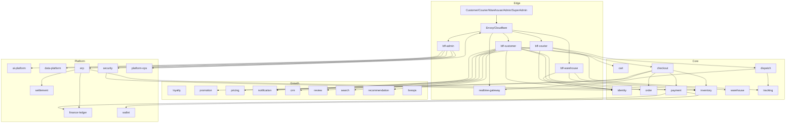
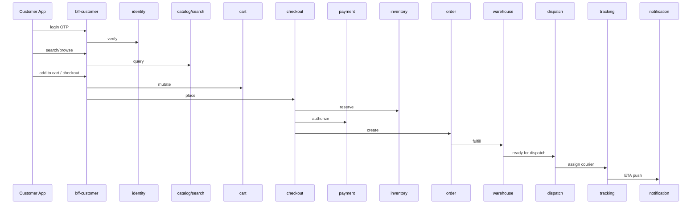

# NEXORA Launch — System Integration & Gap Analysis

> Prompt #30 deliverable. Constitution wins. No architecture redesign.  
> Date: 2026-08-08 · Status: **CONDITIONAL GO** — Wave B edge + cert delivered; production GO pending soak + DR sign-off.

## 1. Complete system dependency graph

## 2. Service interaction (happy path order)

## 3. API dependency matrix (edge → domain)

| Consumer | Depends on (ports / HTTP) |
|----------|---------------------------|
| bff-customer | identity, profile, catalog, search, rec, cart, checkout, order, payment, wallet, loyalty, promo, pricing, notification, crm, review, location, geofence |
| bff-courier | identity, dispatch, tracking, routing, notification, settlement (earnings read) |
| bff-warehouse | identity, warehouse, inventory, order |
| bff-admin | identity, security, erp, platform-ops, data, ai, order, dispatch, crm |
| checkout | cart, inventory, pricing, promotion, payment, order |
| payment | finance-ledger, wallet |
| erp | finance-ledger, inventory, settlement, ai |
| dispatch | routing, tracking, geofence |
| location | geofence, routing |
| recommendation | ai-platform (optional), catalog signals |
| search | catalog index port |
| security | identity trust, vault, opa, fraud facade |
| platform-ops | gitops, cluster, backup |

## 4. Database dependency matrix

| Store | Owners | Consumers (read) |
|-------|--------|------------------|
| Postgres (per-service DB) | each `*-service` | BFFs via API only |
| Redis | session/cart/rate-limit caches | BFFs, identity, cart |
| Kafka | producers across domains | consumers + data-platform |
| OpenSearch | search/catalog projections | search-service |
| ClickHouse | data-platform / analytics | admin dashboards |
| Object (S3/MinIO) | media, backups, evidence | security, platform-ops |
| Vault | secrets | security, platform |

**Rule:** No cross-service FK. Opaque IDs only. Money = int64 minor units.

## 5. Event dependency matrix (Kafka)

| Topic family | Producers | Consumers |
|--------------|-----------|-----------|
| `identity.*` | identity | profile, security, data |
| `order.*` | order | warehouse, notification, data, loyalty, review |
| `payment.*` | payment | ledger, notification, data, erp(AR) |
| `inventory.*` | inventory | warehouse, search, data |
| `dispatch.*` / `tracking.*` | dispatch, tracking | realtime-gateway, notification |
| `crm.*` | crm | notification, data |
| `review.*` | review | search, data |
| `erp.*` | erp | data, security(audit) |
| `security.*` | security | siem, data |
| `platform.*` | platform-ops | data, alerts |
| `ai.*` / `data.*` | ai, data | admin, experiments |

## 6. Deployment topology

- Regions: primary + DR standby (DNS failover)
- Namespaces: `nexora-apps`, `nexora-data`, `nexora-obs`, `nexora-system`, `nexora-ai`
- GitOps: Argo CD ApplicationSet → overlays `staging`/`prod`
- Edge: Cloudflare → Envoy/Istio → BFFs → services
- Data: managed PG/Redis/Kafka preferred; ClickHouse + OpenSearch for analytics/search

## 7. Environment architecture

| Env | Purpose | Data |
|-----|---------|------|
| local | docker-compose deps | ephemeral |
| staging | full stack, canary | anonymized |
| prod | multi-AZ / multi-region ready | encrypted, backups 35d |

## 8. Release roadmap

1. **Wave A (done):** Domain services #09–#29 + infra/GitOps  
2. **Wave B (this prompt):** Edge BFFs + realtime-gateway + integration cert + launch docs  
2b. **Prompt #31:** `liveops-service` (`:8116`) flags/config/experiments/LiveOps calendar (not campaigns/notifications/analytics/AI SoT)  
2c. **Prompt #32:** `supplier-service` (`:8117`) supplier/partner/marketplace/EDI (not ERP AP 3-way, inventory, catalog PIM, payments)  
2d. **Prompt #33:** `quality-service` (`:8118`) + `qa/` gates/certification/automation (not product business logic)  
2e. **Prompt #34:** `global-service` (`:8119`) multi-country/i18n/FX/regional rules (not payments/ledger/maps/CRM)  
2f. **Prompt #35:** `open-platform-service` (`:8120`) developer portal/APIs/webhooks/SDKs (not domain SoT)  
2g. **Prompt #36:** `superapp-service` (`:8121`) mini-apps/plugins/widgets/store/shell (not domain/open-platform/liveops SoT)  
2h. **Prompt #37:** `innovation-service` (`:8122`) innovation lab/sims/twins/IoT/robots (not domain/LiveOps/Super App SoT)  
2i. **Prompt #38:** `enterprise-ops-service` (`:8123`) governance/PMO/BCP/risk/audit (not ERP/security/analytics/infra SoT)  
2j. **Prompt #39:** `hyperscale-cert-service` (`:8124`) + hardening docs/configs (no redesign; certifies ecosystem)  
2k. **Prompt #40:** `autonomy-service` (`:8125`) + Final Genesis (autonomous audits/heal/AI CTO/evolution/governance; no redesign)  
3. **Wave C:** OpenAPI backfill for remaining services; contract CI  
4. **Wave D:** City launch soak + chaos + DR drill sign-off

## 9. Remaining gap analysis (resolved in Prompt #30)

| Gap | Severity | Resolution |
|-----|----------|------------|
| Missing `bff-customer` / courier / warehouse / admin | **Blocker** | Deliver thin aggregation BFFs |
| Missing `realtime-gateway` | **Blocker** | Deliver WS/SSE fanout service |
| OpenAPI missing on many services | High | Catalog + generator checklist; certify via registry |
| `docs/api/error-codes.md` missing | Medium | Create |
| No cross-service smoke/cert harness | High | `tools/integration-cert` |
| Helm lists only 3 services | Medium | Expand registry-driven values |
| Dual-ID prompt collisions | Low | Documented in constitution notes |
| Nested accidental Flutter app copies | Low | Note in audit; do not delete without owners |

## 10. Go / No-Go

**CONDITIONAL GO** when Wave B artifacts land and `tools/integration-cert` + service unit tests pass.  
**NO-GO** if identity/payment/checkout/order/inventory smoke fails or critical CVE open.
