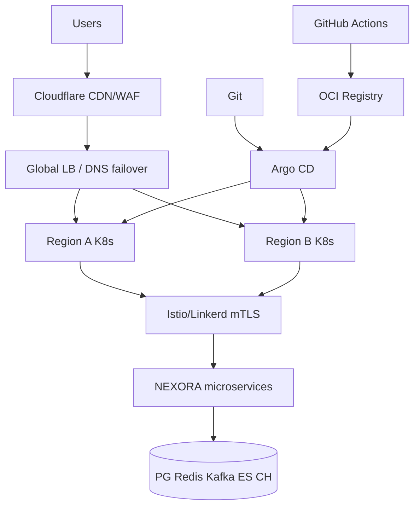
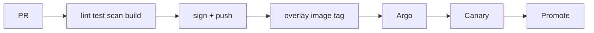
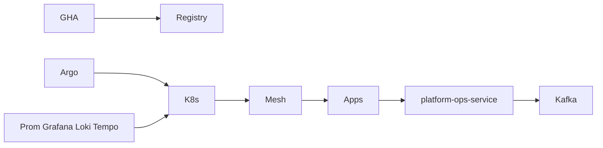

# NEXORA Cloud Platform — Infrastructure, DevOps, Platform Engineering & SRE

> Binding under Master Blueprint §10–11 (`infra/`, `ops/`, `.github/workflows/`) and §7 (`platform-ops-service`).  
> **Hard rules:** Does **not** own application business logic (OMS, payments, catalog, etc.). Orchestrates deploy, scale, observe, recover.  
> GitOps preferred (Argo CD). Multi-cloud ready via Terraform providers + env overlays.

## Mission

Run global Quick Commerce at 99.99% target availability: immutable IaC, Kubernetes, GitOps, zero-downtime strategies, observability stack, DR/backups, SRE error budgets.

## Cloud architecture



## Kubernetes architecture

- Namespaces: `nexora-system`, `nexora-data`, `nexora-apps`, `nexora-obs`, `nexora-ai`
- Workloads: Deployments (stateless), StatefulSets (data), DaemonSets (agents), CronJobs (backup/scan)
- Ingress → Envoy/Istio gateway; NetworkPolicies; Pod Security Standards
- HPA + KEDA; Cluster Autoscaler; PDB for critical services

## Network architecture

- Hub VPC / spoke per env; private subnets for data; public only for ingress
- Service mesh mTLS east-west; Cloudflare WAF north-south
- DNS: geo + health checks; CDN for static/mobile assets

## CI/CD & GitOps



Strategies: rolling · blue/green · canary · shadow · instant rollback via Git revert.

## SRE architecture

- SLIs/SLOs in `ops/slo/`; error budgets; runbooks in `ops/runbooks/`
- `platform-ops-service` records deployments, scaling, backups, alerts, cost snapshots
- Chaos drills + DR runbooks; MTTD/MTTR dashboards via Prometheus/Grafana

## Folder structure

```text
infra/
  ARCHITECTURE.md
  terraform/          # modules + envs
  helm/nexora/        # umbrella chart
  k8s/                # base + overlays
  argocd/             # ApplicationSets
  docker/             # local compose
  mesh/               # Istio/Linkerd snippets
  gateway/            # Envoy/Nginx
  observability/      # Prometheus/Grafana/Loki/Tempo
  backup/             # Velero/cron jobs
  policies/           # Kyverno/OPA gatekeeper samples
ops/
  runbooks/ slo/
.github/workflows/
services/platform-ops-service/   # :8110 control plane API
```

## Dependency graph



## Events

`DeploymentStarted` · `DeploymentCompleted` · `RollbackTriggered` · `ScalingTriggered` · `BackupCompleted` · `RecoveryStarted` · `AlertTriggered`
