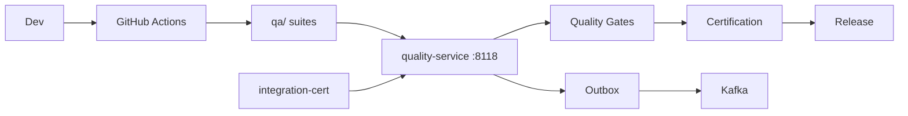
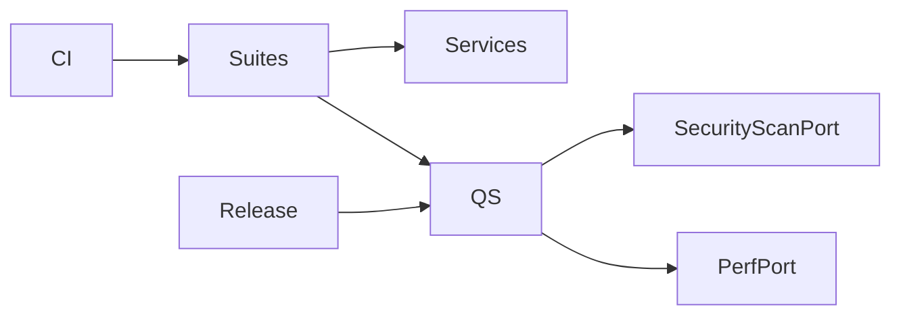
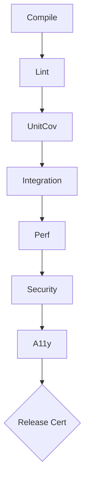

# NEXORA Quality Engineering Platform

> Binding under Master Blueprint §7 (`quality-service`) + `qa/` automation assets.  
> Stack: Go control plane · Playwright · Flutter integration_test · k6 · OWASP ZAP · Allure/JUnit · OTel · GitHub Actions.  
> **Hard rules:** Does **not** own application business logic, product domains, AI model training SoT, or infra provisioning.  
> Orchestrates validation, gates, certification; executes suites via CI/runners; ingests results.

## Mission

Continuously validate every NEXORA component before and after release: unit → integration → E2E → performance → security → accessibility → chaos → AI → observability — with enforceable quality gates and release certification.

## Architecture



## Boundaries

| Owns | Does not own |
|------|----------------|
| Test run registry & results ingest | Domain business rules |
| Quality gate policies & evaluation | Service implementations |
| Release certification records | Terraform apply / GitOps mutate |
| Flaky/coverage/perf/security reports | Production traffic SoT |
| Suite catalogs & schedules | AI model weights |

## Folder structure

```text
services/quality-service/     # control plane API
qa/
  ARCHITECTURE.md
  strategy/
  suites/{unit,integration,e2e,api,ui,perf,security,a11y,chaos,db,infra,ai,obs}
  k6/ playwright/ chaos/ zap/ allure/ fixtures/ reports/
.github/workflows/ci-quality.yml
tools/integration-cert/       # launch cert (existing; extended)
```

## API (`:8118` `/v1/quality/...`)

suites · runs · results · coverage · gates · certifications · flaky · analytics · admin · outbox

## Events

`TestStarted` · `TestCompleted` · `CoverageGenerated` · `QualityGatePassed` · `QualityGateFailed` · `CertificationIssued` · `RegressionCompleted`

## Dependency graph



## Quality gate architecture



## Test strategy (layers)

1. Unit / domain (per-service `go test`)  
2. Contract / API (OpenAPI + integration-cert)  
3. Integration (service+queue+cache)  
4. UI (Playwright admin; Flutter integration_test)  
5. E2E journeys (customer/courier/warehouse/admin/finance/supplier)  
6. Performance (k6 load/stress/spike/soak)  
7. Security (SAST/DAST/ZAP/deps)  
8. Accessibility (WCAG checks)  
9. Chaos (failure injection scenarios)  
10. Shift-right (prod synthetic + SLO burn verification)
