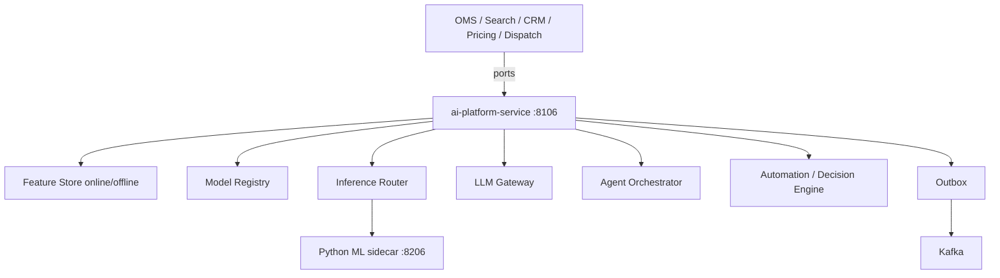
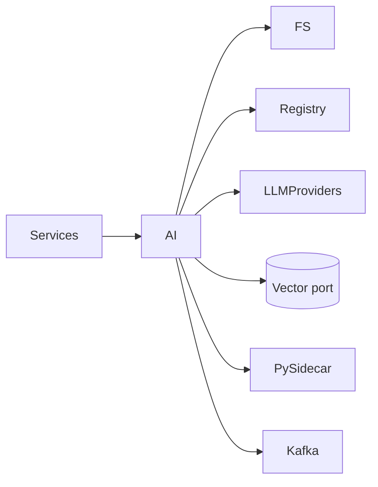

# NEXORA AI Platform — ML, LLM, Agents & Decision Engine

> Binding under Master Blueprint §7 (`ai-platform-service`).  
> Stack: Go (control plane) · Python FastAPI/ONNX sidecar (inference) · PostgreSQL · Redis · Kafka · ClickHouse projections · Vector DB port · Feature Store · MLflow-compatible registry metadata · OTel.  
> **Hard rules:** Does **not** own search index (`search-service`), recommendation rails SoT (`recommendation-service`), CRM tickets (`crm-service`), notifications (`notification-service`), or analytics warehouses.  
> Other domains call this platform via **ports** for embeddings, LLM, fraud scores, forecasts, pricing suggestions, vision/NLP.

## Mission

Centralized AI brain: feature store, model registry/MLOps, real-time & batch inference routing, multi-provider LLM orchestration (RAG/tools/guardrails), multi-agent runtime, automation/decision engine, drift monitoring.

## Architecture



## Feature Store

- Online: low-latency key/value features (Redis-backed in prod; memory in dev)
- Offline: historical snapshots for training (Postgres tables)
- Versioning + lineage metadata + validation hooks

## Model Registry

Versions · stages (`dev`→`staging`→`prod`) · approval · canary/shadow/A-B routing metadata · rollback · metrics history

## Inference

Route by model key → primary / canary / fallback. Real-time sync API + batch job stubs + streaming hook.

## LLM

Providers (mock/openai/anthropic/local), prompt templates, conversation memory, RAG retrieve port, tool/function calling, safety guardrails.

## Agents

`shopping` · `operations` · `warehouse` · `pricing` · `support` · `campaign` · `forecast` · `analytics` · `developer` · `admin`  
Each agent = system prompt + allowed tools + guardrail profile.

## Automation / Decision Engine

Rules (conditions → actions) + AI-assisted decisions + approval gates.

## Boundaries vs domain AI

| Capability | Owner |
|------------|--------|
| Search hybrid retrieve | search-service (calls embeddings here) |
| Rec rails | recommendation-service (may call ranking models here) |
| Support tickets | crm-service (LLM assist via this platform) |
| Push/email | notification-service |
| Fraud score API | ai-platform (fraud models); `fraud-service` may facade later |
| Demand forecast | ai-platform forecast models; `forecasting-service` may facade later |
| Pricing suggestions | ai-platform; human-gated by pricing-service |

## Folder structure

```text
services/ai-platform-service/
  ARCHITECTURE.md README.md FEATURES.md
  cmd/ai-platform-service/
  internal/{config,domain,app,adapters/...}
  ml/          # FastAPI ONNX/heuristic sidecar
  migrations/ api/
```

## API (`:8106` `/v1/ai/...`)

Features · models · infer · llm · agents · automation · forecasts · fraud · vision/nlp stubs · admin · outbox

## Events

`ModelTrained` · `ModelDeployed` · `InferenceCompleted` · `PredictionGenerated` · `FeatureUpdated` · `AgentExecuted` · `AutomationTriggered` · `DriftDetected`

## Dependency graph


