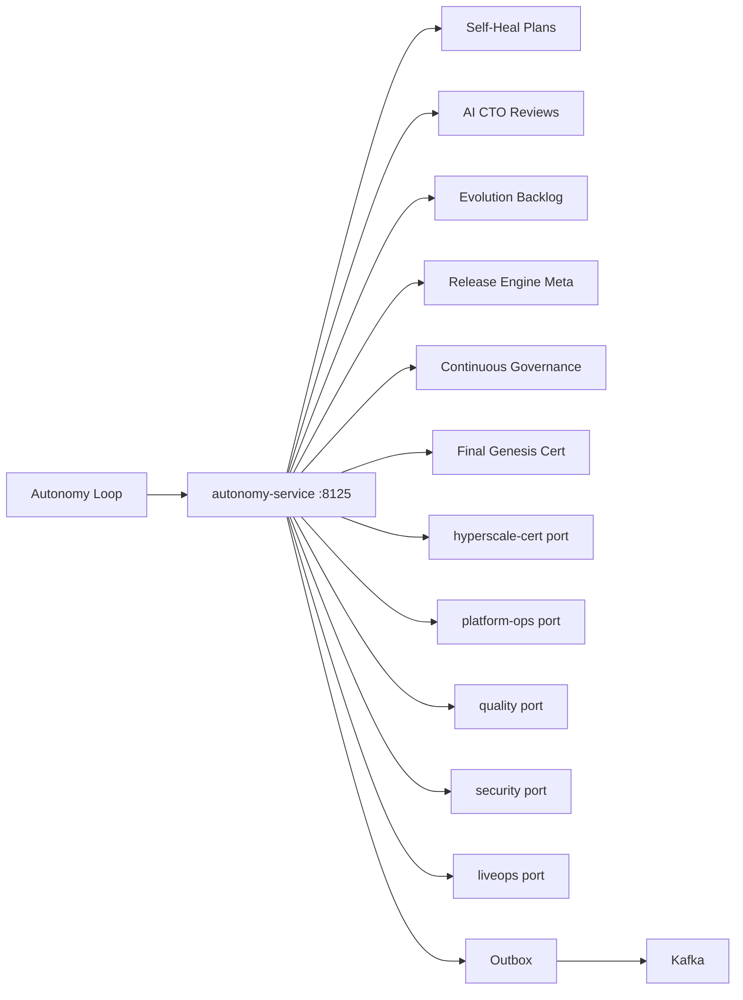
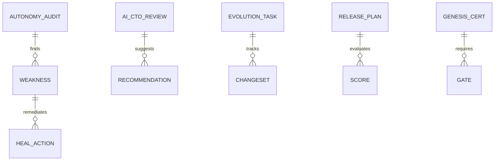

# NEXORA Autonomous Enterprise Delivery, Self-Evolution & Final Genesis

> Binding under Master Blueprint §7 (`autonomy-service`).  
> **Hard rules:** Does **not** redesign architecture, rebuild modules, replace platform-ops apply, quality gates SoT, security GRC, hyperscale cert SoT, LiveOps flags, or domain SoTs.  
> Owns autonomous audit orchestration, self-healing *action plans*, AI CTO reviews, evolution backlog, continuous governance loops, executive AI assistant registry, digital org team registry, and **Final Genesis** certification.

## Mission

Make the completed ecosystem autonomously operable: monitor → detect → remediate → optimize → document → certify — with minimal human intervention (except legally required approvals).

## Architecture



## Boundaries

| Owns | Does not own |
|------|----------------|
| Autonomy audit + dependency graph *snapshot* | Source-of-truth service code |
| Self-heal action registry + scoring | K8s mutation / actual restarts SoT |
| AI CTO review records | Human architectural SoT |
| Evolution / tech-debt backlog | Automatic PR merge SoT |
| Release autonomy *plans* | Argo/GitOps apply SoT |
| Executive AI assistant *registry* | LLM model serving SoT |
| Final Genesis certificate | Hyperscale cert SoT (port) |

## Folder structure

```text
services/autonomy-service/
docs/autonomy/
ops/autonomy/
qa/autonomy/
tools/genesis-cert/
```

## API (`:8125` `/v1/autonomy/...`)

audit · heal · reviews · evolution · release · governance · assistants · org · genesis · admin · outbox

## Events

`AutonomyAuditCompleted` · `SelfHealExecuted` · `AICTOReviewCompleted` · `EvolutionTaskCreated` · `AutonomousReleaseScored` · `GenesisCertified`

## ER


