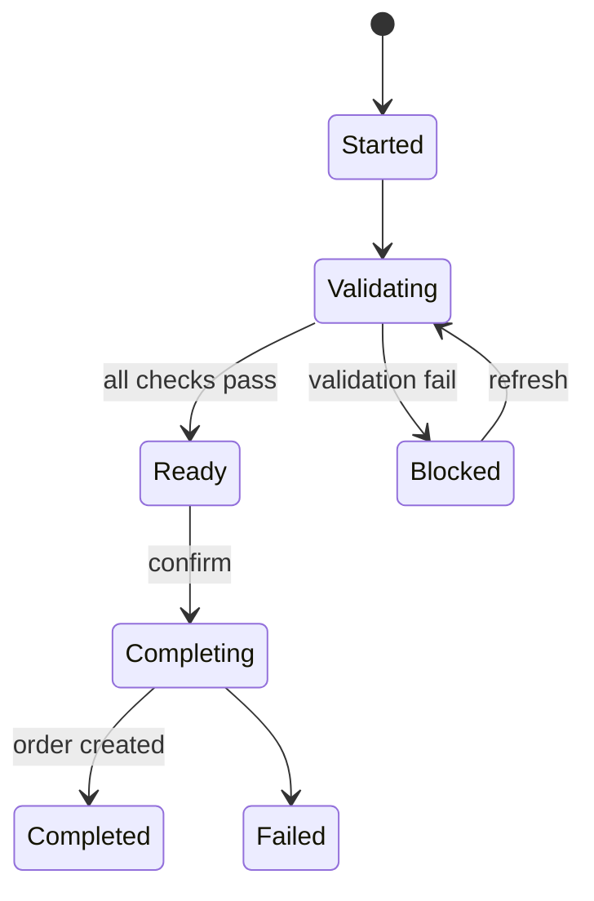
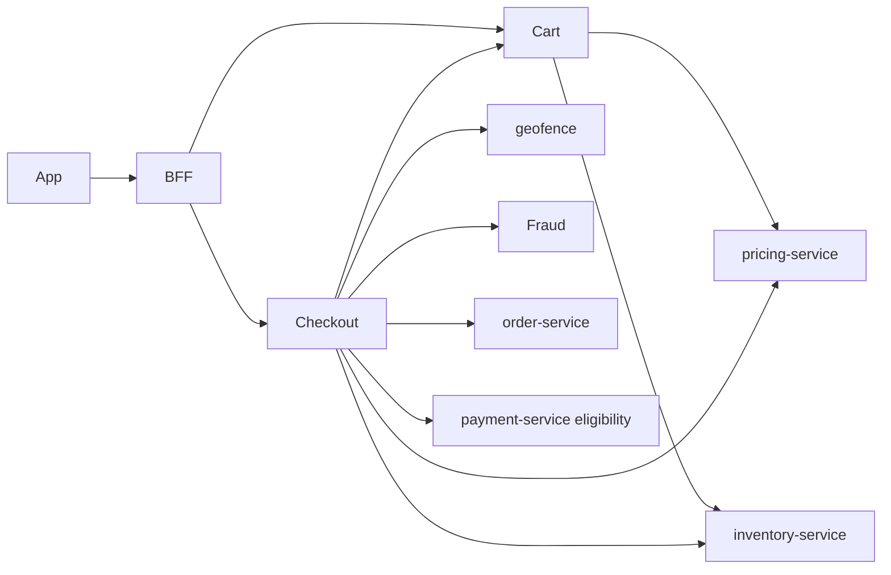

# NEXORA Cart & Checkout Platform — Architecture

> Binding under Master Blueprint §7 (`cart-service`, `checkout-service`).  
> **Hard rules:** No product master (`catalog-service`), no stock ledger (`inventory-service`), no order aggregate (`order-service`), no PSP charges (`payment-service`).  
> Cart/Checkout **preview & orchestrate** via ports: Pricing quote, Inventory ATP/SoftReserve, Geofence zone, Fraud score, Promo eligibility, Order CreateFromCheckout.

## Mission

Real-time cart persistence (guest + auth, merge, offline sync), checkout session validation pipeline, fee/tax/promo **preview**, abandoned-cart recovery — millions of concurrent shoppers.

## Service boundaries

| Service | Owns | Does not own |
|---------|------|----------------|
| `cart-service` | Cart aggregate, lines, coupons applied on cart, wishlist→cart, merge, recommendations attach | Prices SoT, stock SoT, orders |
| `checkout-service` | Checkout session, address/slot/gift/invoice prefs, validation pipeline, recovery | Payment capture, OMS saga |

## Cart architecture

```text
Cart (guest_id | principal_id, tenant_id, city_id)
  ├── Lines (variant_id, qty, notes, addons, replacement prefs)
  ├── Applied coupons / gift cards (preview codes)
  ├── Quote snapshot (minor units) — refreshed via PricingClient
  └── Soft reservation ids (opaque) — via InventoryClient
```

Merge: on login, guest cart ∪ auth cart (qty sum, conflict policy).

## Checkout architecture



Validation pipeline (ordered): customer → address/zone → inventory ATP → price refresh → coupon → age/region → fraud/risk → payment eligibility → duplicate detect → min order.

Complete → `order-service` CreateFromCheckout (idempotent) — does **not** run full place saga here (OMS owns place); checkout may trigger PlaceOrder port optionally.

## Pricing preview

`PricingClient.Quote(cart|checkout)` returns line prices, discounts, tax, delivery, service, packaging, tips — all **minor units**. Cart stores last quote + `quotedAt` + `quoteId`.

## Folder structure

```text
services/cart-service/
services/checkout-service/
  ARCHITECTURE.md (this file shared conceptually; each has README)
  cmd/... internal/{domain,app,adapters} migrations/ api/ proto/
```

## APIs

### Cart `:8087` `/v1/cart/...`
- GET/PUT cart, add/update/remove line, apply/remove coupon  
- merge, save-for-later, recommendations, refresh-quote, abandon mark  

### Checkout `:8088` `/v1/checkout/...`
- start from cart, patch address/slot/gift/invoice/substitutions  
- validate, refresh, complete, recover abandoned  
- admin: explorer, abandonment metrics  

## Events

`cart.lifecycle` — CartCreated/Updated, ItemAdded/Removed, CouponApplied, CartRecovered  
`checkout.lifecycle` — CheckoutStarted/Validated/Completed/Failed  

## Dependency graph



## Money

Integer minor units + currency only.
