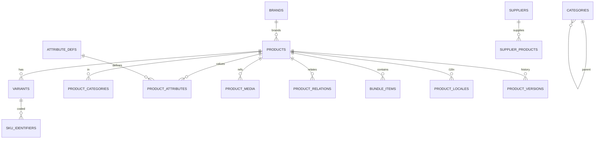
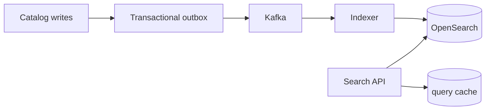
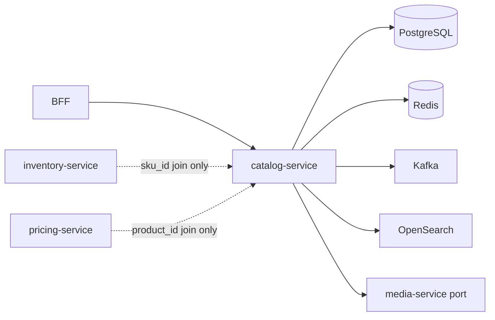

# NEXORA Catalog Service — PIM & Product Catalog Architecture

> Binding under Master Blueprint §7 (`catalog-service`).  
> Stack: **Go** · PostgreSQL · Redis · OpenSearch · Kafka · Object Storage (via `media-service` port) · ClickHouse projections · REST · gRPC · OTel.  
> **Hard rules:** Do **not** own stock quantities (`inventory-service`), sellable prices/tax (`pricing-service`), or orders. Catalog stores **product truth** + media refs + publish state.

## Mission

Enterprise PIM / headless catalog SoT for millions of SKUs across tenants, countries, brands, suppliers, and channels — searchable, versioned, approval-gated, AI-ready.

## Service boundaries

| Owns | Does **not** own |
|------|------------------|
| Master products, variants, SKUs, bundles/kits | On-hand / reserved qty (`inventory-service`) |
| Categories, collections, brands | Base/city/dynamic price (`pricing-service`) |
| Attributes & localized content | Cart / order lines |
| Media **references** + CDN URLs | Binary upload policy engine (`media-service`) |
| Relations, SEO, compliance flags | Search ranking ML serve (`search-service` may re-index) |
| Supplier product links (metadata) | Supplier settlement contracts (finance) |
| Publish workflow + versions | Warehouse pick paths |

## Product taxonomy

```text
Product (master)
  ├── kind: standard|bundle|kit|pack|subscription|digital|gift|seasonal|limited
  ├── Variants[] (option axes: color, size, flavor…)
  │     └── SKU codes: barcode, EAN, UPC, GTIN, internal, supplier, warehouse
  ├── Bundle components (static|dynamic)
  ├── Attribute values (schema-driven)
  ├── Localized content + SEO
  ├── Media assets[]
  ├── Relations[] (related, alt, accessory, replacement, complementary)
  ├── Category memberships + collections
  ├── Brand / manufacturer
  ├── Supplier links
  ├── Compliance (age, hazard, pharmacy, food, country)
  └── Versions + approval trail
```

## ER (logical)



## Folder structure

```text
services/catalog-service/
  ARCHITECTURE.md README.md FEATURES.md
  cmd/catalog-service/
  internal/{config,domain,app,adapters/{http,grpc,postgres,redis,kafka,search,media}}
  migrations/ api/openapi/ proto/ configs/
  docker-compose.yml Dockerfile Makefile
```

## API contracts (`/v1/catalog/...`)

| Area | Examples |
|------|----------|
| Products | CRUD, publish, archive, schedule |
| Variants / SKUs | CRUD, barcode lookup |
| Categories | tree CRUD, collections |
| Brands | CRUD + assets meta |
| Attributes | defs + product values |
| Media | attach/detach refs |
| Bundles | compose |
| Relations | set |
| SEO / locales | upsert |
| Workflow | submit, approve, reject, publish, rollback |
| Import/Export | jobs |
| Search | query, suggest, reindex |
| Admin | explorer, bulk edit, duplicates |
| AI | describe, translate, categorize, quality score (ports) |
| Health | `/health` `/ready` |

## Events (Kafka)

`catalog.product.lifecycle` — ProductCreated/Updated/Published/Archived  
`catalog.variant.events` — VariantCreated/Updated  
`catalog.bundle.events` — BundleCreated/Updated  
`catalog.media.events` — MediaAttached  
`catalog.category.events` — CategoryChanged  
`catalog.brand.events` — BrandChanged  
`catalog.index.commands` — ReindexProduct  

## Search architecture



Documents: `productId`, `tenantId`, `sku`, `barcodes[]`, `title`, `brand`, `categoryIds[]`, `attributes`, `status`, `locales`, facets.

## Media architecture

Client → `media-service` (upload) → CDN URL → catalog stores `ProductMedia` ref (type image|video|360|ar|pdf|audio). Optimization/versioning owned by media-service; catalog versions the **association**.

## Dependency graph



## Status & workflow

`draft → pending_review → approved → published` · also `hidden|archived|deleted|scheduled`  
Roles (enforced at BFF/IAM): author, reviewer, approver, publisher. Audit + version diff + rollback.
