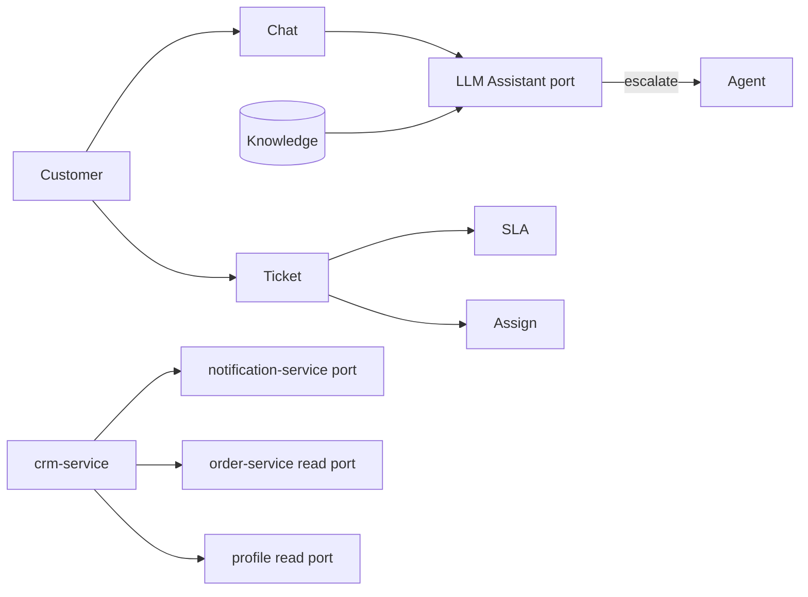
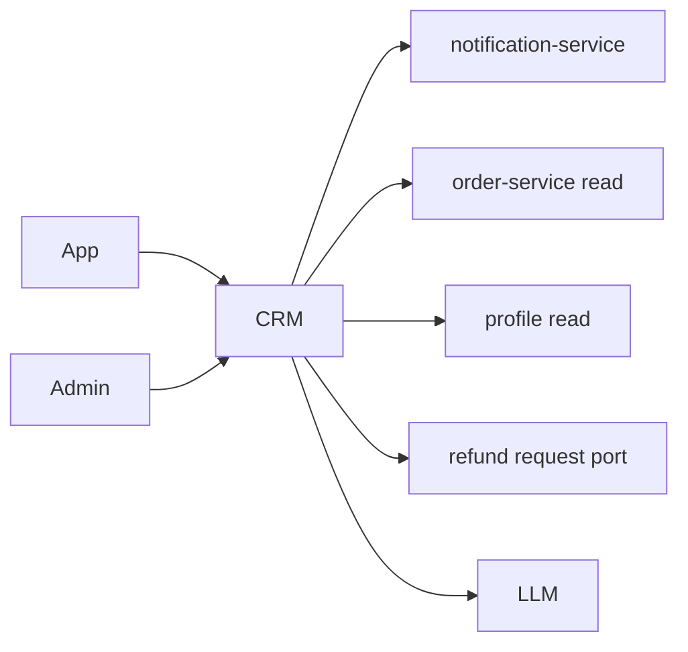

# NEXORA CRM Service — Support & AI Contact Center Architecture

> Binding under Master Blueprint §7 (`crm-service`; AI bot orchestration may later split to `chat-assistant-service`).  
> Stack: Go · PostgreSQL · Redis · Kafka · OpenSearch · ClickHouse projections · WebSocket-ready APIs · gRPC · REST · OTel · LLM port.  
> **Hard rules:** Does **not** own notifications (`notification-service`), order aggregate, payments/refunds execution (`payment-service` / OMS), or customer profile SoT (`customer-profile-service`).  
> Customer 360 = **read aggregation** via ports (orders/payments/loyalty opaque summaries).

## Mission

Enterprise help desk: tickets, live chat, AI assistant, knowledge base, cases, SLA/escalation, CSAT/NPS, agent workforce — omnichannel, real-time, multi-tenant.

## Architecture



## Ticket lifecycle

`open → pending → in_progress → waiting_customer → resolved → closed` (+ `reopened`)  
Merge/split supported. Priority + category drive SLA clocks.

## Live chat

Conversation with messages; typing/read stubs; transfer to agent; AI first-line with human takeover.

## AI assistant

Intent detect → KB retrieve → draft reply → optional tool calls (order lookup port) → escalate if low confidence / negative sentiment.

## Knowledge base

Articles with locales, tags, versioning, publish workflow.

## Folder structure

```text
services/crm-service/
  ARCHITECTURE.md README.md FEATURES.md
  cmd/crm-service/
  internal/{config,domain,app,adapters/...}
  migrations/ api/openapi/ proto/
```

## API (`:8102` `/v1/crm/...`)

Tickets, chats, messages, KB, cases, SLA policies, agents/teams, feedback (CSAT/NPS), Customer360 aggregate, AI ask/escalate, admin stats.

## Events

TicketCreated/Assigned/Escalated/Closed, ChatStarted/Ended, ComplaintCreated, RefundRequested (request only → OMS/payment ports), FeedbackReceived, CSATCompleted

## Dependency graph


