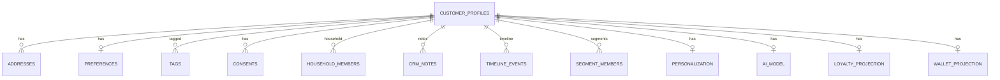
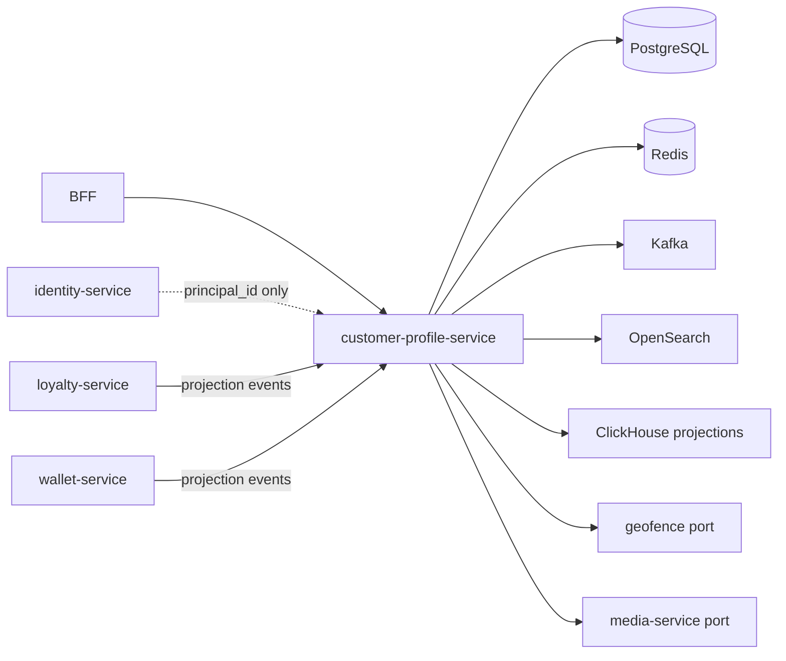

# NEXORA Customer Profile Service — Domain Architecture

> Binding under Master Blueprint §7 (`customer-profile-service`).  
> Stack: **Go** · PostgreSQL · Redis · Kafka · OpenSearch (search) · ClickHouse (analytics projections) · gRPC · REST · OTel.  
> **Hard rule:** Authentication, credentials, sessions, devices, and IAM RBAC live only in `identity-service`. This service stores **profile & CRM data** keyed by `principal_id`.

## Mission

Single source of truth for customer profile, preferences, addresses, consents, household, tags, CRM notes/timeline, personalization, and privacy workflows — multi-tenant, privacy-first, event-driven.

## Microservice boundaries

| Owns | Does **not** own |
|------|------------------|
| Profile attributes, avatar refs | Passwords, OTP, JWT, sessions (`identity-service`) |
| Addresses + delivery notes | Geofence/zone polygons (`geofence-service`) — validates via port |
| Preferences, consents | Notification delivery (`notification-service`) |
| Tags, CRM notes, timeline events | Support tickets lifecycle (`crm-service`) — links by id |
| Segment membership cache / local dynamic rules | Heavy ML segmentation batch (`segmentation-service`) |
| Loyalty/wallet **profile projections** | Points ledger (`loyalty-service`), wallet ledger (`wallet-service`) |
| Personalization profile vectors | Ranking inference (`recommendation-service`) |

## Domain model

```text
CustomerProfile (principal_id, tenant_id)
  ├── Personal fields + accessibility + dietary
  ├── Preferences (brands, categories, delivery, notify, theme…)
  ├── Addresses[]
  ├── Media (avatar versions)
  ├── Tags[]
  ├── Household + members + sharing flags
  ├── Consents[] + privacy requests
  ├── CRM notes + timeline
  ├── Segment memberships
  ├── Personalization profile
  ├── AI customer model (scores)
  └── Activity log (profile-side)
```

## ER (logical)



## Folder structure

```text
services/customer-profile-service/
  ARCHITECTURE.md
  README.md FEATURES.md
  cmd/customer-profile-service/
  internal/
    config/
    domain/
    app/ ports/ memory/
    adapters/ http/ grpc/ postgres/ redis/ kafka/ search/
  migrations/
  api/openapi/
  proto/
  configs/
  docker-compose.yml Dockerfile Makefile
```

## API contracts (REST `/v1/profile/...`)

| Area | Endpoints |
|------|-----------|
| Profile | `GET/PATCH /customers/{id}`, `POST /customers` (provision after IAM) |
| Me | `GET/PATCH /me` (principal from trusted header / gateway) |
| Addresses | CRUD `/customers/{id}/addresses` |
| Preferences | `GET/PUT /customers/{id}/preferences` |
| Avatar | `POST /customers/{id}/avatar`, `DELETE ...` |
| Tags | `GET/POST/DELETE /customers/{id}/tags` |
| Household | `/customers/{id}/household` |
| Consents | `/customers/{id}/consents` |
| CRM | notes, timeline, 360 aggregate |
| Segments | list/assign/evaluate |
| Personalization | get/update |
| AI model | get (read) / recompute (admin) |
| Privacy | export, delete request |
| Admin | search, merge, duplicates |
| Health | `/health`, `/ready` |

gRPC: `GetProfile`, `GetPreferences`, `ListAddresses`, `CheckConsent`, `GetPersonalization`.

## Event contracts (Kafka)

| Topic | Events |
|-------|--------|
| `customer.profile.lifecycle` | CustomerCreated, CustomerUpdated, ProfileDeleted |
| `customer.address.events` | AddressAdded, AddressUpdated, AddressRemoved |
| `customer.preference.events` | PreferenceChanged |
| `customer.media.events` | AvatarUpdated |
| `customer.consent.events` | ConsentChanged |
| `customer.segment.events` | SegmentChanged |
| `customer.privacy.events` | ExportRequested, DeletionRequested |

Payloads: camelCase JSON, `eventId`, `occurredAt`, `tenantId`, `principalId`, `traceId`.

## Dependency graph



## Privacy & security

- Encrypt sensitive fields at rest (PII columns / app-level envelope)
- Mask PII in logs; audit every admin read/write
- Rate limit export/delete
- Fine-grained permissions enforced at BFF/gateway using IAM tokens — this service trusts `X-Nexora-User` / mTLS service calls
