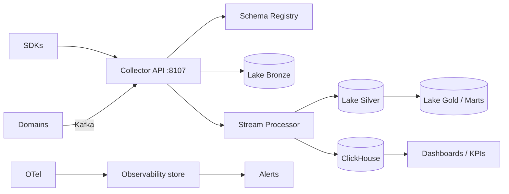
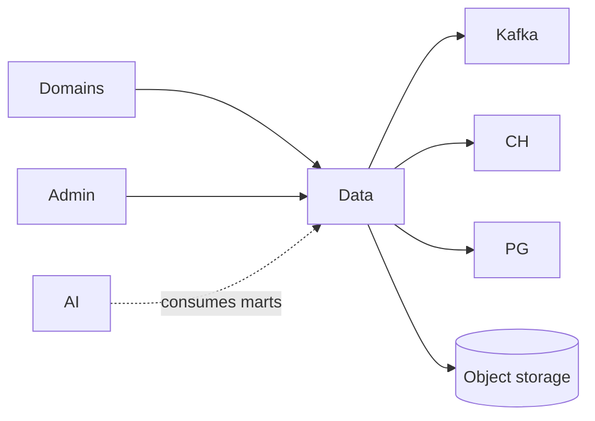
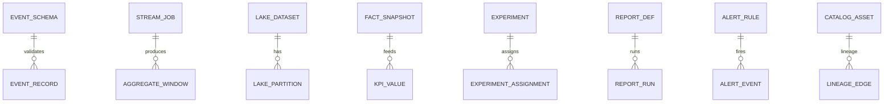

# NEXORA Data Platform — Analytics, BI, Observability & Decision Intelligence

> Binding under Master Blueprint §7 (`data-platform-service`).  
> Stack: Go · Kafka · ClickHouse (OLAP) · PostgreSQL (control plane) · Redis · Object storage / Iceberg metadata · OpenTelemetry · Prometheus-compatible metrics ingest · gRPC · REST.  
> **Hard rules:** Does **not** own AI model training SoT (`ai-platform-service`), CRM tickets, payments ledger, or search index. Ingests **events and metrics** from those domains; produces marts/KPIs/dashboards/reports.

## Mission

Single metrics SoT: event collection, schema registry, streaming aggregates, medallion lake, warehouse facts/dims, real-time KPIs, experimentation, reporting, observability (traces/logs/metrics), alerting, data quality & governance.

## Architecture



## Medallion lake

| Layer | Content |
|-------|---------|
| Bronze | Raw validated events |
| Silver | Deduped, enriched, typed |
| Gold | Business marts / KPI-ready |

## Warehouse (star)

Facts: `fact_orders`, `fact_payments`, `fact_deliveries`, `fact_sessions`, `fact_search`, `fact_support`  
Dims: `dim_date`, `dim_city`, `dim_product`, `dim_customer_segment`, `dim_courier`, `dim_warehouse`

## Observability

Ingest OTel-like spans/logs/metrics → store → SLOs/alerts. Not a replacement for Grafana/Prometheus deploy; provides API + retention metadata.

## Folder structure

```text
services/data-platform-service/
  ARCHITECTURE.md README.md FEATURES.md
  cmd/data-platform-service/
  internal/{config,domain,app,adapters/...}
  schemas/events/ migrations/ api/
```

## API (`:8107` `/v1/data/...`)

Events · schemas · stream jobs · lake datasets · warehouse query · KPIs · realtime · experiments · reports · observability · alerts · catalog · quality · admin

## Events (outbound)

`EventIngested` · `SchemaRegistered` · `AggregateUpdated` · `MartRefreshed` · `ReportGenerated` · `ExperimentDecided` · `AlertFired` · `QualityFailed`

## Dependency graph



## ER (control plane)


