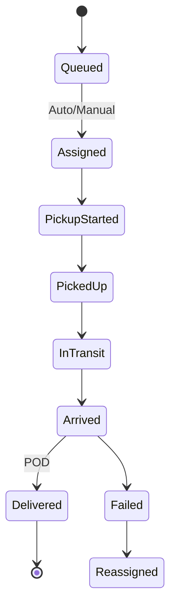
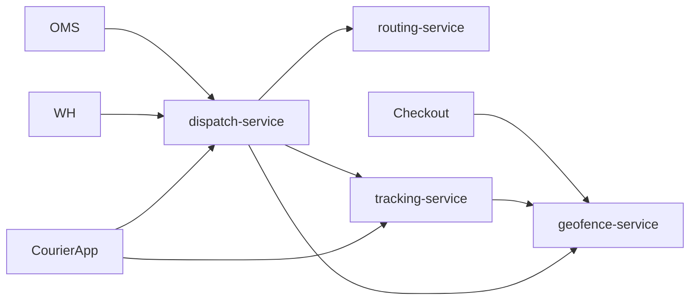

# NEXORA Delivery / Dispatch / Fleet Platform — Architecture

> Binding under Master Blueprint §7: `dispatch-service`, `routing-service`, `tracking-service`, `geofence-service`.  
> **Hard rules:** No order aggregate (`order-service`), no pick/pack (`warehouse-service`), no stock ledger, no courier mobile UI (`apps/mobile_courier`).  
> Opaque refs: `order_id`, `fulfillment_id`, `courier_principal_id`, `warehouse_id`.

## Mission

Real-time DMS: assign couriers, optimize routes/ETA, stream tracking, manage fleet & zones — AI-assisted, multi-tenant, low latency.

## Service map

| Service | Port | Owns |
|---------|------|------|
| `dispatch-service` | `:8096` | Dispatch jobs, assignment strategies, reassign, batch/express/scheduled, fleet vehicles registry, courier availability snapshot |
| `routing-service` | `:8097` | Route plans, multi-stop optimize (heuristic), ETA estimates, traffic/weather hint ports |
| `tracking-service` | `:8098` | Live courier locations, delivery timeline projections, geofence enter/exit events |
| `geofence-service` | `:8099` | Delivery polygons/radius zones, serviceability checks, restricted zones |

## Dispatch workflow



Assignment: nearest / best-score (distance + load + rating + vehicle fit + shift).

## Routing / ETA

Route = ordered waypoints (warehouse → stops). ETA = base travel + traffic factor + courier behavior factor (ports/stubs). Maps provider = port (Google stub).

## Tracking

Courier apps push GPS → tracking-service → Redis latest + Kafka events → BFF WebSocket. Arrival = distance to dropoff < threshold or geofence enter.

## Folder structure

```text
services/dispatch-service/
services/routing-service/
services/tracking-service/
services/geofence-service/
```

## Dependency graph



## Events

`dispatch.*` — DispatchCreated, CourierAssigned, PickupStarted/Completed, DeliveryStarted/Completed/Failed, CourierReassigned  
`routing.*` — RouteUpdated, ETAUpdated  
`tracking.*` — LocationUpdated, GeofenceEnter/Exit  
`geofence.*` — ZoneChanged  

## Money

No payments here. Tips display only if passed as opaque metadata.
