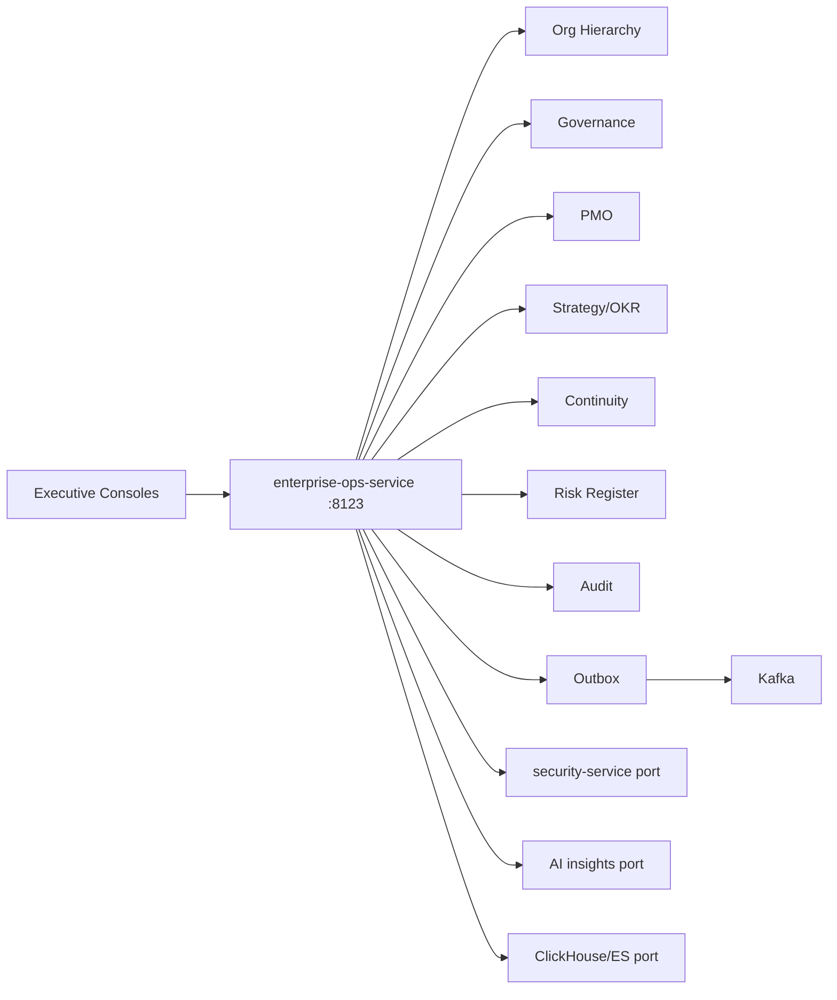
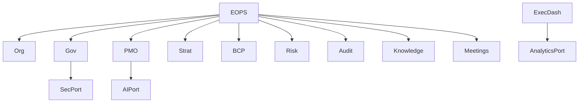
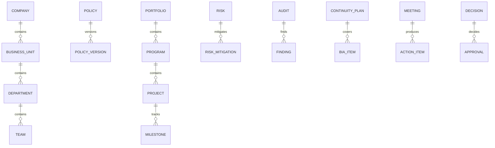

# NEXORA Enterprise Operations, Business Continuity & Global Governance Platform

> Binding under Master Blueprint §7 (`enterprise-ops-service`).  
> Stack: Go · PostgreSQL · Redis · Kafka · ClickHouse/ES analytics *ports* · gRPC/REST · OTel.  
> **Hard rules:** Does **not** own ERP GL/AP/AR, security GRC SoT (`security-service`), analytics warehouse SoT (`data-platform`), platform-ops/infra SoT, identity sessions, or payment ledger.  
> Owns org hierarchy, corporate governance workflows, PMO portfolios, strategic OKR/KPI *registers*, BCP/DR *governance*, enterprise risk register (ops/strategic), policy lifecycle, internal audit schedules/findings, executive decision support views, resource capacity *plans*, knowledge/playbook catalog.

## Mission

Govern the organization: structure, strategy execution, PMO, policies, audits, business continuity, and executive decision support — production-ready and multi-company.

## Architecture



## Boundaries

| Owns | Does not own |
|------|----------------|
| Companies / BU / dept / team hierarchy | IAM users SoT |
| Policy lifecycle + approvals | Security OPA/Zero Trust SoT |
| PMO programs/projects/portfolios | ERP project accounting SoT |
| OKR/KPI registers | Analytics warehouse facts |
| BCP / continuity activation | platform-ops DR runbooks SoT |
| Enterprise risk register (ops/strategic) | Fraud / threat intel SoT |
| Internal audit findings & CAPA | External auditor tooling |
| Executive dashboard *aggregation* | Real-time infra metrics SoT |

## Folder structure

```text
services/enterprise-ops-service/
docs/enterprise-ops/
qa/enterprise-ops/
```

## Dependency graph



## API (`:8123` `/v1/enterprise/...`)

org · governance · policies · pmo · strategy · continuity · risk · audit · meetings · decisions · knowledge · resources · executive · admin · outbox

## Events

`PolicyApproved` · `ProjectCreated` · `RiskIdentified` · `AuditCompleted` · `MeetingScheduled` · `DecisionRecorded` · `ContinuityPlanActivated`

## ER


