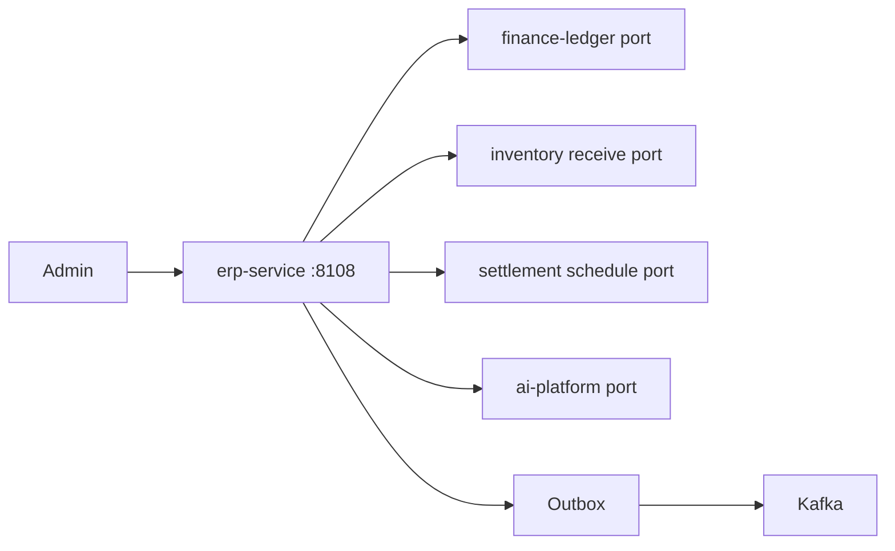
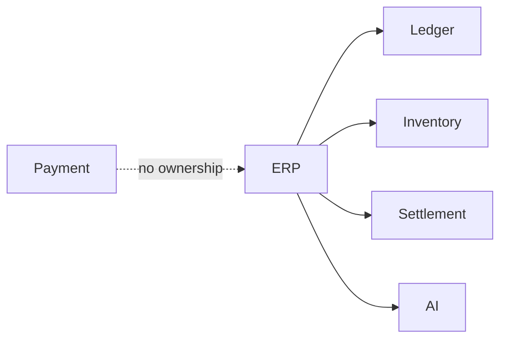
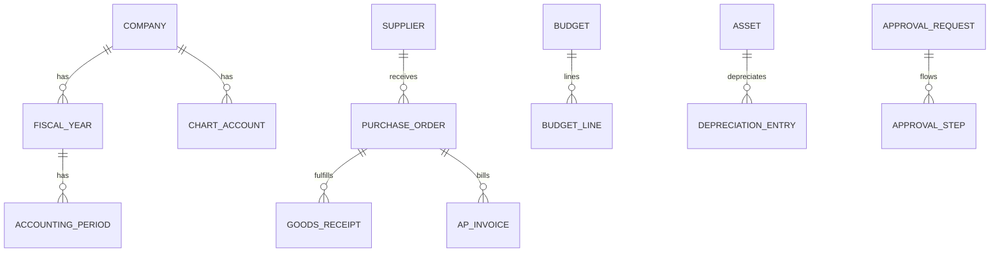

# NEXORA ERP Service — Accounting, Procurement, Treasury & Corporate Finance

> Binding under Master Blueprint §7 (`erp-service`).  
> Stack: Go · PostgreSQL · Redis · Kafka · ClickHouse projections · gRPC · REST · OTel.  
> **Hard rules:** Does **not** own payment intents/PSP (`payment-service`), wallets (`wallet-service`), settlement payout execution (`settlement-service`), or inventory stock ledger (`inventory-service`).  
> Double-entry posting goes through **`finance-ledger-service` port**. Money: **int64 minor units**. Multi-company / multi-currency.

## Mission

Enterprise ERP: chart of accounts & periods, AR/AP ops, treasury & bank reconciliation, budgeting, procurement (PR→PO→GRN→3-way match), suppliers, fixed assets, tax returns, expense/approvals, payroll integration stubs, AI decision ports.

## Architecture



## Boundaries

| Owns | Does not own |
|------|----------------|
| Fiscal periods, COA mapping, AP/AR docs | Payment capture/refund |
| Budgets, approvals, expenses | Wallet balances |
| Procurement & suppliers | Stock quantities SoT |
| Treasury bank books & reconciliation | PSP tokens |
| Fixed assets & depreciation schedules | Courier settlement batch execution |
| Corporate tax return packs | CRM / catalog |

## Folder structure

```text
services/erp-service/
  ARCHITECTURE.md README.md FEATURES.md
  cmd/erp-service/
  internal/{config,domain,app,adapters/...}
  migrations/ api/
```

## API (`:8108` `/v1/erp/...`)

Companies · periods · accounts · journals · AP/AR · treasury · budgets · suppliers · procurement · assets · tax · expenses · approvals · payroll · AI hints · admin

## Events

`JournalCreated` · `InvoiceApproved` · `BudgetApproved` · `PurchaseOrderCreated` · `SupplierAdded` · `PaymentScheduled` · `AssetCreated` · `TaxCalculated`

## Dependency graph



## ER (logical)


