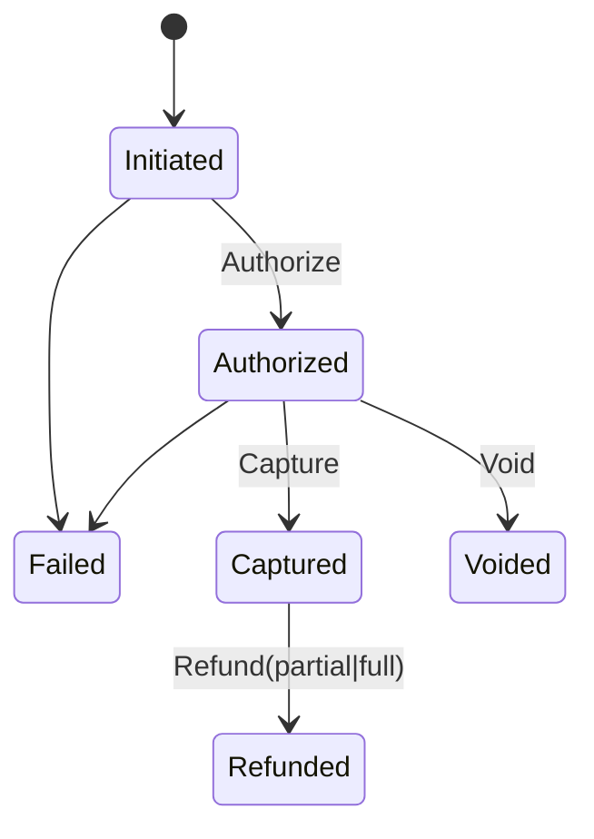
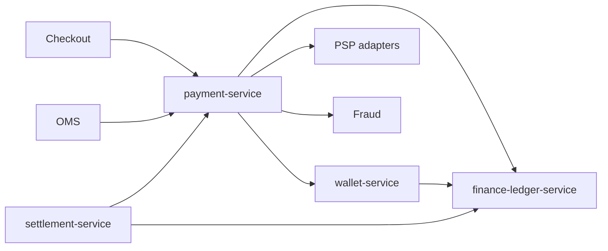

# NEXORA FinTech Platform — Architecture

> Binding under Master Blueprint §7: `payment-service`, `wallet-service`, `finance-ledger-service`, `settlement-service`.  
> **Hard rules:** No order aggregate, no cart, no inventory, no loyalty points engine (wallet may hold opaque promo/cashback balances credited by other services).  
> Money: **int64 minor units** + ISO currency. Never float. Idempotency-Key on all money mutations.

## Mission

PCI-DSS-ready payment orchestration, customer wallets, immutable double-entry ledger, settlements, invoicing/tax hooks, refunds, reconciliation, fraud scoring ports — strong consistency on money paths.

## Service map

| Service | Port (dev) | Responsibility |
|---------|------------|----------------|
| `payment-service` | `:8089` | Intents, authorize/capture/void, PSP routing/failover, refunds, chargebacks, fraud score port, SCA/PSD2 hooks |
| `wallet-service` | `:8090` | Customer wallet accounts & balances (cash/refund/promo/cashback/gift), holds, transfers |
| `finance-ledger-service` | `:8091` | Double-entry journal, accounts chart, immutable entries, tax lines, invoices metadata |
| `settlement-service` | `:8092` | Courier/supplier/merchant/partner settlement batches & reconciliation |

## Payment architecture



- Tokenization: store **payment method tokens** only (PAN never persisted). HSM/KMS port for keys.  
- Routing: method → provider preference → failover.  
- Eligibility API for checkout (no charge).

## Wallet architecture

Accounts per principal: `cash`, `refund`, `promo`, `cashback`, `gift`.  
Operations: credit, debit, hold, release, transfer — ledgered locally + emit events for finance-ledger.

## Ledger architecture (double-entry)

Every financial event posts ≥2 journal lines (debit/credit) balancing to zero. Append-only. Accounts: asset/liability/revenue/expense/clearing.

## Settlement architecture

Aggregate payable periods → batch → approve → payout instruction (bank/PSP port) → reconcile vs provider reports.

## Fraud architecture

Velocity, device, amount, duplicate fingerprint → RiskScore 0–100 → allow/challenge/block. AML/sanctions = async hooks.

## Folder structure

```text
services/payment-service/
services/wallet-service/
services/finance-ledger-service/
services/settlement-service/
```

Each: `ARCHITECTURE.md` (or reference this), `cmd/`, `internal/`, `migrations/`, `api/openapi/`, `proto/`, Docker, tests.

## Dependency graph



## Events

`payment.*` — PaymentInitiated/Authorized/Captured/Failed, RefundRequested/Completed, ChargebackCreated  
`wallet.*` — WalletCredited/Debited  
`ledger.*` — JournalPosted, InvoiceGenerated  
`settlement.*` — SettlementCompleted  

## Security

- No raw card data in logs/DB  
- Encrypt tokens at rest  
- Audit every money mutation  
- Dual-control stubs for high-value refunds/settlements  
- Rate limits on authorize/refund
