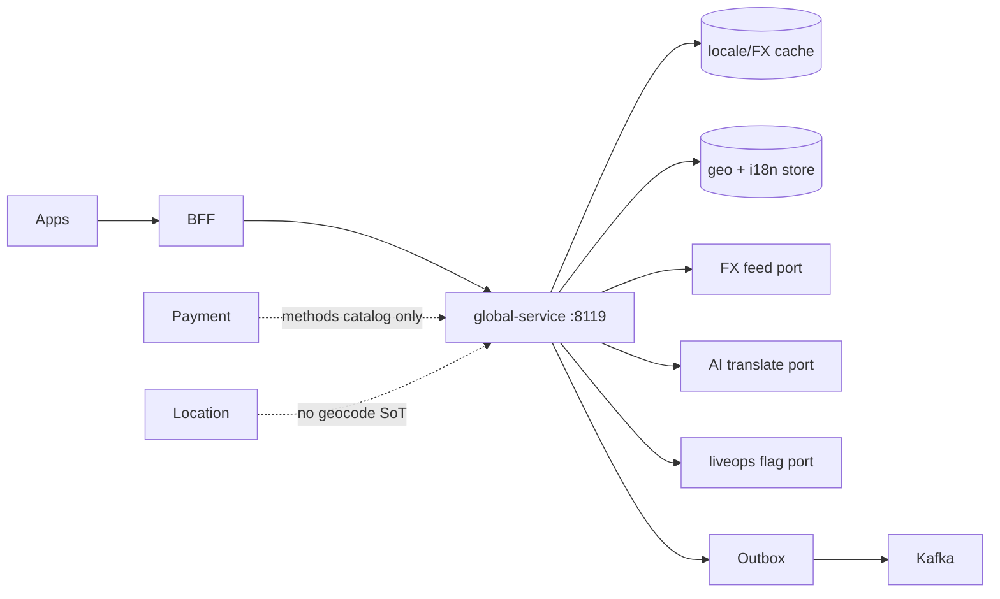
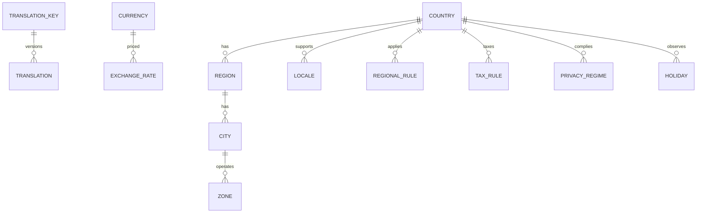

# NEXORA Global Operations & Localization Platform

> Binding under Master Blueprint §7 (`global-service`).  
> Stack: Go · PostgreSQL · Redis · Kafka · OpenSearch projections · ClickHouse metrics · gRPC · REST · OTel.  
> **Hard rules:** Does **not** own payment capture/PSP (`payment-service`), ledger/settlement/tax returns SoT (`finance-ledger`/`erp`/`settlement`), geocoding/maps SoT (`location-service`), or CRM tickets.  
> Owns country hierarchy, locales/translations, FX display rates, regional business/tax/privacy *rules*, payment-method *availability*, logistics *policy* hints.

## Mission

Operate quick commerce in any country without code changes: languages, currencies, timezones, tax regimes, privacy/data residency, regional rules, holidays, and localized content catalogs.

## Architecture



## Boundaries

| Owns | Does not own |
|------|----------------|
| Countries → cities → zones hierarchy | Map tiles / geocode SoT |
| Translations + ICU plural/RTL metadata | Product PIM text SoT (catalog) |
| Display FX rates + historical | Payment settle / wallet balances |
| Regional rules (min order, fees, age, hours) | Pricing waterfall SoT |
| Tax *rules* (VAT/GST rates by region) | ERP tax return packs |
| Privacy regimes + residency policy | Consent UI send / CRM |
| Payment method *availability* by country | PSP charge |
| Holiday / business calendars | Dispatch routing SoT |

## Folder structure

```text
services/global-service/
  ARCHITECTURE.md README.md FEATURES.md
  cmd/global-service/
  internal/{config,domain,app,adapters/{http,grpc,kafka,postgres},ratelimit}
  migrations/ api/ schemas/ docs/i18n/
docs/global/OVERVIEW.md
```

## API (`:8119` `/v1/global/...`)

countries · places · languages · translations · currencies · rates · timezones · holidays · rules · tax · privacy · payments-availability · logistics-policy · legal-docs · resolve · admin · outbox

## Events

`CountryAdded` · `LanguageAdded` · `TranslationUpdated` · `ExchangeRateUpdated` · `TaxRuleUpdated` · `RegionActivated` · `HolidayImported`

## ER (logical)


