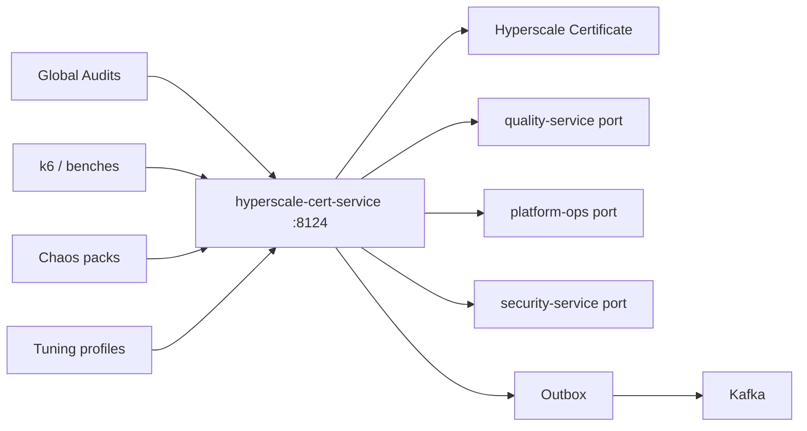
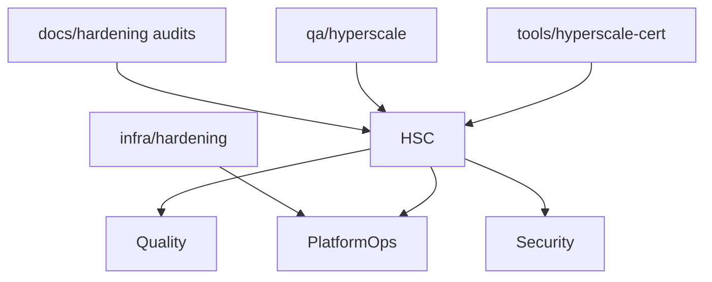
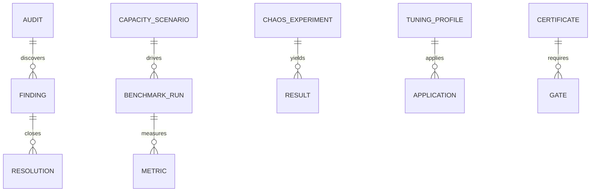

# NEXORA Ultimate Enterprise Hardening & Hyperscale Certification

> Binding under Master Blueprint §7 (`hyperscale-cert-service`).  
> **Hard rules:** Does **not** redesign services, replace quality-service gates SoT, platform-ops infra SoT, security GRC, or analytics warehouse.  
> Owns hyperscale audits, benchmark registry, capacity scenarios, chaos experiment *records*, tuning profiles, optimization findings, and hyperscale production certificates.

## Mission

Harden, optimize, validate, benchmark, and certify the completed NEXORA ecosystem for global hyperscale production — without replacing working implementations.

## Architecture



## Boundaries

| Owns | Does not own |
|------|----------------|
| Benchmark run registry + SLIs | Product API business logic |
| Capacity / peak scenarios | K8s apply / Terraform SoT |
| Chaos experiment metadata | Live chaos injection runtime SoT |
| Tuning profile catalog | Postgres admin SoT |
| Hyperscale certification issue | quality-service release cert SoT |
| Optimization findings / gap closure | Security vuln SoT |

## Folder structure

```text
services/hyperscale-cert-service/
docs/hardening/
infra/hardening/
qa/hyperscale/
tools/hyperscale-cert/
ops/hardening/
```

## Dependency graph



## API (`:8124` `/v1/hyperscale/...`)

audits · findings · benchmarks · capacity · chaos · tuning · certificates · admin · outbox

## Events

`AuditCompleted` · `BenchmarkRecorded` · `ChaosExperimentCompleted` · `OptimizationApplied` · `HyperscaleCertified`

## ER


