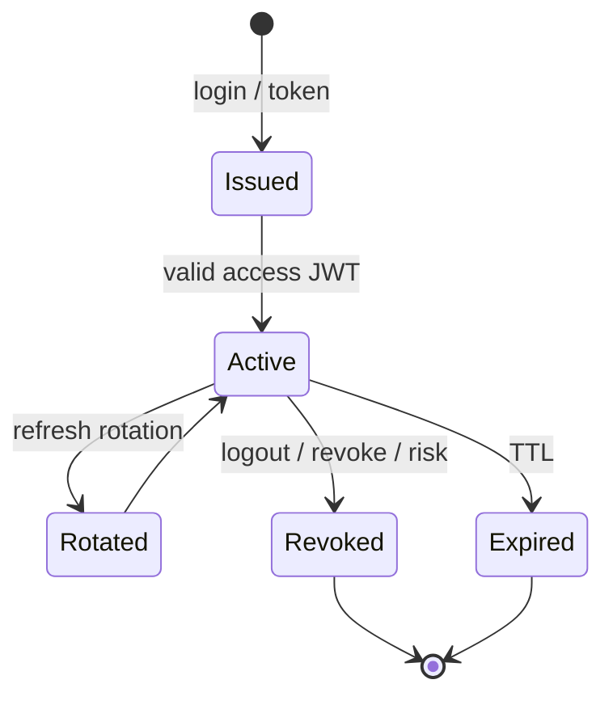
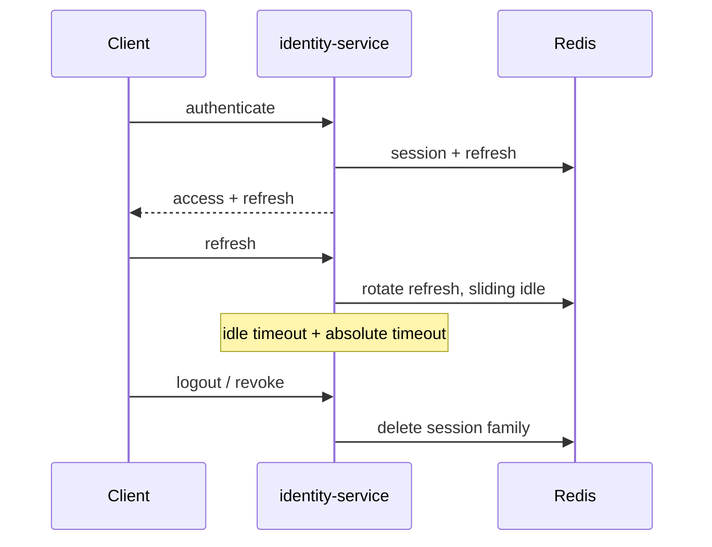
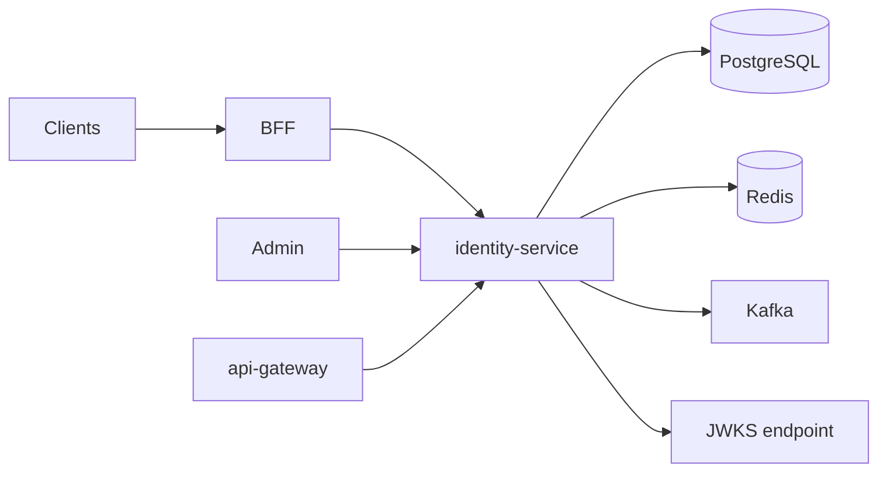

# NEXORA Identity Service — IAM Architecture

> Binding under Master Blueprint §7 (`identity-service`), §29 Authentication, §28 Security.  
> Stack: **Go** · PostgreSQL · Redis · Kafka · JWT · OAuth2/OIDC · WebAuthn/FIDO2.  
> Clients: Customer / Courier / Warehouse / Admin / Super Admin / Partners / Service accounts.  
> **Does not** own customer profiles, CRM tickets, or city-ops — only identity, authn, authz, sessions, devices.

## Mission

Single source of truth for Authentication, Authorization, Identity, Permissions, Sessions, Devices, and Security Policies across the NEXORA ecosystem.

## Goals

Production-ready · Zero Trust · Multi-tenant · Multi-region ready · Stateless app tier · Horizontally scalable · HA.

## Microservice boundaries

| Component | Responsibility |
|-----------|----------------|
| `identity-service` | Users, credentials, factors, sessions, devices, RBAC/ABAC PDP, OIDC provider, risk signals |
| `api-gateway` | Edge JWT validation, rate limit (consumes JWKS / introspection) |
| BFFs | Map client auth UX → identity APIs; never store passwords |
| `fraud-service` | Optional async deep fraud (identity publishes risk events) |
| `audit-service` | Long-term immutable store (identity also writes local audit + Kafka) |

## Identity schema (logical)

```text
Principal (user | service_account | robot)
  ├── Identifiers (email, phone, username, external IdP subject)
  ├── Credentials (password hash, WebAuthn credentials, TOTP secrets)
  ├── Factors / MFA state
  ├── Memberships (tenant_id, org roles)
  ├── Devices
  ├── Sessions + Refresh tokens
  └── Consents / verification flags
```

## Role hierarchy (platform)

```text
service_account / robot
customer | courier | warehouse_* | store_employee
support_* | finance_* | catalog_* | city_ops | admin
super_admin / platform_*
```

Permissions are resource:action strings; ABAC attributes: `tenant_id`, `city_id`, `warehouse_id`, `country_code`, `risk_score`, `mfa_level`.

## Token lifecycle



- Access JWT: short-lived (e.g. 15m), claims: `sub`, `sid`, `tid`, `roles`, `amr`, `acr`, `device_id`
- Refresh: opaque, Redis + DB, rotation on use, reuse detection → family revoke
- Introspection for opaque / step-up

## Session lifecycle



## Authentication flows

1. **Phone OTP** — start → verify → optional MFA → tokens  
2. **Email/password** — login → risk → MFA challenge → tokens  
3. **Magic link** — issue link → consume once  
4. **Social OIDC** — Google/Apple/Facebook/Microsoft/GitHub  
5. **Passkeys / WebAuthn** — register / authenticate  
6. **Guest / anonymous** — limited principal, upgrade path  
7. **Service account** — client credentials + mTLS optional  

## Authorization model

- **RBAC** role → permission set  
- **ABAC** policy checks on attributes  
- **PBAC** policy bundles (templates)  
- **Scopes** for OAuth clients  
- Temporary grants with `expires_at`  
- Delegated access (impersonation) audited + dual-control where required  

## Permission hierarchy

```text
templates → roles → principals
department / country / warehouse scoped bindings
inheritance via role parents
```

## Database schema (PostgreSQL)

Core tables (see migrations):

`principals`, `identifiers`, `credentials`, `webauthn_credentials`, `mfa_factors`, `backup_codes`,  
`oauth_clients`, `oauth_authorization_codes`, `roles`, `permissions`, `role_permissions`,  
`principal_roles`, `temporary_grants`, `devices`, `sessions`, `refresh_tokens`,  
`login_attempts`, `risk_events`, `security_policies`, `consents`, `audit_events`,  
`password_history`, `rate_limit_buckets` (or Redis-only), `tenants` (ref).

## API structure

REST (internal / BFF-facing) under `/v1/identity/...` and OIDC under `/v1/oidc/...`:

| Area | Examples |
|------|----------|
| Auth | `/auth/otp/start`, `/auth/otp/verify`, `/auth/password/login`, `/auth/magic-link/*`, `/auth/social/*`, `/auth/webauthn/*`, `/auth/guest` |
| MFA | `/mfa/totp/enroll`, `/mfa/challenge`, `/mfa/verify` |
| Tokens | `/token/refresh`, `/token/revoke`, `/token/introspect` |
| Sessions | `/sessions`, `/sessions/{id}/revoke` |
| Devices | `/devices`, `/devices/{id}/trust|revoke` |
| Users | `/principals`, `/principals/{id}` |
| RBAC | `/roles`, `/permissions`, `/principals/{id}/roles` |
| OIDC | `/.well-known/openid-configuration`, `/oidc/authorize`, `/oidc/token`, `/oidc/jwks`, `/oidc/userinfo` |
| Admin | `/admin/security/dashboard`, `/admin/risk`, search |
| Compliance | `/privacy/export`, `/privacy/delete` |

gRPC: `IdentityService` for internal session validate / permission check (PDP).

## Kafka topics

- `identity.principal.lifecycle`  
- `identity.session.events`  
- `identity.security.risk`  
- `identity.audit.events`  

## Zero Trust / Risk

Always verify · least privilege · continuous session risk re-score · adaptive MFA on high risk  
Signals: impossible travel, new device, VPN/TOR heuristics, IP reputation, behavior anomalies.

## Folder structure

```text
services/identity-service/
  ARCHITECTURE.md
  README.md
  cmd/identity-service/main.go
  internal/
    config/
    domain/
    app/           # use cases
    adapters/
      http/
      grpc/
      postgres/
      redis/
      kafka/
    security/      # jwt, password, webauthn, otp
    risk/
    ratelimit/
    observability/
  migrations/
  api/openapi/
  proto/
  configs/
  test/
  docker-compose.yml
```

## Dependency graph


