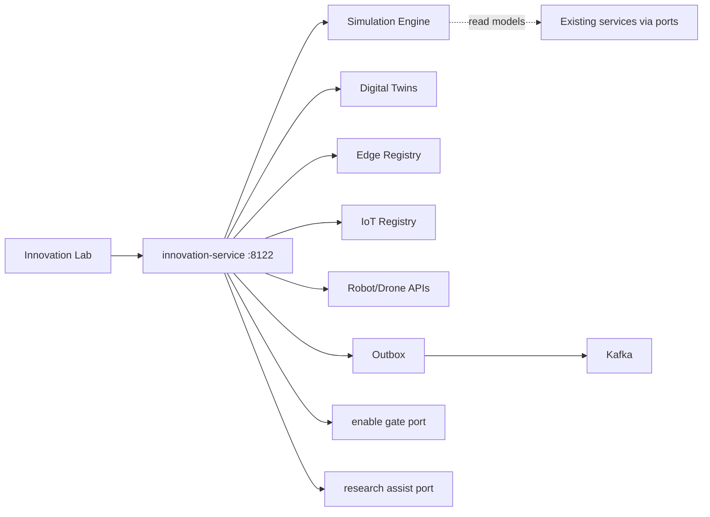
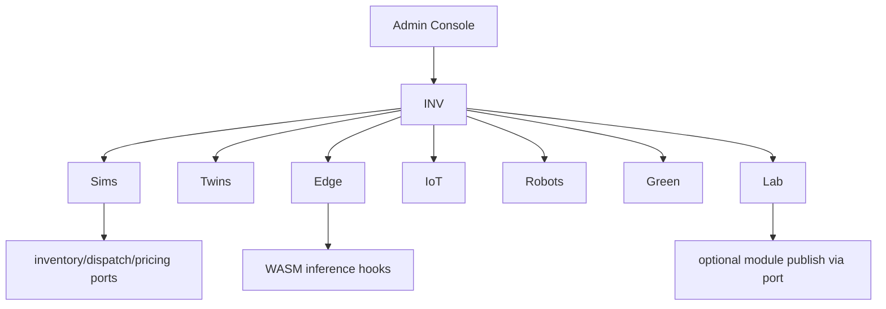
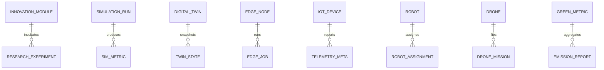

# NEXORA Innovation & Future Expansion Platform

> Binding under Master Blueprint §7 (`innovation-service`).  
> Stack: Go control plane · optional Python/Rust research adapters · Flutter XR/voice stubs · Kafka · WASM/edge hooks · OTel.  
> **Hard rules:** Does **not** replace OMS, inventory, dispatch, payments, AI model SoT, LiveOps flags, Super App module registry, or open-platform keys.  
> Owns experimental/innovation modules, simulation runs, digital-twin *models*, IoT/robot/drone *registries & missions metadata*, edge node registry, TRL scoring, green-tech metrics, quantum-safe *hooks*, research sandboxes.

## Mission

Future-proof the ecosystem with optional, isolated, production-ready innovation modules — no redesign of existing architecture required to adopt emerging tech.

## Architecture



## Boundaries

| Owns | Does not own |
|------|----------------|
| Innovation feature registry + TRL | LiveOps experiment SoT |
| Simulation job lifecycle | OMS / inventory stock SoT |
| Digital twin model metadata | Real warehouse WMS |
| IoT device registry + telemetry *ingest meta* | Hardware firmware |
| Robot/drone fleet *registry* + mission plans | Physical fleet control SoT |
| Optional blockchain/XR/quantum hooks | Payment / ledger SoT |
| Carbon / energy *metrics* | ERP sustainability filings |

## Folder structure

```text
services/innovation-service/
docs/innovation/
qa/innovation/
packages/flutter/innovation_xr_stub/
packages/python/innovation_research/
packages/rust/innovation_edge_stub/
```

## Dependency graph



## API (`:8122` `/v1/innovation/...`)

lab · modules · simulations · twins · edge · iot · robots · drones · blockchain · xr · multimodal · green · quantum · research · admin · outbox

## Events

`SimulationStarted` · `SimulationCompleted` · `InnovationEnabled` · `ResearchExperimentCreated` · `EdgeNodeRegistered` · `IoTDeviceConnected` · `RobotAssigned` · `DroneMissionCreated`

## ER


