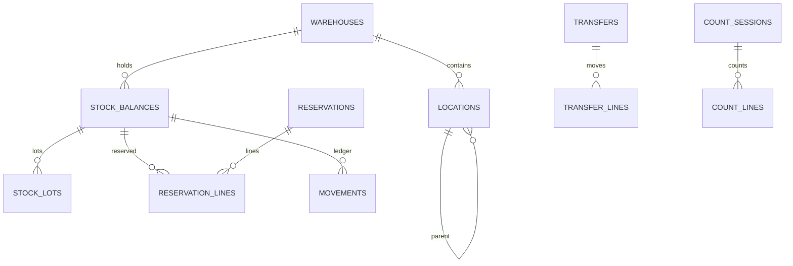
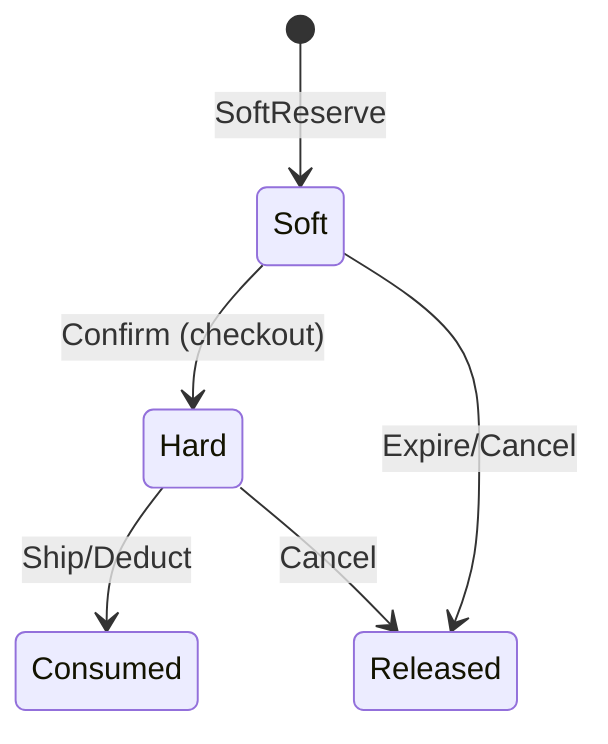
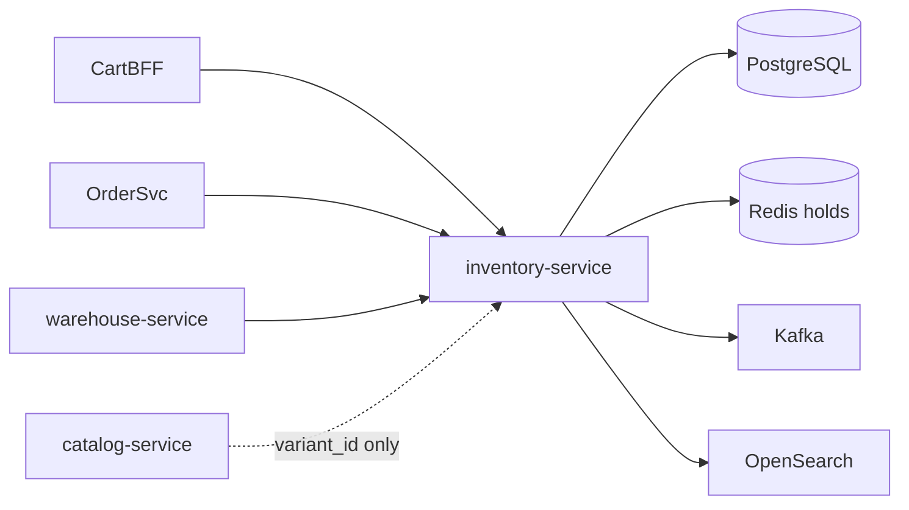

# NEXORA Inventory Service — Stock & Reservation Architecture

> Binding under Master Blueprint §7 (`inventory-service`).  
> Stack: **Go** · PostgreSQL · Redis · Kafka · OpenSearch · ClickHouse projections · gRPC · REST · OTel.  
> **Hard rules:** No product master content (`catalog-service`), no sell prices (`pricing-service`), no order aggregate (`order-service`).  
> Pick/pack **task assignment** remains `warehouse-service`; this service is SoT for **quantities, locations, reservations, movements**.

## Mission

Real-time inventory SoT across warehouses: available/reserved/blocked stock, soft/hard reservations, ATP, FEFO/FIFO lots, transfers, counts, expiry — strongly consistent per (warehouse, sku/variant) ledger with event fan-out.

## Consistency model

| Concern | Model |
|---------|--------|
| Reserve / release / adjust / receive / ship deduct | **Strong** (row lock / serializable tx per stock key) |
| Search / analytics / forecasts | Eventual (OpenSearch / ClickHouse) |
| Cross-warehouse ATP | Read models + optional sync reservation |

## Domain concepts

```text
WarehouseLocation hierarchy:
  Warehouse → Building → Floor → Zone → Aisle → Rack → Shelf → Bin/Container
  (+ cold|frozen|secure zone types)

StockBalance (warehouse_id, variant_id / sku_key, location_id?, lot_id?)
  on_hand, reserved, blocked, incoming, in_transit
  available = on_hand - reserved - blocked

Lot/Batch: expiry, mfg date, FEFO/FIFO rank

Reservation: soft|hard, expires_at, priority, order_ref (opaque), lines[]
Movement: receipt|sale|transfer|adjust|count|damage|return|waste|…
```

## ER (logical)



## Reservation architecture



- Soft: cart hold, short TTL, Redis + DB  
- Hard: committed order hold until pick/ship  
- Reuse detection N/A; **optimistic version** on balance row + idempotency keys  
- Multi-warehouse / split: reservation header + lines per warehouse

## Availability (ATP)

`ATP = on_hand - reserved - blocked + incoming_within_horizon` (policy configurable)  
Regional / zone ATP = aggregate published read model.

## Folder structure

```text
services/inventory-service/
  ARCHITECTURE.md README.md FEATURES.md
  cmd/inventory-service/
  internal/{config,domain,app,adapters/{http,grpc,postgres,redis,kafka,search}}
  migrations/ api/openapi/ proto/ configs/
```

## API (`/v1/inventory/...`)

| Area | Endpoints |
|------|-----------|
| Warehouses / locations | CRUD tree |
| Stock | get, list, search by SKU/barcode/lot |
| Reserve | soft, hard, extend, release |
| ATP | query variant/warehouse/region |
| Movements | post adjust/receive/damage/waste; list ledger |
| Transfers | create, approve, complete |
| Counts | start, submit lines, approve variance |
| Lots / expiry | list near-expiry, FEFO allocate |
| Returns | receive return to stock/quarantine |
| Forecast | get projections (AI port) |
| Admin | explorer, health |
| Health | `/health` `/ready` |

## Events (Kafka)

`inventory.stock.events` — InventoryCreated/Updated, StockAdjusted, StockReceived, StockExpired  
`inventory.reservation.events` — StockReserved, ReservationReleased, ReservationExpired  
`inventory.transfer.events` — StockTransferred  
`inventory.count.events` — StockCountCompleted  
`inventory.index.commands` — ReindexStock  

## Dependency graph



## Sync

Writers update Postgres ledger → outbox → Kafka → search/analytics.  
Clients may subscribe via BFF WebSocket to reservation/stock topics (gateway), not owned here.
