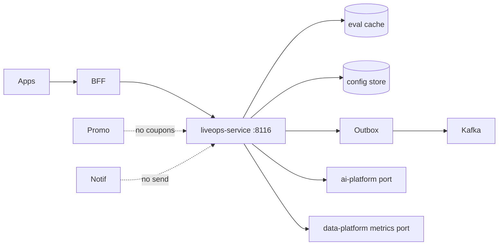
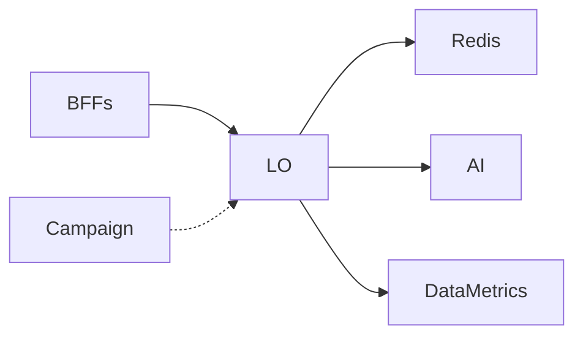
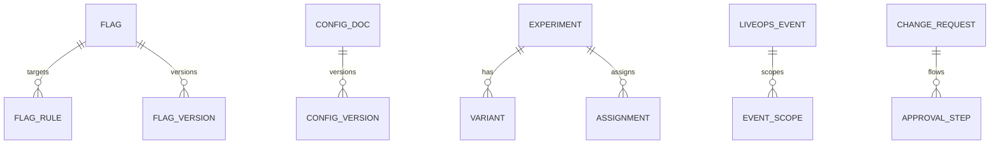

# NEXORA LiveOps Service — Feature Flags, Remote Config, Experimentation & Growth

> Binding under Master Blueprint §7 (`liveops-service`; subsumes `feature-flag-service` + `config-service` duties; those remain split-ready facades).  
> Stack: Go · PostgreSQL · Redis · Kafka · ClickHouse projections · gRPC · REST · OTel.  
> **Hard rules:** Does **not** own campaign/coupon SoT (`promotion-service`), notification delivery (`notification-service`), analytics warehouse SoT (`data-platform-service`), or AI model serving (`ai-platform-service`).  
> Evaluates flags/config/experiments in real time; emits growth events; AI winner hints via port.

## Mission

Control app behavior without mobile releases: flags, remote config, targeting, percentage/geo/version rollouts, A/B–MVT experiments, LiveOps calendar events, instant rollback, approval + audit.

## Architecture



## Boundaries

| Owns | Does not own |
|------|----------------|
| Flag definitions + evaluation | Promo coupon rules |
| Remote config documents | Push/SMS/email send |
| Experiment assign/decide | ClickHouse warehouse SoT |
| LiveOps event calendar | Pricing waterfall |
| Rollout / emergency rollback | IAM authn |
| Targeting context rules | Catalog SoT |

## Folder structure

```text
services/liveops-service/
  ARCHITECTURE.md README.md FEATURES.md Makefile Dockerfile
  cmd/liveops-service/main.go
  internal/
    config/
    domain/          # flags, config, experiments, events, rollback, outbox
    app/             # use-cases + ports + memory adapters
    adapters/{http,grpc,kafka,postgres}
    ratelimit/
  migrations/001_liveops.sql
  api/openapi/openapi.yaml
  api/proto/liveops/v1/liveops.proto
  schemas/events/
  docs/i18n/
```

## API (`:8116` `/v1/liveops/...`)

Flags · evaluate · configs · experiments · assign/decide · events · rollbacks · approvals · admin · outbox

## Events

`FeatureFlagCreated` · `FeatureFlagUpdated` · `FeatureEnabled` · `FeatureDisabled` · `ExperimentStarted` · `ExperimentCompleted` · `ConfigurationUpdated` · `RollbackExecuted`

## Dependency graph



## ER (logical)


