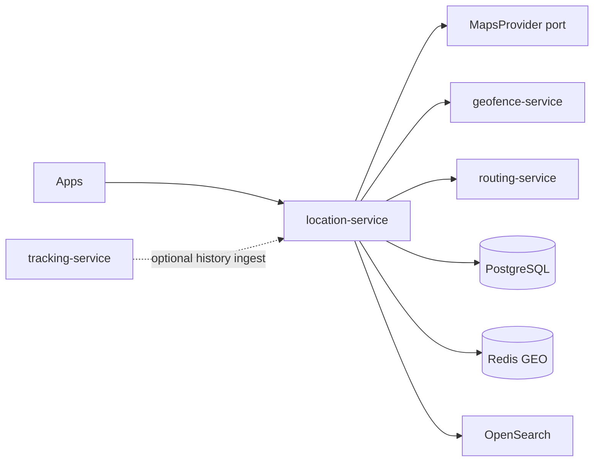

# NEXORA Location Service — Maps & GeoIntelligence Architecture

> Central **location infrastructure** for the ecosystem.  
> Stack: Go · PostgreSQL (+ PostGIS-ready SQL) · Redis · Kafka · OpenSearch · gRPC · REST · OTel.  
> Map tile SDKs (Google/Apple/Mapbox/OSM) live on clients; this service owns **geocoding, addresses, spatial index, provider facade, caches, heatmaps**.  
> **Hard rules:** Does **not** own dispatch assignment (`dispatch-service`), order lifecycle, or courier live tracking store (`tracking-service`).  
> **Composes** existing `geofence-service` + `routing-service` via ports (no duplicate polygon/ETA engines).

## Mission

Power millions of address lookups, geocode/reverse-geocode, nearby/spatial queries, zone checks (via geofence port), route/ETA requests (via routing port), and spatial analytics with low latency and privacy controls.

## Boundaries

| Owns | Delegates / does not own |
|------|---------------------------|
| Address book enrichment & validation scores | Customer profile address CRUD SoT (`customer-profile-service`) — may sync snapshots |
| Geocode / reverse / autocomplete (provider + cache) | Tile rendering |
| Spatial POI index (warehouse/pickup/partner refs) | Live courier GPS stream (`tracking-service`) |
| Heatmap aggregates / coverage metrics | Dispatch assignment |
| Offline cache manifests | Geofence polygons SoT (`geofence-service`) |
| Provider routing facade | Route persistence SoT (`routing-service`) |

## Spatial indexing strategy

- Postgres: `GEOGRAPHY(Point,4326)`-ready columns + GiST indexes (SQL compatible without requiring PostGIS in memory mode).  
- Redis GEO for hot nearby queries.  
- OpenSearch geo_point for address/POI search (HTTP indexer when `OPENSEARCH_URL` set).  
- In-memory: Haversine + simple R-tree optional; tests use Haversine.

## Address architecture

```text
NormalizedAddress
  line1, building, entrance, floor, apt, landmark
  lat, lng, place_id, confidence, risk_score
  components (country, city, district, …)
```

Pipeline: raw → provider geocode → normalize → duplicate detect → feasibility via GeofenceClient.Serviceability.

## Folder structure

```text
services/location-service/
  ARCHITECTURE.md README.md FEATURES.md
  cmd/location-service/
  internal/{config,domain,app,adapters/{http,grpc,postgres,redis,kafka,search,maps,geofence,routing}}
  migrations/ api/openapi/ proto/
```

## API (`:8100` `/v1/location/...`)

| Area | Endpoints |
|------|-----------|
| Geocode | forward, reverse, autocomplete |
| Addresses | validate, normalize, enrich, score |
| Spatial | nearby, radius, bbox, nearest (warehouse/pickup) |
| Maps | provider config, style hints, offline manifest |
| Routes | proxy CreateRoute/ETA → routing-service |
| Zones | proxy serviceability → geofence-service |
| History | device/courier/customer location history (privacy-scoped) |
| AI | demand heatmap, coverage score |
| Admin | coverage dashboard aggregates |

## Events

`location.address` — AddressValidated, AddressCreated  
`location.geo` — LocationUpdated (device), RouteCalculated (proxy), ETAUpdated (proxy)  
`location.geofence` — GeofenceEntered/Exited (from tracking/geofence ingest)  
`location.zone` — DeliveryZoneChanged (admin)

## Dependency graph


