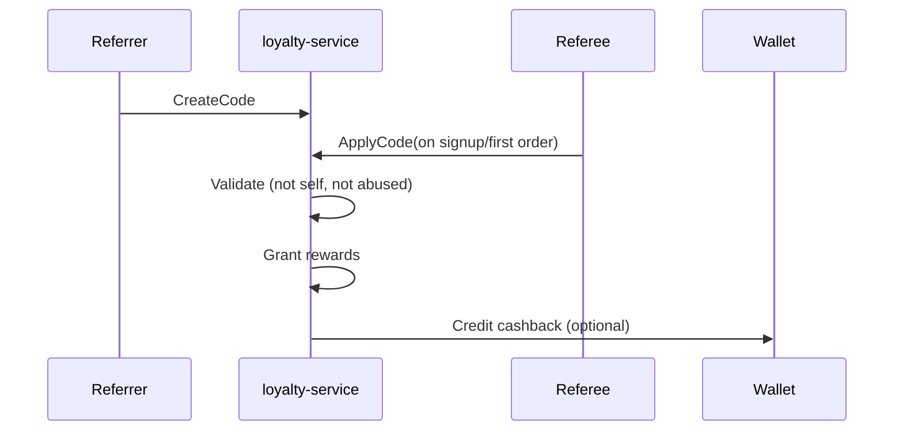
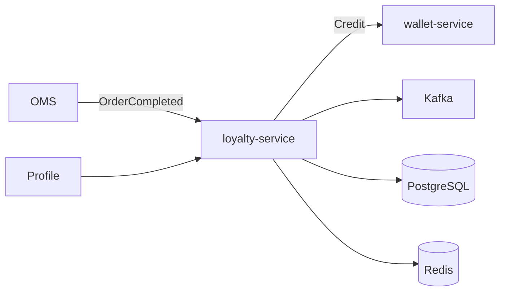

# NEXORA Loyalty Service — Engagement Architecture

> Binding under Master Blueprint §7 (`loyalty-service`).  
> Stack: Go · PostgreSQL · Redis · Kafka · ClickHouse projections · OpenSearch · gRPC · REST · OTel.  
> **Hard rules:** Does **not** own PSP payments (`payment-service`), coupon/campaign engines (`promotion-service`), CRM tickets, or wallet **ledger** (`wallet-service`).  
> Cashback/reward money credits go through **WalletClient** (promo/cashback accounts). Points/XP stay in loyalty DB.

## Mission

Maximize retention and LTV via points, memberships, rewards, referrals, gamification (missions, streaks, achievements, spin), and AI personalization hooks — real-time, multi-tenant, abuse-resistant.

## Domain map

```text
LoyaltyAccount (principal_id)
  ├── points_balance, tier_points, xp
  ├── Membership (standard|silver|gold|platinum|diamond|vip|corporate|family|student|custom)
  ├── Ledger of point events (earn/redeem/expire)
  ├── Rewards unlocked / redeemed
  ├── Cashback grants → WalletClient
  ├── Referrals (code, invites, fraud flags)
  ├── Achievements / badges / collectibles
  ├── Missions / challenges / streaks
  ├── Spin campaigns + prizes
  └── AI scores (churn, LTV) — projection
```

## Referral architecture



Multi-level optional via `depth` config; fraud: same device/IP velocity, self-referral block.

## Cashback orchestration

Rules produce `CashbackGrant` → on confirm, `WalletClient.Credit(cashback|promo)`. Loyalty stores grant status; wallet owns balance.

## Gamification

XP → levels; achievements; daily/weekly/monthly missions; streaks with recovery; spin wheel weighted prizes; digital collectibles.

## Folder structure

```text
services/loyalty-service/
  ARCHITECTURE.md README.md FEATURES.md
  cmd/loyalty-service/
  internal/{config,domain,app,adapters/...}
  migrations/ api/openapi/ proto/
```

## API (`:8093` `/v1/loyalty/...`)

| Area | Endpoints |
|------|-----------|
| Account | get/create, points history |
| Earn/Redeem | purchase earn, redeem points |
| Membership | get, evaluate upgrade |
| Rewards | list, unlock, redeem |
| Cashback | grant, confirm (wallet) |
| Referrals | code, apply, stats |
| Gamification | XP, achievements, missions, streaks, spin, collectibles |
| AI | churn/LTV stub scores |
| Admin | dashboards, manual grant (audited) |

## Events

`loyalty.points` — PointsEarned/Redeemed  
`loyalty.rewards` — RewardUnlocked/Redeemed  
`loyalty.membership` — MembershipUpgraded/Downgraded  
`loyalty.referral` — ReferralCompleted  
`loyalty.cashback` — CashbackIssued  
`loyalty.game` — AchievementUnlocked, MissionCompleted, StreakUpdated  

## Dependency graph


