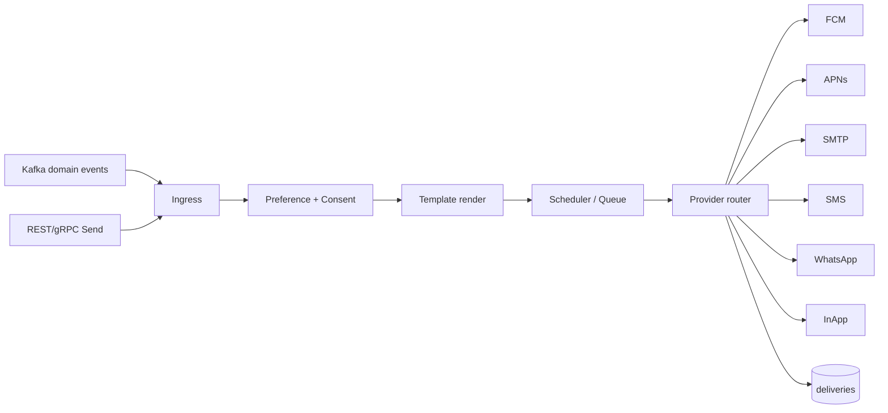
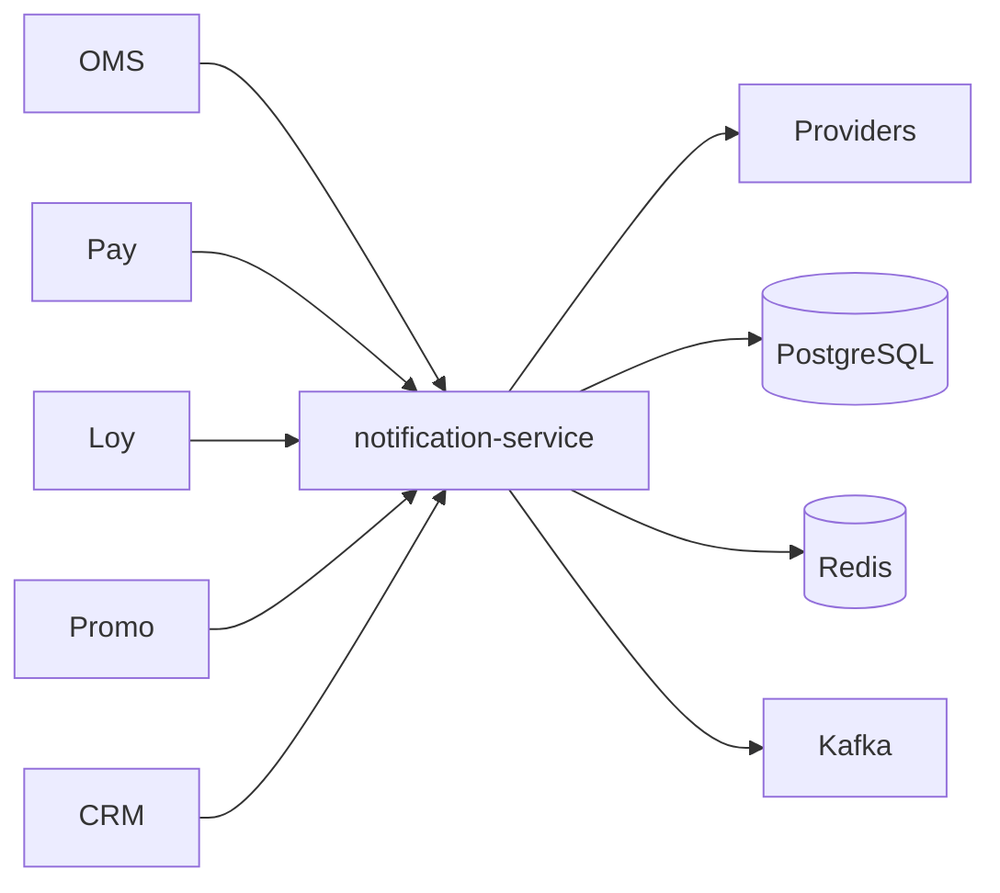

# NEXORA Notification Service — Omnichannel Messaging Architecture

> Binding under Master Blueprint §7 (`notification-service`).  
> Stack: Go · PostgreSQL · Redis · Kafka · FCM/APNs/SMTP/SMS/WhatsApp provider ports · gRPC · REST · OTel.  
> **Hard rules:** Does **not** own CRM tickets, campaign/coupon definitions (`promotion-service`), or order state (`order-service`).  
> Consumes domain events and **renders + delivers** messages per templates, preferences, and consent.

## Mission

Reliable omnichannel delivery (push, in-app, email, SMS, WhatsApp) with templates, localization, scheduling, preference/consent enforcement, provider failover, retries/DLQ, and delivery analytics — multi-tenant, AI send-time hints.

## Architecture



## Template architecture

`Template` (channel, locale, version, status draft|approved|active|retired)  
Variables `{{orderId}}` etc. Conditional blocks stubbed. A/B variant key optional. Approval workflow for marketing templates.

## Preferences & compliance

Per principal: channel opt-in/out, quiet hours, frequency caps.  
Transactional may override marketing opt-out (policy flag). GDPR/KVKK consent recorded; CAN-SPAM unsubscribe for marketing email.

## Queues

Priority: transactional > otp > system > marketing.  
Retry with backoff; DLQ after N failures. Delayed/scheduled via `send_at`.

## Folder structure

```text
services/notification-service/
  ARCHITECTURE.md README.md FEATURES.md
  cmd/notification-service/
  internal/{config,domain,app,adapters/{http,grpc,postgres,redis,kafka,providers}}
  migrations/ api/openapi/ proto/
```

## API (`:8101` `/v1/notifications/...`)

| Area | Endpoints |
|------|-----------|
| Send | single, bulk, event-trigger |
| Templates | CRUD, preview, approve, localize |
| Preferences | get/put, quiet hours |
| Inbox | list, mark read, archive |
| Deliveries | status, receipts |
| Schedule | create/cancel |
| Providers | health, route config |
| Admin | dashboards aggregates |
| AI | best-send-time stub, channel recommend stub |

## Events (outbound)

`notification.delivery` — NotificationQueued, NotificationSent, NotificationFailed, NotificationOpened (email), NotificationClicked  
Inbound consume (stub handlers): OrderCreated, OrderDelivered, PaymentSuccess, RefundCompleted, RewardEarned, CouponIssued, MembershipUpgraded, SupportTicketCreated

## Dependency graph



## Security

Encrypt provider secrets at rest (stub vault). Mask PII in logs. Rate-limit send APIs. Audit template approval + bulk sends.
