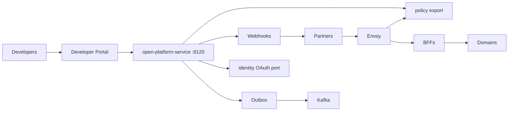
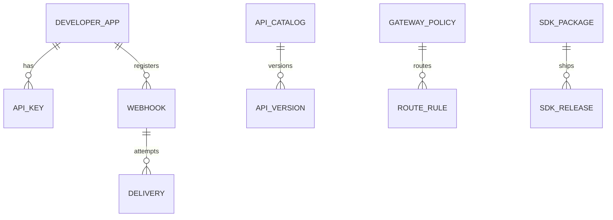

# NEXORA Open Platform & Developer Ecosystem

> Binding under Master Blueprint §7 (`open-platform-service`).  
> Stack: Go · PostgreSQL · Redis · Kafka · OpenAPI 3.1 · AsyncAPI · OAuth2/OIDC (via identity port) · Envoy policy export · OTel.  
> **Hard rules:** Does **not** own domain business logic (orders/payments/catalog/etc.), IAM credential issuance SoT (`identity-service`), or edge proxy binary (`infra/gateway`).  
> Owns developer apps, API keys, webhook registry/delivery, API catalog/versioning, gateway *policies*, SDK registry, partner integration connectors metadata, developer portal APIs.

## Mission

Enable third parties and internal teams to integrate securely via versioned APIs, webhooks, SDKs, and a developer portal — without embedding product domain logic.

## Architecture



## Boundaries

| Owns | Does not own |
|------|----------------|
| API catalog & version metadata | Order/payment/catalog SoT |
| API keys / partner app registry | Session/OTP issuance |
| Webhook endpoints + signed delivery | Domain event producers (consumes refs) |
| Gateway rate/quota/version policies | Envoy process / mesh install |
| SDK package registry + codegen hints | Mobile app UI |
| Integration connector configs | ERP/CRM execution |

## OpenAPI strategy

1. Domain services publish OpenAPI under `services/*/api/openapi/`  
2. `open-platform-service` maintains catalog index + public surface matrix  
3. Portal serves aggregated docs; contract tests via `qa/` + quality-service  
4. SemVer: `v1` stable; deprecation windows recorded on `ApiVersion`

## Folder structure

```text
services/open-platform-service/
docs/developers/
packages/sdk/{go,node,python,flutter}/
infra/gateway/  # consumes exported policies (existing)
```

## API (`:8120` `/v1/open/...`)

apps · api-keys · catalog · versions · gateway-policies · webhooks · deliveries · sdks · integrations · sandbox · usage · admin · outbox

## Events

`ApiKeyCreated` · `WebhookRegistered` · `WebhookDelivered` · `SdkGenerated` · `ApiVersionReleased` · `PartnerIntegrated`

## ER


