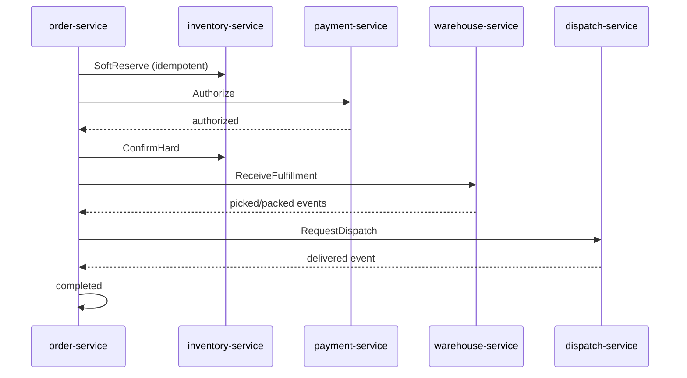
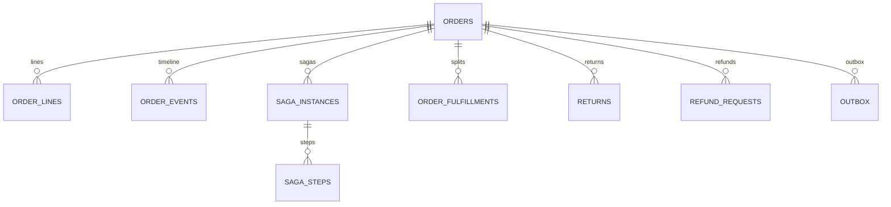
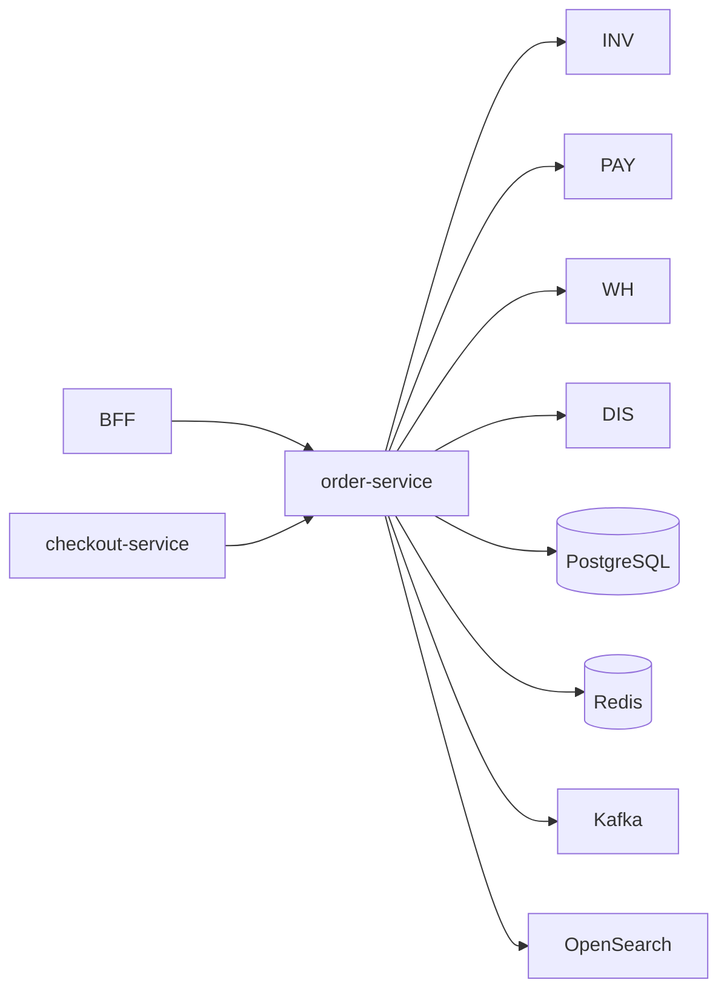

# NEXORA Order Service — OMS Architecture

> Binding under Master Blueprint §7 (`order-service`), AD-11 outbox, § no 2PC (sagas).  
> Stack: **Go** · PostgreSQL · Redis · Kafka · gRPC · REST · OpenSearch · ClickHouse projections · OTel.  
> **Hard rules:** Does **not** own stock ledger (`inventory-service`), pick/pack tasks (`warehouse-service`), PSP charges (`payment-service`), or courier matching (`dispatch-service`). OMS **orchestrates** via ports + Kafka + transactional outbox.

## Mission

Canonical order aggregate and lifecycle state machine; saga orchestration across inventory → payment → warehouse → dispatch; compensations; idempotent commands; multi-tenant / multi-warehouse / split orders.

## Order lifecycle (canonical statuses)

```text
draft → pending_payment → payment_processing → payment_failed
                      ↘ inventory_reservation → inventory_failed
                      ↘ warehouse_assigned → picking → packing → ready_for_dispatch
                      → courier_assigned → out_for_delivery → delivered → completed
cancel paths → cancelled
refund paths → refund_pending → refunded
terminal: failed | archived
```

Strict transitions only (domain table). Illegal jumps → `ErrInvalidTransition`.

## Saga orchestration (happy path)



### Compensations

| Failure | Compensate |
|---------|------------|
| Payment fail after soft reserve | Release reservation → `payment_failed` / cancel |
| Inventory fail | Cancel / `inventory_failed` |
| Warehouse fail pre-dispatch | Release hard hold + payment void/refund port |
| Customer cancel pre-pick | Release + void/refund per policy |
| Post-delivery return | Return saga → refund port (no stock write here) |

Timeouts + retries + DLQ via outbox / saga step table.

## CQRS

- **Write:** Postgres order aggregate + outbox  
- **Read:** list/search via OpenSearch indexer from events; timeline from `order_events`

## Folder structure

```text
services/order-service/
  ARCHITECTURE.md README.md FEATURES.md
  cmd/order-service/
  internal/{config,domain,app/{saga},adapters/{http,grpc,postgres,redis,kafka,search,inventory,payment,warehouse,dispatch}}
  migrations/ api/openapi/ proto/ configs/
```

## API (`/v1/orders/...`)

| Area | Endpoints |
|------|-----------|
| Create / get / list / search | CRUD-ish + OpenSearch |
| Confirm (start saga) | from draft/checkout |
| Modify (pre-pick policies) | items, address, schedule, notes, gift |
| Cancel | with reason + compensation |
| Returns / refunds | request, approve (triggers payment port) |
| Admin | intervene, split, merge, priority, timeline, state inspect |
| Webhooks | outbound registration stub |
| Health | `/health` `/ready` |

## Events (Kafka)

`order.lifecycle` — OrderCreated, OrderValidated, InventoryReserved, PaymentAuthorized, WarehouseAssigned, PickingStarted, PackingCompleted, CourierAssigned, OutForDelivery, Delivered, Completed, Cancelled, RefundRequested, RefundCompleted, OrderArchived  

Outbox table guarantees at-least-once publish.

## ER (logical)



## Dependency graph



## Money

Integer **minor units** + `currency` only (never float). Totals are snapshots; live pricing owned by `pricing-service` at quote time.
