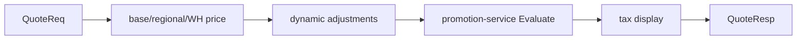
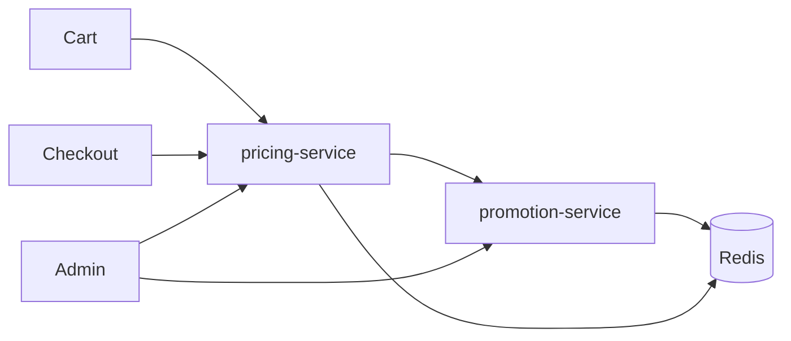

# NEXORA Promotion & Pricing Platform — Architecture

> Binding under Master Blueprint §7: `promotion-service`, `pricing-service`.  
> **Hard rules:** No PSP (`payment-service`), no loyalty points (`loyalty-service`), no order aggregate, no stock ledger, no product master (opaque `variant_id` / `sku`).  
> Money: **int64 minor units** + currency. Evaluation must be low-latency (Redis cache for active campaigns).

## Mission

Millisecond promo eligibility + quote assembly for cart/checkout; campaigns, coupons, vouchers, rule stacking; base/regional/dynamic price components with AI suggestion ports.

## Service map

| Service | Dev port | Owns |
|---------|----------|------|
| `promotion-service` | `:8094` | Campaigns, promotions, coupons, vouchers, rule engine, targeting, redemption counters, simulation |
| `pricing-service` | `:8095` | Price books (base/regional/warehouse/customer), tax display rules, quote assembly calling promo evaluate, dynamic price adjustments |

## Promotion architecture

```text
Campaign (schedule, status draft|scheduled|active|paused|expired)
  └── Promotions[] (type percent|fixed|bogo|bxgy|bundle|threshold|free_ship|gift|multibuy)
        └── Rules (eligibility, exclusions, stack group, priority)
Coupon / Voucher codes → bind promotion + usage limits
```

Evaluate(cart context) → sorted applicable discounts with conflict resolution (priority, stack groups, exclusions).

## Pricing architecture



Dynamic inputs (ports): demand/supply/inventory hints, time-of-day, optional AI optimizer — never invent catalog titles.

## Rule engine

- Priority DESC, then created_at  
- Stack groups: only one winner per group unless `stackable`  
- Exclusion lists by promo id  
- Limits: global / per-user / per-order / per-device  

## Folder structure

```text
services/promotion-service/
services/pricing-service/
```

## Events

`promo.campaign` — CampaignCreated/Activated/Expired  
`promo.coupon` — CouponGenerated/Redeemed  
`promo.voucher` — VoucherIssued/Redeemed  
`pricing.price` — PriceChanged  
`promo.rule` — PromotionApplied (on evaluate commit)

## Dependency graph


