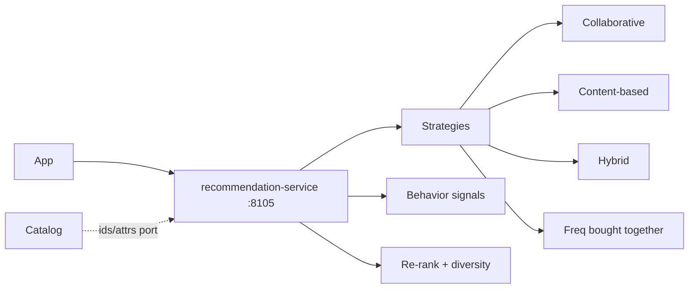

# NEXORA Recommendation Service — Personalization Architecture

> Binding under Master Blueprint §7 (`recommendation-service`).  
> Stack: Go · PostgreSQL · Redis · Kafka · ClickHouse · Vector/Embedding ports · LLM port · gRPC · REST · OTel.  
> **Hard rules:** Does **not** own catalog, search index SoT (`search-service`), promotions, or CRM. Serves rails / similar / FBT / next-best via opaque product IDs.

## Mission

Personalized and contextual product recommendations at low latency: collaborative, content-based, hybrid, cross-sell, upsell, frequently-bought-together, seasonal, next-best-offer.

## Architecture

## Strategies

| Strategy | Signal |
|----------|--------|
| `collaborative` | Co-purchase / co-view |
| `content` | Category/brand/tags similarity |
| `hybrid` | Blend CF + content |
| `fbt` | Order co-occurrence |
| `upsell` | Same category higher price band |
| `cross_sell` | Complementary categories |
| `trending` | Trend scores from search/orders |
| `personalized` | User history + membership |

## Events

`RecommendationShown` · `RecommendationClicked` · `SignalIngested`

## API (`:8105` `/v1/recommendations/...`)

Rails · similar · for-you · fbt · next-best · ingest signal · admin stats
