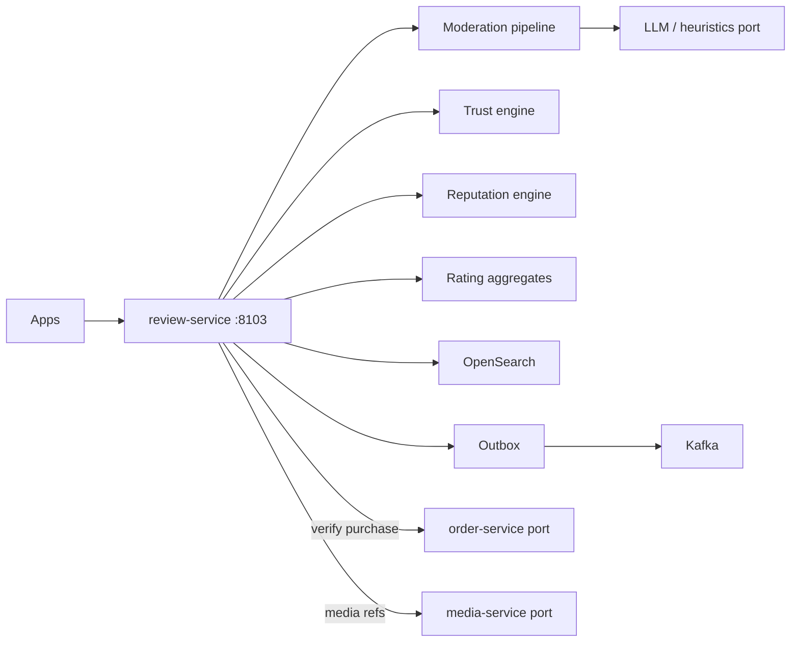
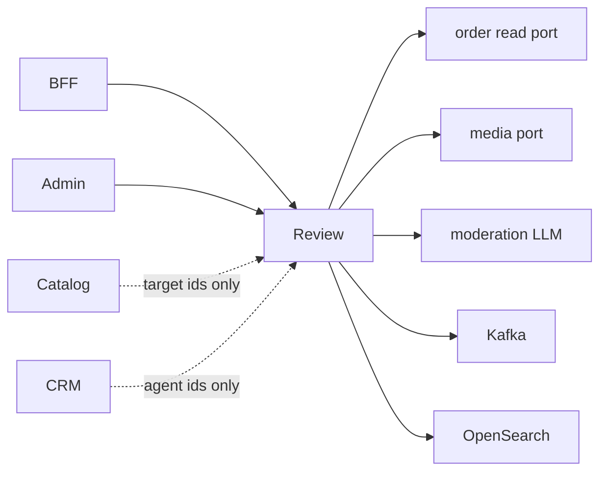
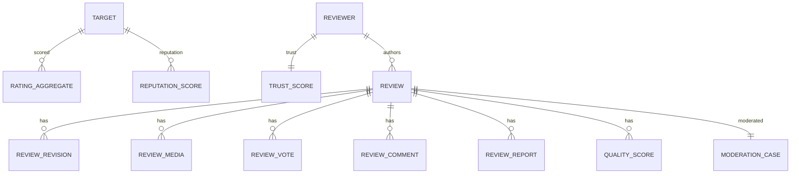

# NEXORA Review Service — Rating, Reputation & Trust Architecture

> Binding under Master Blueprint §7 (`review-service`).  
> Stack: Go · PostgreSQL · Redis · Kafka · OpenSearch · ClickHouse projections · Object storage refs · gRPC · REST · OTel · LLM moderation port.  
> **Hard rules:** Does **not** own product catalog (`catalog-service`), CRM tickets/CSAT (`crm-service`), customer profile SoT (`customer-profile-service`), binary media policy (`media-service`), or order aggregate (`order-service`).  
> Opaque cross-service IDs only. Verified-purchase / delivery checks via **ports**.

## Mission

Central trust layer: reviews, ratings, media refs, moderation, fraud signals, trust scores, entity reputation, quality dimensions, public search index — multi-tenant, AI-moderated, fraud-resistant.

## Boundaries

| Owns | Does not own |
|------|----------------|
| Review/rating aggregates & history | Product/SKU master data |
| Moderation queues & decisions | Support tickets / CSAT / NPS |
| Trust & reputation scores | Identity / sessions |
| Quality dimension scores | Order lifecycle |
| Review interactions (helpful, report, reply) | Notification delivery |
| Review search documents (OpenSearch) | Binary upload CDN policy |

## Architecture



## Review targets

`product` · `order` · `courier` · `warehouse` · `support_agent` · `store` · `brand` · `campaign` · `delivery` · `experience`

## Rating engine

- Schemes: `stars_5`, `emoji`, `thumbs`
- Aggregates: count, sum, average, Bayesian average, time-decay average
- Verified-only aggregates optional
- Weight = trust_weight × time_decay × scheme_weight

### Bayesian average

\[
\bar{r}_{bayes} = \frac{C\cdot m + \sum w_i r_i}{C + \sum w_i}
\]

Prior mean \(m\) (default 4.0), confidence \(C\) (default 20).

### Time decay

\[
w_t = e^{-\lambda \cdot days}
\]

Default \(\lambda = 0.01\).

## Review lifecycle

`draft → pending_moderation → published | rejected | hidden`  
Edit → new revision + re-moderation. Soft-delete with retention. History immutable.

## Moderation pipeline

1. Heuristic filters (profanity, PII patterns, spam length/dup)
2. AI content classify (hate, violence, adult, copyright hints)
3. Fraud signals (dup text, velocity, review bombing, bot heuristics)
4. Auto-approve / auto-reject / queue for human
5. Manual decide → publish events

## Trust engine signals

Verified purchase · verified delivery · trusted reviewer badge · expert · top contributor · verified media · AI trust score · reviewer reputation

## Reputation engine

Per-entity rolling reputation from weighted published ratings + quality dims + moderation penalties.

## Quality dimensions

`product_quality` · `delivery_quality` · `packaging` · `support_quality` · `freshness` · `accuracy` · `timeliness` · `overall`

## Folder structure

```text
services/review-service/
  ARCHITECTURE.md README.md FEATURES.md
  cmd/review-service/
  internal/{config,domain,app,adapters/{http,memory,postgres,kafka,opensearch,moderation,media},ratelimit}
  migrations/ api/openapi/ api/proto/ deploy/ docs/
```

## API (`:8103` `/v1/reviews/...`)

Reviews CRUD + interactions · Ratings submit/aggregates · Moderation queue · Trust/reputation · Quality · Search · Admin dashboards · Outbox publish

## Events

`ReviewCreated` · `ReviewUpdated` · `ReviewDeleted` · `RatingSubmitted` · `MediaAttached` · `ReviewReported` · `ReviewApproved` · `ReviewRejected` · `TrustScoreUpdated` · `ReputationUpdated`

## Dependency graph



## ER (logical)



## Search architecture

OpenSearch index `reviews-{tenant}`: text, tags, sentiment, targetType/targetId, verified, status, helpfulCount, createdAt. Write-through on publish/update/hide.
