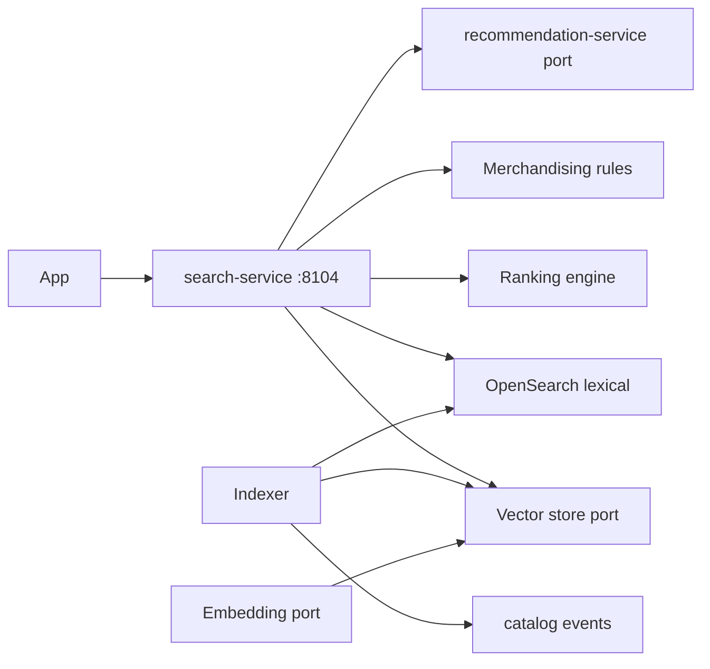
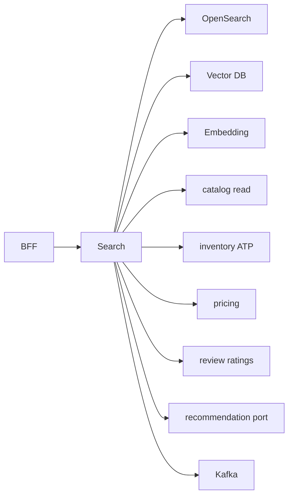

# NEXORA Search Service — Discovery & Enterprise Search Architecture

> Binding under Master Blueprint §7 (`search-service`).  
> Stack: Go · OpenSearch/Elasticsearch · Redis · PostgreSQL · Kafka · ClickHouse projections · Vector DB port (Qdrant/Milvus) · Embedding port · LLM port · gRPC · REST · OTel.  
> **Hard rules:** Does **not** own product master (`catalog-service`), campaigns/coupons (`promotion-service`), CRM, or recommendations SoT (`recommendation-service` — called via port for rails).  
> Opaque IDs only. Prices/ATP/ratings via **ports**.

## Mission

Sub-second product discovery: lexical + semantic hybrid search, autocomplete, filters/sorts, merchandising boosts, trending, voice/image query stubs, indexing pipeline.

## Architecture



## Search pipeline

1. Query normalize + rewrite (synonyms, did-you-mean, LLM rewrite port)
2. Intent detect (browse / find / compare / deal)
3. Lexical retrieve (BM25 / fuzzy / phrase)
4. Vector retrieve (kNN embeddings)
5. Hybrid fuse (RRF / weighted)
6. Filters (category, brand, price, ATP, rating, diet…)
7. Merchandising (pin / boost / demote / sponsored)
8. Personalization signals (optional context)
9. Sort or AI rank
10. Analytics event `SearchPerformed`

## Indexing

- Document = denormalized catalog snapshot + ATP flag + rating rollup + price hint (from ports at index time)
- Modes: full / incremental / realtime (Kafka) / batch
- Versioned index aliases

## Folder structure

```text
services/search-service/
  ARCHITECTURE.md README.md FEATURES.md
  cmd/search-service/
  internal/{config,domain,app,adapters/...}
  migrations/ api/openapi/ api/proto/
```

## API (`:8104` `/v1/search/...`)

Query · autocomplete · suggest · similar · trends · index upsert/reindex · synonyms · boost rules · admin stats · outbox

## Events

`SearchPerformed` · `SuggestionClicked` · `ProductRankUpdated` · `EmbeddingGenerated` · `IndexUpdated` · `TrendingUpdated`

## Dependency graph


