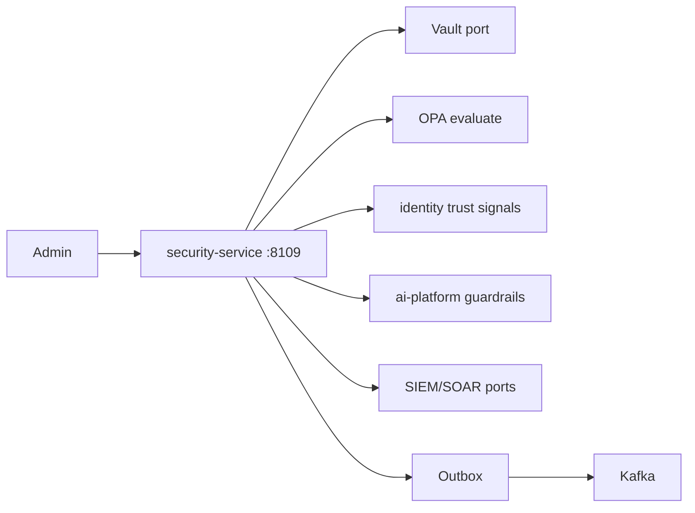
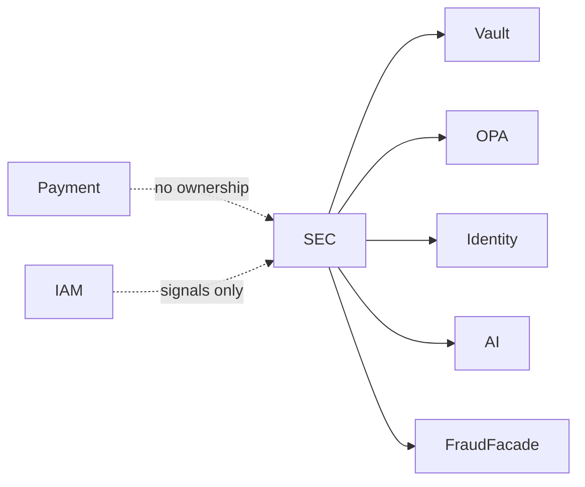
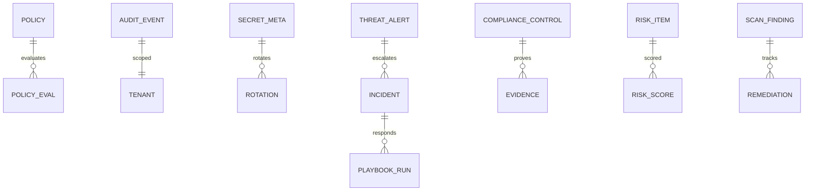

# NEXORA Security Service — Enterprise Security, Compliance, Governance & Risk

> Binding under Master Blueprint §7 (`security-service`).  
> Stack: Go · PostgreSQL · Redis · Kafka · Vault port · OPA policy · OTel · Prometheus.  
> **Hard rules:** Does **not** own IAM authn/sessions/credentials (`identity-service`), payment PSP/PAN/3DS (`payment-service`), or wallet crypto.  
> Coordinates audit, threat, secrets metadata, compliance evidence, risk, incidents. `audit-service` / `fraud-service` remain split-ready facades via ports.

## Mission

Zero Trust continuous verification signals, policy decisions (OPA), immutable audit, secrets lifecycle (Vault), vulnerability & DevSecOps findings, incident response, compliance packs (GDPR/KVKK/PCI/ISO/SOC2), data governance, risk register, AI prompt/guardrail security.

## Architecture



## Boundaries

| Owns | Does not own |
|------|----------------|
| Security policies, audit ledger, incidents | Login/password/OTP issuance |
| Secrets metadata + rotation orchestration | Raw secret values at rest (Vault) |
| Vulnerability/scan findings | Payment fraud capture SoT |
| Compliance evidence & data classification | Catalog / OMS / Inventory |
| Risk register & vendor risk | Feature flags product SoT |
| Threat alerts & playbooks | Network WAF appliance config |

## Folder structure

```text
services/security-service/
  ARCHITECTURE.md README.md FEATURES.md
  cmd/security-service/
  internal/{config,domain,app,adapters,...}
  migrations/ api/ policies/
```

## API (`:8109` `/v1/security/...`)

Policies · evaluate · audits · secrets · threats · vulns · incidents · compliance · data-gov · risks · access requests · AI security · DevSecOps · admin · outbox

## Events

`SecurityAlertCreated` · `ThreatDetected` · `PolicyViolated` · `SecretRotated` · `CertificateRenewed` · `IncidentOpened` · `IncidentClosed` · `ComplianceAuditCompleted`

## Dependency graph



## ER (logical)


