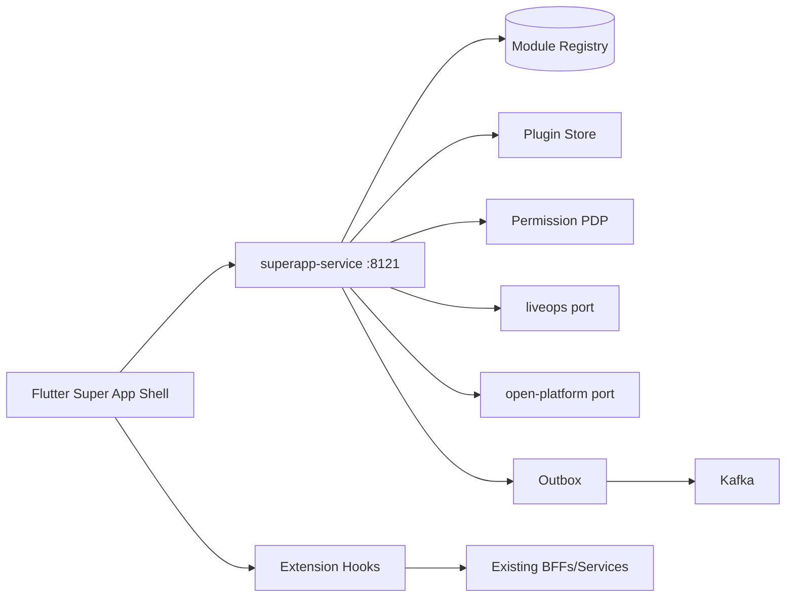
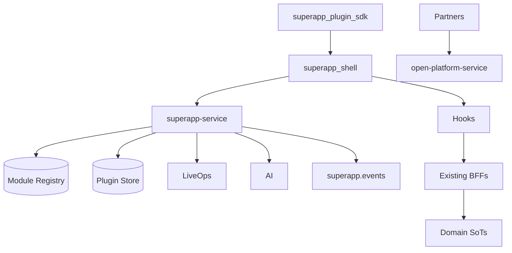
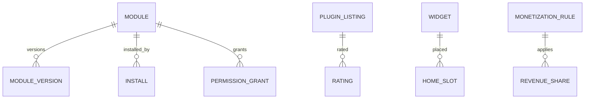

# NEXORA Super App & Modular Ecosystem Platform

> Binding under Master Blueprint §7 (`superapp-service`).  
> Stack: Go control plane · Flutter shell/plugin SDK · PostgreSQL · Redis · Kafka · WASM/micro-frontend manifests · OTel.  
> **Hard rules:** Does **not** own domain SoT (orders/payments/catalog), open-platform API keys/webhooks SoT, liveops flag SoT, identity/wallet/loyalty balances.  
> Owns mini-app/plugin/widget registry, manifests, install lifecycle, permissions sandbox metadata, store listings, monetization *rules*, shell module resolution.

## Mission

Host independent Mini Apps, Plugins, Widgets, and Partner modules inside a single Super App shell — dynamically installable, remotely configurable, sandboxed, and production-ready.

## Architecture



## Boundaries

| Owns | Does not own |
|------|----------------|
| Mini-app / plugin / widget catalog | Product catalog SoT |
| Install/update/remove lifecycle | Payment capture |
| Manifest + signing metadata | Wallet balances |
| Permission grants for modules | IAM sessions |
| Store ratings for plugins | Review SoT for products |
| Monetization commission *rules* | Settlement execution |
| Shell module resolution API | LiveOps experiment SoT |

## Folder structure

```text
services/superapp-service/
packages/flutter/superapp_shell/
packages/flutter/superapp_plugin_sdk/
docs/superapp/
qa/superapp/
```

## Dependency graph



## API (`:8121` `/v1/superapp/...`)

modules · mini-apps · plugins · widgets · store · installs · permissions · hooks · monetization · resolve · admin · outbox

## Events

`PluginInstalled` · `PluginRemoved` · `PluginUpdated` · `MiniAppLaunched` · `WidgetAdded` · `ModuleActivated` · `PermissionGranted`

## ER


