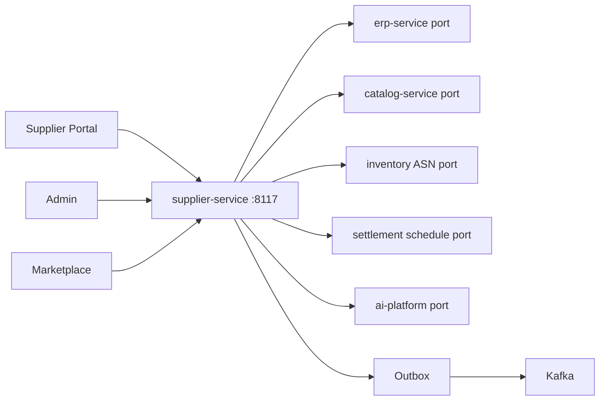
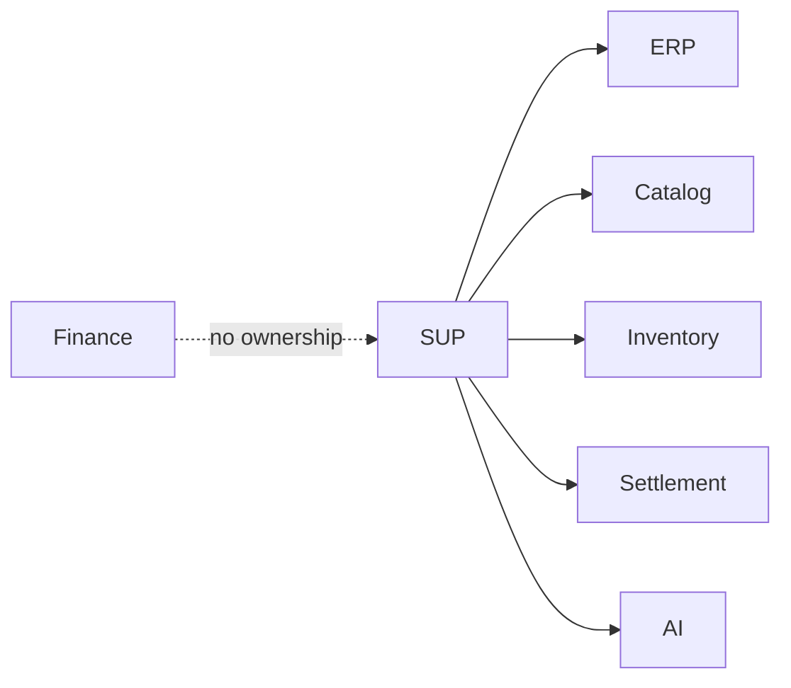
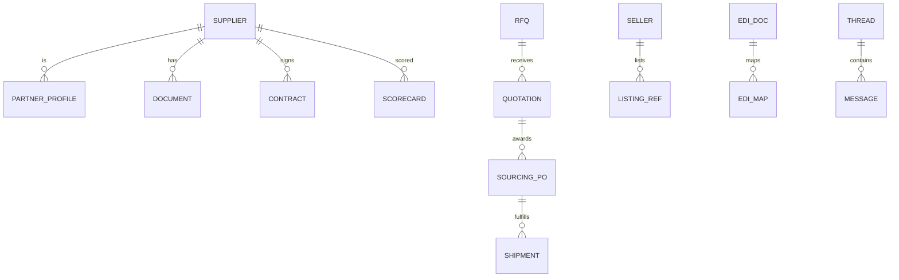

# NEXORA Supplier & Partner Ecosystem Service

> Binding under Master Blueprint §7 (`supplier-service`).  
> Stack: Go · PostgreSQL · Redis · Kafka · OpenSearch projections · ClickHouse metrics · gRPC · REST · OTel.  
> **Hard rules:** Does **not** own ERP accounting SoT (journals/AP 3-way match), inventory stock ledger, product catalog SoT, payment/wallet, or settlement payout execution.  
> Collaborates via ports: ERP PO refs, catalog submission approval, inventory ASN/receive signals, settlement payout schedules, AI ranking/risk.

## Mission

Supplier/partner onboarding & lifecycle, B2B procurement collaboration (RFQ/RFP/quotes), marketplace sellers, EDI exchange, contracts, inbound shipment collaboration, scorecards, and supplier portal APIs — without replacing ERP finance or catalog PIM.

## Architecture



## Boundaries

| Owns | Does not own |
|------|----------------|
| Supplier/partner master + verification | ERP COA/journals/AP match SoT |
| RFQ/RFP/quotations & sourcing POs | Stock quantities |
| Marketplace sellers & listings refs | Product PIM SoT |
| EDI docs (850/855/856/810 mappings) | Payment capture |
| Contracts & scorecards | Settlement batch execution |
| Catalog submissions (pending) | Catalog publish SoT |
| Inbound ASN / QC collaboration | Warehouse WOMS SoT |

## Folder structure

```text
services/supplier-service/
  ARCHITECTURE.md README.md FEATURES.md Makefile Dockerfile
  cmd/supplier-service/
  internal/{config,domain,app,adapters/{http,grpc,kafka,postgres},ratelimit}
  migrations/ api/openapi/ api/proto/ schemas/events/ docs/i18n/
```

## API (`:8117` `/v1/supplier/...`)

Suppliers · partners · documents · contracts · RFQ/quotes · POs · shipments · EDI · marketplace sellers · catalog submissions · scorecards · messages · portal · AI · approvals · admin · outbox

## Events

`SupplierCreated` · `SupplierApproved` · `PurchaseOrderCreated` · `ShipmentReceived` · `InvoiceMatched` · `ContractRenewed` · `SellerOnboarded` · `SupplierRated`

## Dependency graph



## ER (logical)


