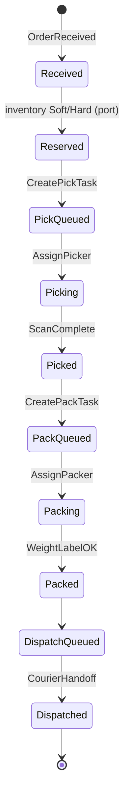
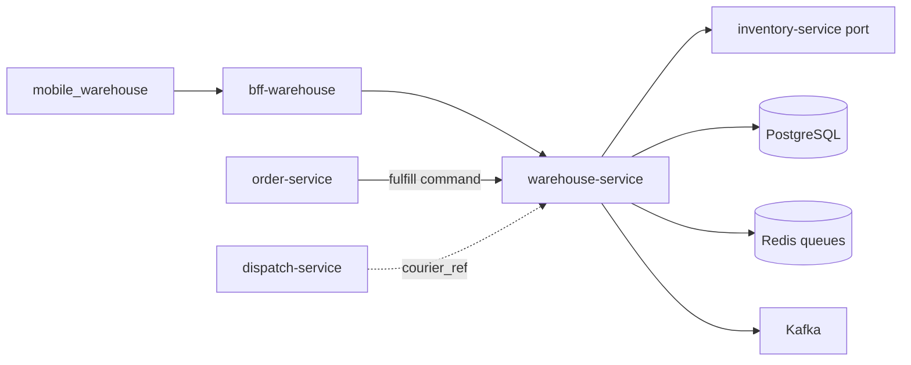
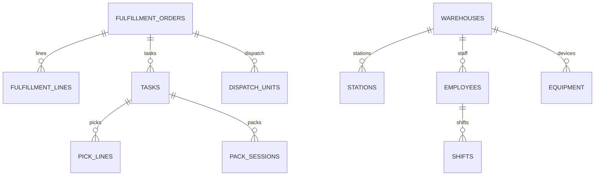

# NEXORA Warehouse Service — Operations & Fulfillment (WOMS)

> Binding under Master Blueprint §7 (`warehouse-service`).  
> Stack: **Go** · PostgreSQL · Redis · Kafka · gRPC · REST · WebSocket fan-out via gateway · OTel.  
> Clients: `bff-warehouse` → `apps/mobile_warehouse`.  
> **Hard rules:** Stock quantities / reservations SoT = `inventory-service`. Order aggregate = `order-service`. Catalog content = `catalog-service`. This service owns **fulfillment tasks, pick/pack/dispatch workflows, stations, workforce shifts, equipment, QC**.

## Mission

Optimize dark-store throughput from order arrival at warehouse → courier handoff: tasking, pick routes, pack quality, labels, dispatch queue — AI-assisted, multi-warehouse, offline-tolerant at the edge (mobile outbox).

## Fulfillment pipeline



## Boundaries

| Owns | Does **not** own |
|------|------------------|
| Fulfillment orders (projection + lines) | Canonical order state machine |
| Pick/pack/dispatch **tasks** & queues | On-hand / reserved qty ledger |
| Stations, waves, batches, zones assignment | Product master / prices |
| Scan verification rules (expected barcode) | Device auth (IAM) |
| Labels metadata + print intents | Courier matching (dispatch-service may assign; WH confirms handoff) |
| Workforce shifts / attendance (WH scoped) | HR payroll |
| Equipment registry + heartbeats | IoT platform core |
| QC inspections on fulfill units | Finance refunds |

## Picking architecture

Strategies: `single | batch | wave | zone | cluster | priority | express`  
Route: ordered pick lines with location hints from inventory location codes (opaque).  
AI port: `OptimizePickRoute(lines) → sorted lines`.  
Verification: barcode/QR/RFID/shelf/qty/expiry; substitution policy port (order rules).

## Packing architecture

Station claim → materials → weight/dimension checks → cold/fragile/hazard flags → seal → label.  
Package size suggestion via AI port (stub).

## Dispatch workflow

Packed units → dispatch queue → package verify → courier arrival / assignment ref → QR handoff → complete → emit `DispatchCompleted` (inventory Consume on ship via port).

## Task engine

Priority queue per warehouse + role. Reassign, cancel, escalate, SLA timers. History append-only.

## Folder structure

```text
services/warehouse-service/
  ARCHITECTURE.md README.md FEATURES.md
  cmd/warehouse-service/
  internal/{config,domain,app,adapters/{http,grpc,postgres,redis,kafka,inventory}}
  migrations/ api/openapi/ proto/ configs/
```

## API (`/v1/warehouse/...`)

| Area | Endpoints |
|------|-----------|
| Fulfillment | receive, get, list, cancel |
| Tasks | queue, claim, reassign, complete, escalate |
| Picking | start, scan line, short-pick, complete |
| Packing | claim station, verify weight, seal, label |
| Dispatch | queue, verify package, handoff confirm |
| QC | create inspection, pass/fail |
| Workforce | clock in/out, breaks, performance snapshot |
| Equipment | register, heartbeat, list |
| Sensors | temperature/humidity ingest (stub) |
| AI | route optimize, pack suggest, labor suggest |
| Admin | dashboards aggregates |
| Health | `/health` `/ready` |

## Events (Kafka)

`warehouse.fulfillment.events` — OrderReceived, PickingStarted/Completed, PackingStarted/Completed, LabelGenerated, DispatchStarted/Completed, CourierAssigned  
`warehouse.task.events` — TaskAssigned, TaskCompleted, TaskEscalated  

## Dependency graph



## ER (logical)


